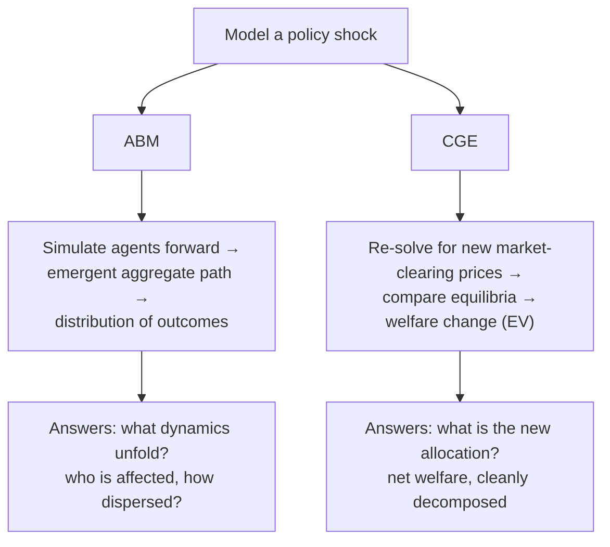

# ABM vs CGE

!!! abstract "Emergence vs equilibrium — the two ways to build an economy"
    An **agent-based model (ABM)** builds a system from the bottom up out of many
    heterogeneous, interacting, boundedly-rational agents and lets aggregate behavior
    *emerge*. A **computable general equilibrium (CGE)** model assumes optimizing agents
    and solves for the set of prices at which **all markets clear simultaneously**. They
    are the two most complete answers to the same question — *how does a whole economy
    behave?* — and they answer it in opposite methodological directions. This chapter
    pairs a Gold [ABM referent (Covasim)](../model-families/health/covasim.md) with a Gold
    [CGE referent](../model-families/economics/cge.md).

## The two worldviews

=== "ABM — emergence from the bottom"
    Specify the *agents* — their state, rules, and interaction network — and *simulate
    forward*. There is no aggregate objective and no imposed consistency condition; the
    macro pattern (a price level, an epidemic curve, a wealth distribution) is whatever
    the micro interactions produce. Equilibrium, if it appears at all, is an **emergent
    outcome**, not an assumption.

    **Referents:** [Covasim](../model-families/health/covasim.md) (epidemic ABM),
    agent-based macro (e.g. the "Schelling → Santa Fe → EURACE/CATS" lineage),
    [MATSim](../model-families/transport/matsim.md) (transport).

=== "CGE — consistency from the top"
    Specify *preferences, technology, and endowments*; assume every agent optimizes and
    every market clears; then **solve** the simultaneous system for equilibrium prices and
    quantities. Consistency (Walras' law, zero profit, income balance) is **imposed as the
    solution concept** (see [CGE dossier](../model-families/economics/cge.md)).

    **Referents:** [CGE](../model-families/economics/cge.md),
    [GTAP](../model-families/economics/gtap.md), and — with intertemporal stochastics —
    [DSGE](../model-families/economics/dsge.md).

## The comparison matrix

| Dimension | **ABM** | **CGE** |
|-----------|---------|---------|
| Building block | Heterogeneous agents + interaction rules | Representative optimizing agents + markets |
| Aggregation | **Bottom-up, emergent** | Top-down consistency imposed |
| Solution concept | Forward simulation (no fixed point required) | Simultaneous **market-clearing fixed point** |
| Rationality | Bounded / heuristic / adaptive | Full optimization, often rational expectations |
| Equilibrium | Emergent, possibly none or many | Assumed, usually unique |
| Heterogeneity | Native, unlimited | Limited (representative agents / few types) |
| Expectations | Adaptive, backward-looking | Model-consistent / rational |
| Output | **Distribution** over stochastic runs | **Point** equilibrium (per scenario) |
| Micro-foundations | Explicit agents, weak aggregate theory | Strong neoclassical theory, thin heterogeneity |
| Calibration | Black-box, outer search (Optuna/ABC) | Benchmark to a **SAM**, exact-replication |
| Interpretability | Emergent, path-dependent, harder | Shadow prices / duals, clean welfare |
| Computational cost | High (ensembles of simulations) | Moderate (one nonlinear solve per scenario) |
| Welfare analysis | Contested / secondary | Clean (equivalent variation) |
| Fails when… | mechanism under-determined; behavior assumed | agents can't optimize/foresee; slack & disequilibrium matter |
| Exemplars | Covasim, MATSim, ABM macro | CGE, GTAP, (intertemporal) DSGE |

## Why the divide runs deep

The split is not cosmetic — it changes *what a result even means*.

- A CGE gives you a **counterfactual equilibrium** and a clean welfare number, but it
  *assumes away* the adjustment path, involuntary unemployment, and heterogeneity that
  might be the whole story.
- An ABM gives you **dynamics, dispersion, and tail risk**, but its aggregate behavior is
  under-theorized and its parameters are often under-identified (equifinality — see the
  [Covasim dossier](../model-families/health/covasim.md)).

This is the same coordination question examined in
[Equilibrium vs Disequilibrium](equilibrium-vs-disequilibrium.md), viewed through
*method* rather than *market-clearing*: CGE **imposes** coordination as a solved fixed
point; ABM lets (dis)coordination **happen**.

## When each is appropriate

- **CGE** for **structural, resource-allocation, long-run** questions where full
  utilization and optimization are acceptable idealizations and a clean welfare verdict is
  wanted: tax reform, trade policy, the long-run incidence of a carbon price.
- **ABM** where **heterogeneity, networks, adaptation, and out-of-equilibrium dynamics**
  are the point: epidemics, financial contagion, technology diffusion, congestion,
  distributional tails, and regime shifts a fixed-point solver would miss.

## Where each fails

!!! warning "CGE's failure modes"
    - Bakes in full employment / market clearing — can **assume away** the phenomenon of
      interest (recessions, involuntary unemployment).
    - Representative agents erase distribution; the "average" household can be no one.
    - Comparative-statics: the transition path and its politics are invisible.

!!! warning "ABM's failure modes"
    - **Equifinality** — many parameterizations fit; mechanism under-determined.
    - Weak aggregate theory; results can be sensitive to unobserved rule choices.
    - Computationally heavy; welfare and "optimal policy" are hard to define.
    - Behavior is often **exogenous** — the model may assume the responses it should explain.

## The synthesis frontier

- **Agent-based macroeconomics** (JMAB, EURACE, CATS/Dosi-style) builds full economies
  from heterogeneous firms/banks/households — a direct ABM answer to DSGE/CGE.
- **Heterogeneous-agent equilibrium** — HANK models (see
  [DSGE](../model-families/economics/dsge.md)) import rich heterogeneity *into* an
  equilibrium frame, meeting ABM partway.
- **Coupled simulators** — an epidemic/transport/energy ABM feeding demands and shocks
  into a CGE core (and vice versa): the integration this atlas is ultimately designing
  toward.

### Lesson for the integrated simulator

!!! quote "If we were designing the world's most capable policy simulator today…"
    ABM and CGE are not rivals to be adjudicated but **two subsystems to be composed**.
    The design implication is a simulator that can host an **emergent agent hemisphere**
    (heterogeneous, stochastic, path-dependent — the Covasim style) *and* an
    **equilibrium/optimizing hemisphere** (consistent, welfare-scored — the CGE style),
    with a defined interface for exchanging state between them: agents generate the
    demands, shocks, and frictions the equilibrium core takes as given, while equilibrium
    prices and incomes feed back as the environment agents respond to. Crucially, the
    simulator should **route each question to the hemisphere where it is valid** — long-run
    allocation and welfare to the equilibrium core, dynamics/heterogeneity/tail-risk to the
    agents — and, where they overlap, run both and **report the divergence** as a measure
    of model uncertainty rather than hiding it behind a single number.

## See also
- Referents: [Covasim](../model-families/health/covasim.md) (ABM) · [CGE](../model-families/economics/cge.md) (equilibrium)
- Related: [Optimization vs Simulation](optimization-vs-simulation.md) · [Equilibrium vs Disequilibrium](equilibrium-vs-disequilibrium.md) · [Top-Down vs Bottom-Up](top-down-vs-bottom-up.md)
- [Taxonomy — Axes 1 & 3](../foundations/taxonomy.md) · [Comparative hub](index.md)
