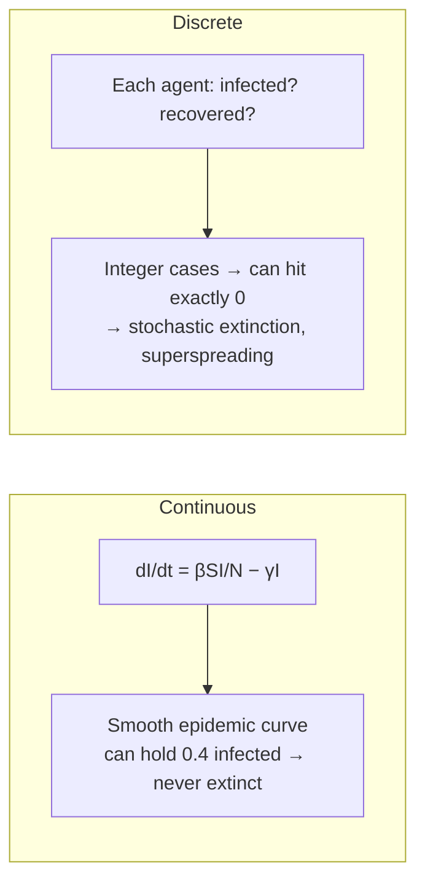

# Continuous vs Discrete

!!! abstract "Smooth flows or countable events?"
    Does the model represent the world as **continuous quantities changing smoothly** —
    stocks flowing, differential equations integrating — or as **discrete entities and
    events** — individuals, transitions, steps that either happen or don't? This is
    [Taxonomy Axis 6](../foundations/taxonomy.md), and it is really *two* linked choices:
    continuous vs discrete **state** (a fractional population vs countable agents) and
    continuous vs discrete **time** (integration vs stepping/events). The choice follows the
    phenomenon: below some scale, "3.7 infected people" is nonsense and discreteness *is* the
    physics.

## The two representations

=== "Continuous — smooth quantities & time"
    State variables are **real-valued aggregates** (a population level, a capital stock, a
    concentration) evolving by **differential equations** integrated through continuous time.
    Individuals are dissolved into densities.

    **Referents:** [Vensim / System Dynamics](../model-families/frameworks/vensim.md)
    (stock-flow ODEs), compartmental SEIR, the carbon/temperature boxes of
    [DICE](../model-families/climate-iam/dice.md).

=== "Discrete — countable entities & events"
    State is made of **discrete objects** (agents, units) in **discrete states**, updated at
    **discrete time steps** or on **events**. Change is a countable transition, not a smooth
    flow.

    **Referents:** [Covasim](../model-families/health/covasim.md) (discrete agents, daily
    steps), [MATSim](../model-families/transport/matsim.md), discrete-event simulation, any
    [agent-based](../paradigms/index.md) model.

## The comparison matrix

| Dimension | **Continuous** | **Discrete** |
|-----------|----------------|--------------|
| State | Real-valued aggregates (densities) | Countable entities / discrete states |
| Time | Continuous (ODE integration) | Time-stepped or event-driven |
| Change | Smooth flows / rates | Countable transitions / events |
| Smallest unit | Infinitely divisible | Indivisible (one agent, one event) |
| Core mathematics | ODEs / PDEs, calculus | Difference eqns, Markov chains, event queues |
| Natural at | Large populations, aggregate dynamics | Small counts, heterogeneity, thresholds |
| Integer effects | Lost (fractional entities) | Native (a case, a start-up, extinction) |
| Cost | Cheap (few variables) | Scales with entity/event count |
| Stochasticity link | Usually deterministic | Often stochastic (discrete draws) |
| Exemplars | Vensim/SD, SEIR, DICE climate | Covasim, MATSim, discrete-event sim |

## Why granularity changes the answer

The classic case is epidemics (modeled both ways — see
[SD vs ABM](system-dynamics-vs-abm.md)). A **continuous** SEIR model can carry "0.4 infected
people" indefinitely, so the disease **never truly dies out**; a **discrete** agent model
has *integer* cases, so an outbreak can hit exactly zero and **go extinct** — and can show
**superspreading** from individual-level variance. When counts are small, discreteness is not
a detail; it changes the qualitative outcome. When counts are large, the continuous
approximation is excellent and vastly cheaper (the **mean-field limit**).

## When each is appropriate

- **Continuous** for **large populations and aggregate dynamics** where individual
  granularity averages out: macro stocks and flows, well-mixed large-population epidemics,
  physical concentrations, capital accumulation. Cheap, smooth, analytically tractable.
- **Discrete** when **small numbers, heterogeneity, networks, thresholds, or indivisible
  events** drive the result: early-outbreak extinction, superspreading, individual routing
  and congestion, queueing, discrete decisions.

## Where each fails

!!! warning "Continuous's failure modes"
    - **Fractional entities are unphysical** at small scale — cannot represent extinction,
      integer thresholds, or "one superspreader."
    - Well-mixed/aggregate assumptions erase heterogeneity and network structure.
    - Smoothness can hide genuinely discontinuous, event-driven behavior.

!!! warning "Discrete's failure modes"
    - **Cost scales with entity/event count** — millions of agents/events are expensive.
    - Time-step artifacts — results can depend on step size; event ordering matters.
    - Often needs many stochastic replications to be meaningful (ties to
      [Deterministic vs Stochastic](deterministic-vs-stochastic.md)).

## The synthesis frontier

- **Hybrid / multi-scale simulation** — continuous where counts are large, switching to
  discrete agents where they are small (e.g. continuous background epidemic + discrete
  early-outbreak or super-spreader dynamics); platforms like AnyLogic mix ODE, agent, and
  discrete-event in one model.
- **Mean-field & diffusion limits** — theory for *when* a discrete model's average collapses
  to a continuous ODE, telling you when the cheap approximation is safe.
- **Tau-leaping / hybrid stochastic** — bridge exact discrete stochastic simulation and
  continuous approximation for efficiency.

### Lesson for the integrated simulator

!!! quote "If we were designing the world's most capable policy simulator today…"
    Granularity should track the **phenomenon and its scale**, not the modeler's habit. The
    simulator should let a subsystem be represented **continuously where populations are large
    and discretely where counts are small or indivisible events matter** — and, ideally,
    *switch between the two automatically* as a quantity crosses the scale where the
    mean-field approximation breaks (the continuous-to-discrete handoff that decides whether
    an epidemic can go extinct). This is the granularity face of the same
    [SD vs ABM](system-dynamics-vs-abm.md) boundary: keep the cheap continuous
    [integration engine](../patterns/integration-engine.md) as the default accounting
    substrate, escalate to discrete [agents](../patterns/behavior-engine.md) where integer
    effects, heterogeneity, or networks change the answer, and use mean-field theory to know
    which regime each subsystem is actually in.

## See also
- Referents: [Vensim / SD](../model-families/frameworks/vensim.md) · [DICE](../model-families/climate-iam/dice.md) climate boxes (continuous) · [Covasim](../model-families/health/covasim.md) · [MATSim](../model-families/transport/matsim.md) (discrete)
- Related: [System Dynamics vs Agent-Based](system-dynamics-vs-abm.md) · [Deterministic vs Stochastic](deterministic-vs-stochastic.md) · [Integration Engine](../patterns/integration-engine.md)
- [Taxonomy — Axis 6](../foundations/taxonomy.md) · [Comparative hub](index.md)
