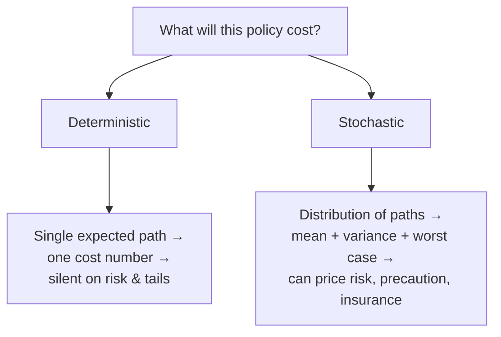

# Deterministic vs Stochastic

!!! abstract "Does the model roll dice?"
    A **deterministic** model produces the *same* output every time from the same inputs —
    one trajectory, one number. A **stochastic** model contains genuine randomness, so its
    output is a **distribution** over many possible futures. This is
    [Taxonomy Axis 5](../foundations/taxonomy.md), and it decides whether the model can speak
    about **risk, uncertainty, and tail events** at all — or only about a single "best
    guess." For policy, that difference is often the whole point: the cost of climate change
    or a pandemic lives in the *tails*, which a deterministic model cannot see.

## The two stances

=== "Deterministic — one trajectory"
    No random variables in the core; given inputs, the solution is unique and repeatable.
    Uncertainty, if addressed, is bolted on *afterwards* by running the deterministic model
    under different assumptions (scenario/[sensitivity](../patterns/sensitivity-engine.md)
    analysis).

    **Referents:** [DICE](../model-families/climate-iam/dice.md) (deterministic optimal
    path), [CGE](../model-families/economics/cge.md),
    [TIMES](../model-families/energy/times.md)/[OSeMOSYS](../model-families/energy/osemosys.md)
    (deterministic least cost), core [Vensim/SD](../model-families/frameworks/vensim.md).

=== "Stochastic — a distribution of trajectories"
    Randomness is *intrinsic*: shocks, random matching, sampled transitions. A single run is
    one realization; conclusions come from **ensembles**. The output is a distribution, with
    means, variances, and tails.

    **Referents:** [DSGE](../model-families/economics/dsge.md) (stochastic shocks + rational
    expectations), [Covasim](../model-families/health/covasim.md) (Monte-Carlo agent
    transitions), stochastic-programming energy models, DSICE.

## The comparison matrix

| Dimension | **Deterministic** | **Stochastic** |
|-----------|-------------------|----------------|
| Randomness in core | None | Intrinsic |
| Output | Single trajectory / value | **Distribution** of outcomes |
| Repeatability | Exact | Per-seed; stable only in ensemble |
| Uncertainty treatment | External (scenarios, sensitivity) | **Internal** (native) |
| Tail / risk analysis | Not directly | **Yes** — variance, quantiles, extinction prob. |
| Cost | One solve | Many runs (ensemble) or larger state |
| Interpretability | High (one clean answer) | Needs statistical reading |
| Typical math | ODE/LP/NLP, fixed inputs | SDEs, Markov chains, Monte-Carlo, stochastic DP |
| Risk-relevant policy | Weak (expected path only) | Strong (precaution, insurance, worst case) |
| Exemplars | DICE, CGE, TIMES, SD | DSGE, Covasim, stochastic programming |

## Why randomness matters for policy

- A **deterministic** model answers *"what happens on the central path?"* — clean and
  communicable, but it treats the expected outcome as *the* outcome. For convex damages or
  fat-tailed risks, **the expected path badly understates expected harm** (Jensen's
  inequality; the Weitzman "dismal theorem" critique of deterministic
  [DICE](../model-families/climate-iam/dice.md)).
- A **stochastic** model answers *"what is the distribution, and how bad is the tail?"* —
  enabling **precautionary** and **risk-averse** policy that a deterministic model cannot
  even represent.

## When each is appropriate

- **Deterministic** when the central tendency is the object, randomness is second-order, and
  **transparency and speed** matter — first-order framing, optimal paths, structural
  comparative statics. Cheap and legible.
- **Stochastic** when **risk, variance, insurance value, or tail events** are the point —
  business cycles ([DSGE](../model-families/economics/dsge.md)), epidemic extinction/
  superspreading ([Covasim](../model-families/health/covasim.md)), catastrophic climate
  tails, robust decision-making under deep uncertainty.

## Where each fails

!!! warning "Deterministic's failure modes"
    - **Blind to risk** — reports an expected path, not a distribution; misses variance and
      tails that dominate welfare under convex damage.
    - Certainty-equivalence can be badly wrong when the world is nonlinear.
    - Scenario/sensitivity analysis approximates uncertainty but cannot capture endogenous
      randomness (e.g. shocks propagating through the system).

!!! warning "Stochastic's failure modes"
    - **Computationally heavy** — ensembles, or the curse of dimensionality in stochastic DP.
    - Requires specifying the *distributions* — often as uncertain as the parameters
      themselves.
    - Output needs careful statistical interpretation; easy to under-sample the tail that
      matters most.

## The synthesis frontier

- **Deterministic core + [sensitivity](../patterns/sensitivity-engine.md)/Monte-Carlo
  wrapper** — the pragmatic majority: run a deterministic model many times over sampled
  inputs to *approximate* a distribution (uncertainty *around* the model, not *within* it).
- **Stochastic optimization / robust control** — optimize over distributions or worst cases
  (stochastic programming, DSICE, robust decision-making).
- **Emulators for expensive stochastic models** — surrogate the ensemble to make tail
  exploration affordable.

### Lesson for the integrated simulator

!!! quote "If we were designing the world's most capable policy simulator today…"
    Whether a subsystem is deterministic or stochastic should be a **property of the
    question, not a fixed trait of the engine**. Because the policy-relevant magnitude —
    climate damage, pandemic burden, financial loss — so often lives in the **tail**, the
    simulator must be able to produce **distributions, not just central paths**, and should
    make uncertainty *native* wherever tails matter: intrinsic shocks in the
    [macro](../model-families/economics/dsge.md) core, Monte-Carlo ensembles in the
    [agent](../model-families/health/covasim.md) core. Where a deterministic core is kept for
    speed and clarity, it must be **wrapped by the [Sensitivity Engine](../patterns/sensitivity-engine.md)**
    so a distribution is always available, and the simulator should **never report an
    expected-path number without also reporting its spread** — because a policy chosen on the
    mean can be catastrophic on the tail.

## See also
- Referents: [DICE](../model-families/climate-iam/dice.md) · [CGE](../model-families/economics/cge.md) (deterministic) · [DSGE](../model-families/economics/dsge.md) · [Covasim](../model-families/health/covasim.md) (stochastic)
- Related: [Continuous vs Discrete](continuous-vs-discrete.md) · [Sensitivity Engine](../patterns/sensitivity-engine.md) · [Optimization vs Simulation](optimization-vs-simulation.md)
- [Taxonomy — Axis 5](../foundations/taxonomy.md) · [Comparative hub](index.md)
