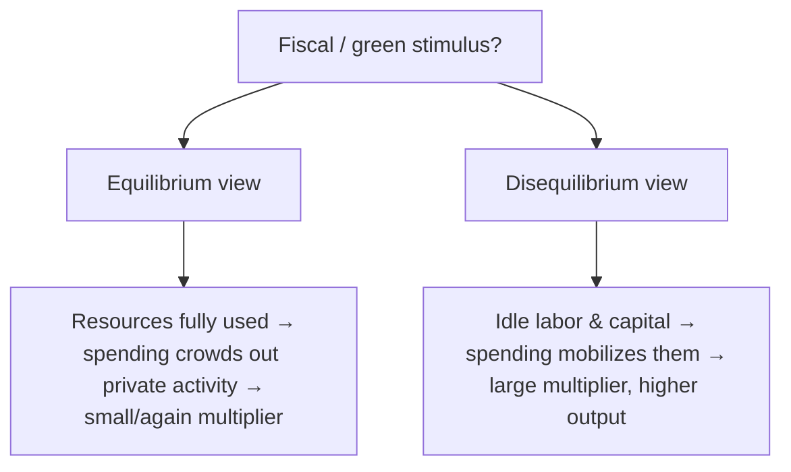

# Equilibrium vs Disequilibrium

!!! abstract "A theory of how coordination happens"
    Does the economy **clear** — supply meeting demand at prices the model solves for —
    or can it sit for years in **imbalance**, with unemployment, idle capacity, and
    unmet demand? This is not a modeling nicety; it is a claim about *how an economy
    coordinates itself*, and it is arguably the **single most consequential and
    contested assumption** in economic policy modeling. It divides the neoclassical
    mainstream from post-Keynesian, structuralist, and complexity traditions.

## The two worldviews

=== "Equilibrium — markets clear"
    Prices adjust (instantly, or toward a steady state) so that supply equals demand in
    every market **simultaneously**. Agents are *on* their supply and demand curves. The
    economy is, in effect, always at (or converging to) a coordinated optimum.

    **Referents:** [CGE](../model-families/economics/cge.md) (Walrasian general
    equilibrium), [DSGE](../model-families/economics/dsge.md) (stochastic equilibrium +
    rational expectations), [GTAP](../model-families/economics/gtap.md).

=== "Disequilibrium — imbalances persist"
    Markets need *not* clear. There can be **involuntary unemployment**, rationing,
    inventories, and demand-led output. Adjustment is slow, adaptive, and path-dependent;
    the economy may never reach — or may have many — "equilibria."

    **Referents:** [E3ME](../model-families/economics/e3me.md) (macro-econometric,
    post-Keynesian), agent-based macroeconomics, some
    [system-dynamics](../model-families/frameworks/vensim.md) models.

## The comparison matrix

| Dimension | **Equilibrium** | **Disequilibrium** |
|-----------|-----------------|--------------------|
| Do markets clear? | Yes, simultaneously | Not necessarily |
| Unemployment | Voluntary / frictional only (or via closure) | Involuntary, persistent |
| Output determination | Supply-side (resources, technology) | Often demand-led (Keynesian) |
| Expectations | Rational / model-consistent | Adaptive, backward-looking, heuristic |
| Prices | Clear markets | Sticky, cost-plus, may not clear |
| Uniqueness | Usually a unique equilibrium | Multiple states / path dependence |
| Micro-foundation | Optimizing agents | Estimated behavior / rules of thumb |
| Welfare interpretation | Clean (equivalent variation) | Contested / secondary |
| Policy multiplier | Often small (crowding out) | Can be large (idle resources) |
| Intellectual home | Neoclassical | Post-Keynesian, structuralist, complexity |
| Exemplars | CGE, DSGE, GTAP | E3ME, ABM macro, some SD |

## Why the choice matters for policy

The assumption **quietly decides the answer** to the most important policy questions:

- In an **equilibrium** model, factors are (essentially) fully employed, so a green
  investment push mostly *reallocates* activity — the modeled cost of climate policy
  tends to be a **net GDP cost**.
- In a **disequilibrium** model with idle resources, the same push can *raise*
  employment and output — climate policy can show a **net GDP benefit**.

This is why [E3ME](../model-families/economics/e3me.md) (disequilibrium) and a
[CGE](../model-families/economics/cge.md) (equilibrium) can reach *opposite* headline
conclusions on the same carbon policy. **Neither is a bug** — they encode different
theories of macro coordination, and the atlas documents both.

## When each is appropriate

- **Equilibrium** when analyzing **long-run, resource-constrained** questions where
  full utilization is a reasonable idealization (long-run tax incidence, trade patterns,
  the eventual allocation after adjustment), and when welfare-theoretic cleanliness matters.
- **Disequilibrium** when **short-to-medium-run demand, unemployment, and adjustment
  frictions** dominate — recessions, stimulus, transitions with stranded assets and
  slack — or when the very existence of a unique equilibrium is doubtful.

## Where each fails

!!! warning "Equilibrium's failure modes"
    - Assumes away the phenomenon (unemployment, crises) that policy most cares about.
    - Instantaneous, frictionless coordination is empirically heroic; **DSGE's inability
      to represent 2008** is the canonical indictment.
    - Full-employment closure can *build in* the conclusion that stimulus doesn't work.

!!! warning "Disequilibrium's failure modes"
    - Weaker theoretical discipline; behavior is estimated or assumed, risking the
      **Lucas critique** (relationships may not survive policy changes).
    - Contested welfare interpretation; harder to derive normative "optimal" policy.
    - Freer parameters can make results depend heavily on modeler choices.

## The synthesis frontier

- **Frictions inside equilibrium** — New Keynesian DSGE adds sticky prices and (post-2008)
  financial frictions and occasionally-binding constraints, importing disequilibrium-like
  behavior into an equilibrium frame.
- **Agent-based macro** — build the macroeconomy from heterogeneous, boundedly rational
  agents; equilibrium (if any) is *emergent*, not assumed (cf.
  [Optimization vs Simulation](optimization-vs-simulation.md)).
- **Closure as a switch** — as [CGE](../model-families/economics/cge.md) shows,
  neoclassical vs Keynesian behavior can be a *closure choice* over similar accounts.

### Lesson for the integrated simulator

!!! quote "If we were designing the world's most capable policy simulator today…"
    The market-clearing assumption should be a **dial, not a hard-wired belief**. Because
    equilibrium and disequilibrium closures can produce *opposite signs* on headline
    policy results, an integrated simulator must (1) make the coordination assumption an
    **explicit, switchable component** — Walrasian clearing, sticky-price frictions, or
    emergent agent-based coordination — and (2) **report results as conditional on it**,
    ideally running the *same* policy under multiple closures so users see the range. The
    goal is not to adjudicate a century-old dispute but to make its stakes visible:
    whenever a model reports that climate or fiscal policy "costs X% of GDP," the
    simulator should surface how much of that number is economics and how much is the
    unexamined assumption that the economy was already using all its resources.

## See also

- [Taxonomy — Axis 3](../foundations/taxonomy.md)
- Referents: [CGE](../model-families/economics/cge.md) · [DSGE](../model-families/economics/dsge.md) (equilibrium) · [E3ME](../model-families/economics/e3me.md) (disequilibrium)
- Related: [Optimization vs Simulation](optimization-vs-simulation.md) · [Top-Down vs Bottom-Up](top-down-vs-bottom-up.md) · [Comparative hub](index.md)
