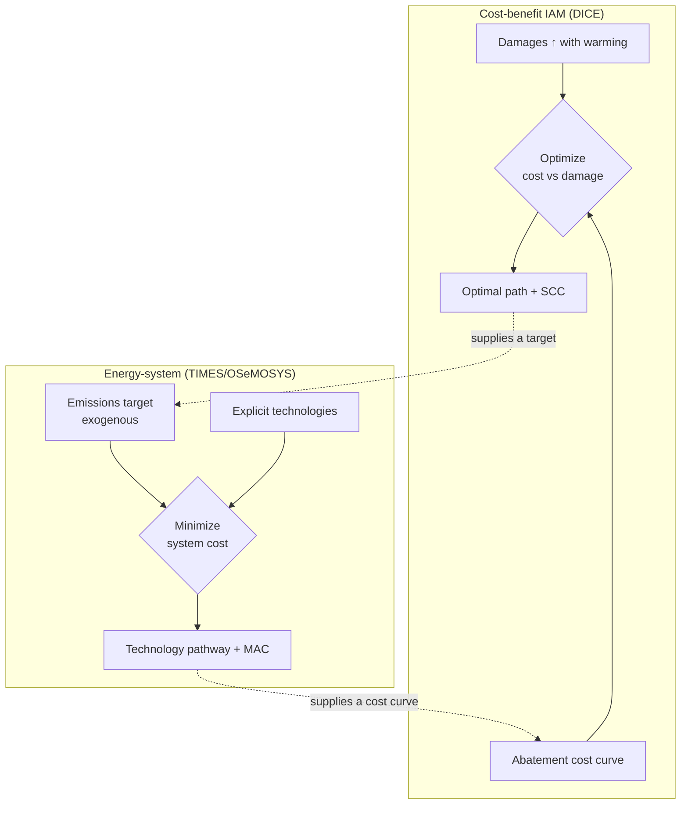

# IAM vs Energy-System Models

!!! abstract "Two scales of the same climate problem"
    Both **integrated assessment models (IAMs)** and **energy-system models** are built to
    inform climate policy — but they cut the problem at different scales. A cost-benefit
    IAM like [DICE](../model-families/climate-iam/dice.md) compresses the *entire world
    economy and climate* into a few aggregate equations to ask **"how much should we abate,
    all things considered?"** An energy-system model like
    [TIMES](../model-families/energy/times.md) or
    [OSeMOSYS](../model-families/energy/osemosys.md) resolves *hundreds of specific
    technologies* to ask **"what is the least-cost way to actually deliver a given energy or
    emissions target?"** They are complements, and confusing their outputs is a common
    policy error. All three referents here are **Gold dossiers**.

## The two scales

=== "IAM (cost-benefit) — the whole system, coarsely"
    A tiny, tractable coupling of a **macro-economy**, an **emissions/abatement** relation,
    and a **carbon-climate** module, optimized end-to-end to trade the *cost* of abatement
    against the *damage* of warming. Output: an **optimal emissions path** and a **social
    cost of carbon**.

    **Referents:** [DICE](../model-families/climate-iam/dice.md) (and FUND, PAGE); the
    cost-benefit branch of the IAM family.

=== "Energy-system — one sector, finely"
    A large **bottom-up** representation of the energy system — resources, conversion
    technologies, infrastructure, and end-use demands — solved for **least cost** subject to
    policy constraints. Output: **technology deployment and dispatch pathways** and
    **marginal abatement costs**.

    **Referents:** [TIMES](../model-families/energy/times.md),
    [OSeMOSYS](../model-families/energy/osemosys.md), PyPSA; the bottom-up energy family.

!!! note "A caveat on a broad family name"
    "IAM" also covers large **process-based / detailed-process IAMs** (GCAM, MESSAGEix,
    REMIND, IMAGE) that *embed* an energy-system model inside a broader land-economy-climate
    frame. This matrix contrasts the **cost-benefit IAM** archetype (DICE) with
    **stand-alone energy-system** models; the process-based IAMs are precisely the
    **hybrid** that blends the two (see the synthesis section).

## The comparison matrix

| Dimension | **Cost-benefit IAM** (DICE) | **Energy-system model** (TIMES/OSeMOSYS) |
|-----------|------------------------------|-------------------------------------------|
| Core question | *How much* abatement is optimal? | *How* to meet a target at least cost? |
| Objective | Max net welfare (benefits − costs) | Min system cost s.t. constraints |
| Scope | Whole economy + climate, aggregated | Energy sector, disaggregated |
| Technology detail | None (a cost curve) | Hundreds of explicit technologies |
| Climate module | Yes — carbon cycle + temperature | Usually none (emissions accounting only) |
| Damages | **Endogenous** (damage function) | **Absent** — target is exogenous |
| Emissions target | Output of the optimization | Input constraint |
| Signature output | Social cost of carbon; optimal path | Technology pathway; marginal abatement cost |
| Spatial/temporal detail | Global, decadal | Regional, sub-annual time slices |
| Size | ~tens of equations | ~$10^5$–$10^6$ variables (LP) |
| Normative content | Strong (welfare-optimal) | Weak (cost-min *given* a goal) |
| Key uncertainty | Damage fn, discount rate | Technology costs, resource limits, demand |
| Exemplars | DICE, FUND, PAGE | TIMES, OSeMOSYS, PyPSA |

## How they answer differently

The two models are **naturally complementary**: the IAM's optimal path (or SCC) can *set
the target* an energy-system model then delivers in technological detail; conversely, the
energy-system model's marginal abatement cost curve is *exactly the abatement-cost input*
an IAM represents only as a stylized function. Each supplies what the other assumes.

## When each is appropriate

- **Cost-benefit IAM** for **framing, first-order, "how-much" questions**: the social cost
  of carbon, the optimal global carbon price, the rough timing of abatement, and
  transparent sensitivity to discounting and damages. Its virtue is that it is small enough
  to fully understand.
- **Energy-system model** for **implementation, "how" questions**: which technologies,
  built when and where, to hit a decarbonization target at least cost — including the
  lumpy, network, and dispatch realities the IAM cost curve hides.

## Where each fails

!!! warning "Cost-benefit IAM failure modes"
    - The **damage function** is the weakest link — poorly constrained, and it *drives the
      answer* (the [DICE](../model-families/climate-iam/dice.md) Stern/Weitzman critiques).
    - No technological resolution: cannot say *how* to abate, or whether the path is
      feasible with real infrastructure.
    - Aggregate cost curves hide the lumpiness, lock-in, and networks energy models capture.

!!! warning "Energy-system failure modes"
    - **No damages, no climate feedback** — it optimizes cost against an *assumed* target,
      not against warming itself; it cannot tell you *whether* the target is worth it.
    - Perfect-foresight least cost overstates coordination and understates behavioral/market
      frictions (see [Top-Down vs Bottom-Up](top-down-vs-bottom-up.md)).
    - Huge data appetite; results hinge on technology-cost and demand assumptions.

## The synthesis frontier

- **Process-based / detailed IAMs** (GCAM, MESSAGEix, REMIND, IMAGE) *are* the synthesis —
  a detailed energy (and land) system embedded in a climate-economy frame, giving both
  technological detail and a climate response, at the cost of transparency.
- **Soft-linking** — run a cost-benefit IAM and an energy-system model iteratively, passing
  a carbon price/target one way and a marginal-abatement-cost curve the other, until they
  agree.
- **The recurring atlas move** — this is another instance of *route the question to the
  right scale and reconcile*, as in [Top-Down vs Bottom-Up](top-down-vs-bottom-up.md).

### Lesson for the integrated simulator

!!! quote "If we were designing the world's most capable policy simulator today…"
    An IAM and an energy-system model are **the same climate problem at two resolutions**,
    and the simulator's job is to let them **inform each other rather than compete**. The
    design implication is a **multi-scale architecture**: a compact cost-benefit core that
    reasons about damages, discounting, and the *worth* of a target, coupled to a
    high-resolution [energy-dispatch engine](../patterns/energy-dispatch-engine.md) that
    reasons about *how* to hit it — with a defined handshake (a carbon price / target flowing
    down, a marginal-abatement-cost curve flowing up) iterated to consistency. Crucially the
    simulator should let the user **choose the resolution per question** — a coarse SCC
    estimate when framing, full technological detail when planning deployment — and never let
    an energy model's silence on damages be mistaken for a claim that a target is optimal,
    nor an IAM's stylized cost curve be mistaken for a feasible engineering plan.

## See also
- Referents: [DICE](../model-families/climate-iam/dice.md) (IAM) · [TIMES](../model-families/energy/times.md) · [OSeMOSYS](../model-families/energy/osemosys.md) (energy)
- Related: [Top-Down vs Bottom-Up](top-down-vs-bottom-up.md) · [Optimization vs Simulation](optimization-vs-simulation.md) · [Energy Dispatch Engine](../patterns/energy-dispatch-engine.md)
- [Taxonomy](../foundations/taxonomy.md) · [Comparative hub](index.md)
