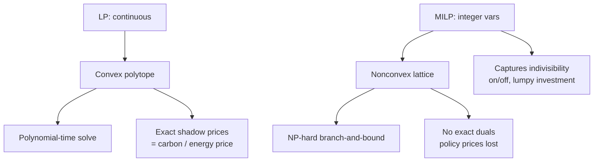

# LP vs MILP

!!! abstract "The price of an integer"
    [Linear programming](../paradigms/algorithms/lp.md) and
    [mixed-integer LP](../paradigms/algorithms/milp.md) look almost identical on the page —
    the same linear objective and constraints — but forcing even a few variables to be
    **integers** transforms the problem from *polynomial-time, globally optimal, and
    dual-priced* into *NP-hard, nonconvex, and price-less*. That single modeling decision
    ripples through tractability, interpretability, and what policy questions the model can
    answer. It is the most consequential **algorithmic** choice in bottom-up energy
    modeling.

## The two formulations

=== "LP — everything divisible"
    All variables are continuous. The feasible region is a convex **polytope**; the optimum
    sits at a vertex, found in polynomial time, and every constraint yields a **shadow
    price**. You can build "0.37 of a power plant" — an acceptable idealization at national
    scale.

    **Referents:** [OSeMOSYS](../model-families/energy/osemosys.md),
    [TIMES](../model-families/energy/times.md) (both deliberately LP).

=== "MILP — some choices indivisible"
    Some variables must be integers (often binary $\{0,1\}$): build-or-not, on-or-off,
    this-technology-or-that. The feasible set becomes a **nonconvex lattice**; solving means
    searching a branch-and-bound tree, and exact shadow prices **no longer exist**.

    **Referents:** unit-commitment power models, **PyPSA** with integer commitment,
    facility-location and scheduling models.

## The comparison matrix

| Dimension | **LP** | **MILP** |
|-----------|--------|----------|
| Variables | Continuous | Some integer / binary |
| Feasible region | Convex polytope | Nonconvex lattice |
| Complexity | **Polynomial-time** | **NP-hard** |
| Global optimum | Guaranteed | Guaranteed *if solved to gap 0* (often costly) |
| Typical scale | $10^6$–$10^7$ variables, seconds | thousands of binaries can take hours |
| Algorithm | Simplex / interior-point | Branch-and-bound / branch-and-cut |
| **Shadow prices / duals** | **Yes — exact** | **No** (only relaxation duals, inexact) |
| Represents indivisibility | No (fractional builds) | **Yes** (discrete decisions) |
| Represents on/off, start-up | No | Yes (unit commitment) |
| Solution reporting | Optimal | Often "within X% of optimal" (gap) |
| Policy legibility | High (marginal prices) | Lower (no clean carbon/energy price) |
| Exemplars | OSeMOSYS, TIMES, PyPSA-LP | Unit commitment, PyPSA-MILP, OR models |

## Why the integer changes everything

The **loss of duals** is the subtle, decisive consequence. Bottom-up energy models exist
largely to produce **marginal abatement costs and shadow carbon prices** — and those are
*dual variables*. Go MILP and that headline output becomes ill-defined. This is precisely
why [OSeMOSYS](../model-families/energy/osemosys.md) and
[TIMES](../model-families/energy/times.md) stay LP and tolerate fractional capacity: at a
national/decadal scale, "0.37 of a plant" is a rounding matter, but a **clean carbon price
is the whole point**.

## When each is appropriate

- **LP** when quantities are **effectively divisible** at the model's scale (aggregate
  capacity, energy flows) and you need **marginal prices** and fast, large-scale, provably
  optimal solutions — i.e. most system-wide energy and economic planning.
- **MILP** when **indivisibility genuinely changes the answer**: unit commitment
  (min up/down times, start-up costs), discrete plant sizing, network/topology design,
  siting, and scheduling — where pretending a decision is continuous would be nonsense.

## Where each fails

!!! warning "LP's failure modes"
    - Cannot represent genuinely discrete decisions — fractional builds/commitment can be
      physically meaningless at fine temporal/spatial resolution.
    - Convexity forbids economies of scale, fixed costs, and threshold effects (must be
      linearized away).

!!! warning "MILP's failure modes"
    - **Combinatorial blow-up** — a few thousand binaries can be intractable; may not close
      the optimality gap.
    - **No exact shadow prices** — forfeits the marginal carbon/energy prices that are often
      the model's primary deliverable.
    - Results can depend on solver tolerances and formulation tightness.

## The synthesis frontier

- **Tight formulations & decomposition** — better MILP encodings, Benders/Dantzig-Wolfe
  decomposition, and column generation push the tractable frontier outward.
- **LP relaxation + rounding** — solve the LP, round the few decisions that must be integer,
  repair feasibility — recovering most of LP's speed and prices.
- **Convex-hull pricing** — research on *approximate* prices for nonconvex (unit-commitment)
  markets, trying to restore a usable "shadow price" to MILP.

### Lesson for the integrated simulator

!!! quote "If we were designing the world's most capable policy simulator today…"
    The LP↔MILP boundary should be an **explicit, costed switch**, never an accident. Because
    integrality forfeits the shadow prices that make optimization outputs policy-legible —
    and can turn a seconds-long solve into an intractable one — the simulator should keep
    each subsystem in [LP](../paradigms/algorithms/lp.md) wherever a continuous relaxation is
    honest, **quarantine unavoidable discrete decisions into the smallest possible
    [MILP](../paradigms/algorithms/milp.md) block**, and surface the **optimality-gap
    tolerance** as a first-class dial. When a subsystem *must* be MILP, the simulator should
    also compute and label an **approximate price** (e.g. convex-hull or relaxation dual) so
    the user is never silently left without the marginal cost they came for. In short: treat
    "add an integer" as a decision with a known bill, not a free modeling convenience.

## See also
- Referents: [LP](../paradigms/algorithms/lp.md) · [MILP](../paradigms/algorithms/milp.md) · [OSeMOSYS](../model-families/energy/osemosys.md) · [TIMES](../model-families/energy/times.md)
- Related: [Optimization vs Simulation](optimization-vs-simulation.md) · [IAM vs Energy-System Models](iam-vs-energy.md) · [Energy Dispatch Engine](../patterns/energy-dispatch-engine.md)
- [Taxonomy — Axis 8](../foundations/taxonomy.md) · [Comparative hub](index.md)
