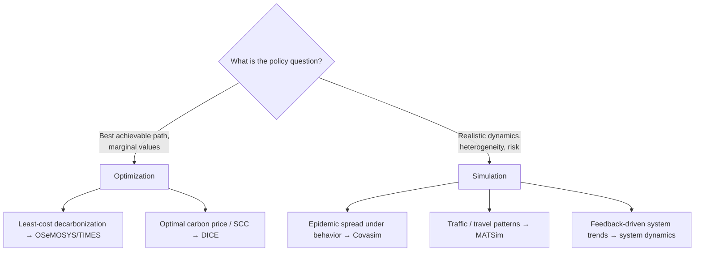

# Optimization vs Simulation

!!! abstract "The deepest divide in policy modeling"
    Every model on [Axis 1 of the taxonomy](../foundations/taxonomy.md) sits somewhere
    between two poles. **Optimization** models *solve for* the best decision. **Simulation**
    models *evolve* a system and observe what emerges. The choice is not a technical
    detail — it encodes whether you are asking a **normative** question ("what is the
    best we could do?") or a **positive** one ("what will actually happen?"). Most
    modeling disputes trace back to answering one question with a tool built for the other.

## The two philosophies

=== "Optimization — *what is best?*"
    Posit an **objective** and **constraints**; a solver computes the decision path that
    extremizes the objective. A single solve returns *the* optimum.

    $$\max_{u(\cdot)} \; \int_0^T \mathcal{U}(x,u)\,dt \quad \text{s.t.}\quad \dot{x}=f(x,u),\; g(x,u)\le 0$$

    **Referents in this atlas:** [DICE](../model-families/climate-iam/dice.md) (welfare
    max), [OSeMOSYS](../model-families/energy/osemosys.md) (least cost),
    [TIMES](../model-families/energy/times.md) (max surplus).

=== "Simulation — *what will happen?*"
    Specify **rules** — behavioral equations, transition probabilities, agent heuristics —
    and step the system forward. Outcomes are **emergent**; nothing is maximized at the
    system level.

    $$x_{t+1} = F(x_t,\,\varepsilon_t;\,\theta) \quad\text{(step forward, observe)}$$

    **Referents:** agent-based models ([Mesa](../model-families/frameworks/mesa.md),
    [MATSim](../model-families/transport/matsim.md), [Covasim](../model-families/health/covasim.md)),
    system dynamics ([Vensim](../model-families/frameworks/vensim.md)),
    [EnergyPLAN](../model-families/energy/energyplan.md) (rule-based dispatch).

## The comparison matrix

| Dimension | **Optimization** | **Simulation** |
|-----------|------------------|----------------|
| Question | Normative — *what is best?* | Positive — *what will happen?* |
| Core object | Objective + constraints | Rules / behaviors / transitions |
| System-level goal | Yes — extremized | None — emergent |
| Agent rationality | Perfectly rational (globally) | Bounded / heuristic / heterogeneous |
| Foresight | Often perfect | Typically none / adaptive |
| Typical math | LP, MILP, NLP, optimal control | ODEs, stochastic stepping, agent rules |
| Outcome | One optimum per scenario | A distribution of outcomes |
| Equilibrium | Usually assumed/computed | May never reach equilibrium |
| Interpretability | High — duals, shadow prices | Lower — path-dependent, emergent |
| Calibration burden | Moderate (costs, elasticities) | High (behavioral rules, networks) |
| Computational cost | Solve-once (can be huge LP/MILP) | Many runs (Monte-Carlo ensembles) |
| Policy output | Optimal path + marginal values (e.g. SCC, carbon price) | Scenario trajectories, risk distributions |
| Fails when… | agents don't optimize / can't foresee | you need a *best* answer; calibration thin |

## Where each is appropriate

- **Use optimization** when there is a defensible objective (cost, welfare) and you want
  the **frontier of the possible** or a **shadow price** — the marginal value of a
  constraint (a carbon cap's price, a fuel's marginal cost). Optimization *prescribes*.
- **Use simulation** when behavior, heterogeneity, and out-of-equilibrium dynamics
  dominate, when there is **no single objective** society agrees on, or when you need a
  **distribution of outcomes** and tail risk rather than a point optimum. Simulation
  *describes*.

## Where each fails

!!! warning "Optimization's failure modes"
    - **The clairvoyant planner.** Perfect foresight and a single optimizing agent are
      idealizations; real actors are myopic, strategic, and heterogeneous. An "optimal"
      transition may be behaviorally unreachable.
    - **Objective smuggling.** The result is only as legitimate as the objective. DICE's
      social cost of carbon swings by an order of magnitude with the discount rate — a
      value judgment hidden inside a maximization.
    - **Convexity pressure.** Tractable optimization prefers convex, smooth worlds;
      tipping points, increasing returns, and lumpy decisions are awkward (MILP) or
      excluded.

!!! warning "Simulation's failure modes"
    - **No normative anchor.** It tells you what *happens* under assumed rules, not what
      is *best* — unhelpful when the question is "what should we do?"
    - **Calibration fragility.** Emergent results can be exquisitely sensitive to
      behavioral rules that are hard to identify from data.
    - **Interpretability.** Path dependence and stochasticity make it harder to attribute
      outcomes to causes than reading an optimizer's duals.

## The synthesis frontier

The interesting systems live **between** the poles, and the best modern practice couples them:

- **Optimization inside simulation** — agents each solve small optimizations, but the
  macro outcome is simulated and emergent (e.g., [MATSim](../model-families/transport/matsim.md)
  agents optimize daily plans yet the system relaxes to an equilibrium via iteration).
- **Simulation inside optimization** — an optimizer chooses policy while a simulated
  world evaluates it (reinforcement learning; robust/scenario optimization over
  simulated ensembles).
- **Elastic-demand partial equilibrium** ([TIMES](../model-families/energy/times.md)) is
  itself a hybrid: an optimization whose solution *is* a market equilibrium.

### Lesson for the integrated simulator

!!! quote "If we were designing the world's most capable policy simulator today…"
    Do not pick a side. An integrated simulator should treat **optimization and
    simulation as interchangeable back-ends behind a common problem interface**, and
    route each subsystem to the appropriate one: an energy subsystem may be a least-cost
    LP, a household sector an agent-based simulation, a climate module a deterministic
    emulator — coupled through shared state. Crucially, it should make the
    **normative/positive boundary explicit**: label which outputs are *prescriptions*
    (contingent on an objective and its value judgments) and which are *descriptions*
    (contingent on behavioral assumptions), so users never mistake an optimizer's
    "optimal" for a forecast, or a simulation's trajectory for a recommendation.

## See also

- [Taxonomy — Axis 1](../foundations/taxonomy.md)
- Referents: [DICE](../model-families/climate-iam/dice.md) · [OSeMOSYS](../model-families/energy/osemosys.md) · [TIMES](../model-families/energy/times.md)
- Related matrices: [Comparative Analyses hub](index.md)
