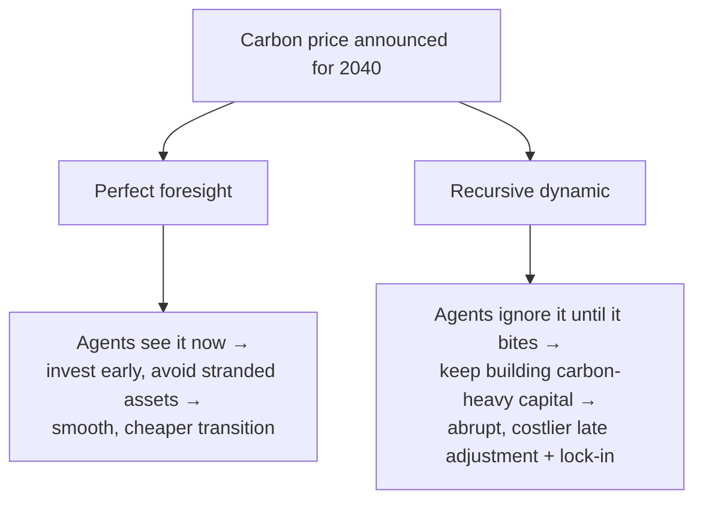

# Recursive-Dynamic vs Perfect Foresight

!!! abstract "How much does the model know about its own future?"
    A dynamic policy model must take a stance on **foresight**: does it optimize the *entire*
    trajectory at once, choosing today's investment in full knowledge of every future price,
    policy, and technology (**perfect foresight**) — or does it step forward period by
    period, deciding each step with only current information and expectations (**recursive
    dynamic / myopic**)? This is [Taxonomy Axis 4](../foundations/taxonomy.md), and it
    quietly determines how "smart" the modeled economy is about anticipating change — which
    can move the cost of a pre-announced policy by a wide margin.

## The two temporal stances

=== "Perfect foresight — solve the whole path at once"
    All periods are optimized **simultaneously**; agents anticipate the entire future
    perfectly. A pre-announced carbon price decades out changes investment *today*. One
    single, large intertemporal optimization.

    **Referents:** [DICE](../model-families/climate-iam/dice.md) (intertemporal welfare
    optimum), [TIMES](../model-families/energy/times.md) (least cost over the full horizon),
    forward-looking [DSGE](../model-families/economics/dsge.md) and Ramsey-type CGE.

=== "Recursive dynamic — step through time myopically"
    The model solves **one period at a time**, carries state (capital, capacity) forward, and
    re-solves the next period. Agents use current/adaptive expectations, *not* full knowledge
    of the future. A sequence of smaller static-ish problems linked by state.

    **Referents:** recursive-dynamic [CGE](../model-families/economics/cge.md) (the common
    workhorse form), [GCAM](../model-families/climate-iam/dice.md) and many process-based
    IAMs, myopic [energy](../model-families/energy/osemosys.md) runs.

## The comparison matrix

| Dimension | **Perfect Foresight** | **Recursive Dynamic** |
|-----------|------------------------|------------------------|
| Solved as | One intertemporal optimization | Sequence of per-period solves |
| Knowledge of future | Complete (clairvoyant) | None / adaptive expectations |
| Anticipation effects | Yes — future policy moves today | No — reacts only when policy arrives |
| Expectations | Model-consistent / rational | Myopic, backward-looking, adaptive |
| Computational structure | Large coupled system | Many smaller linked problems |
| Scale behavior | Harder as horizon grows (all at once) | Scales gently (decoupled steps) |
| Time-consistency | Consistent by construction | Can be time-inconsistent |
| Realism of behavior | Heroic (nobody foresees perfectly) | Arguably closer to real agents |
| Policy cost of pre-announced reform | Lower (smooth early adjustment) | Higher (abrupt, late adjustment) |
| Path dependence / lock-in | Under-represented (optimizer avoids it) | Naturally represented |
| Exemplars | DICE, TIMES, forward DSGE | Recursive CGE, GCAM, myopic energy |

## Why foresight changes the answer

- **Perfect foresight** tends to make policy look **cheaper and smoother**: the clairvoyant
  economy pre-positions, spreading adjustment over decades and never stranding an asset it
  could have foreseen.
- **Recursive dynamic** tends to make the *same* policy look **costlier and lumpier**: myopic
  agents over-invest in soon-obsolete capital and then must scramble, exhibiting realistic
  **lock-in** and stranded assets.

Neither is "right" — they bracket a real uncertainty about how much economic actors actually
anticipate announced policy.

## When each is appropriate

- **Perfect foresight** for **normative long-run** questions where the interesting object is
  the *efficient* trajectory and its shadow prices — the optimal carbon price, the
  least-cost transition, the welfare frontier. It answers "what is the best path?"
- **Recursive dynamic** for **positive, transition-focused** questions where **lock-in,
  stranded assets, adjustment costs, and realistic (limited) anticipation** matter — the
  messy politics and dynamics of *actually getting there*. It answers "what is likely to
  happen step by step?"

## Where each fails

!!! warning "Perfect foresight's failure modes"
    - **Clairvoyance is empirically false** — no agent foresees decades of prices/policy;
      the model can *understate* transition costs and *erase* lock-in.
    - Large horizon-wide solves are heavy and can be brittle.
    - Assumes commitment — real policy is revised, breaking the foresight the model assumed.

!!! warning "Recursive dynamic's failure modes"
    - **Myopia is also extreme** — real agents do anticipate *somewhat*; pure myopia can
      *overstate* costs and lock-in.
    - No clean intertemporal optimum → weaker welfare interpretation.
    - Can be **time-inconsistent**; results sensitive to the assumed expectation rule.

## The synthesis frontier

- **Imperfect / adaptive foresight** — a middle ground: agents optimize over a *rolling
  finite window* (limited foresight), or update expectations adaptively — bracketing the two
  extremes instead of choosing one.
- **Myopic-but-learning** — recursive models with expectation updating or scenario learning.
- **Foresight as a dial** — run the *same* policy under perfect and myopic foresight and
  report the **range**, treating the gap as a measure of "anticipation risk."

### Lesson for the integrated simulator

!!! quote "If we were designing the world's most capable policy simulator today…"
    Foresight must be an **explicit, switchable assumption**, because it silently sets how
    cheaply a pre-announced reform appears to work. Perfect foresight and pure myopia are the
    two ends of a real spectrum of *how much agents anticipate policy*, and the honest
    simulator should support **limited/rolling-horizon foresight** in between — and, for any
    headline transition cost, run the policy at **multiple foresight levels** and report the
    spread. The design payoff is separating two things models usually conflate: the *physical
    and economic cost* of a transition, and the *behavioral assumption* about how well the
    economy saw it coming. Lock-in and stranded assets — which perfect foresight erases and
    pure myopia exaggerates — should be **observable outputs** the user can watch respond as
    they turn the foresight dial.

## See also
- Referents: [DICE](../model-families/climate-iam/dice.md) · [TIMES](../model-families/energy/times.md) (perfect foresight) · recursive-dynamic [CGE](../model-families/economics/cge.md)
- Related: [Optimization vs Simulation](optimization-vs-simulation.md) · [Equilibrium vs Disequilibrium](equilibrium-vs-disequilibrium.md) · [IAM vs Energy-System Models](iam-vs-energy.md)
- [Taxonomy — Axis 4 (Foresight)](../foundations/taxonomy.md) · [Comparative hub](index.md)
