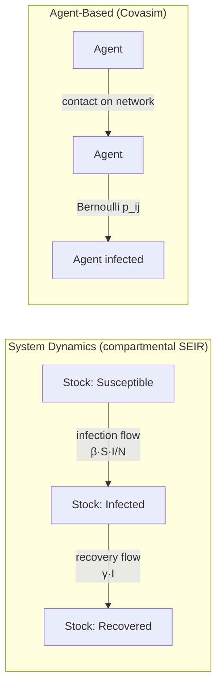

# System Dynamics vs Agent-Based

!!! abstract "Two simulation paradigms — aggregate feedback vs individual interaction"
    Both are **simulation** (no optimization, no imposed equilibrium), so both live on the
    "emergent" side of [Optimization vs Simulation](optimization-vs-simulation.md). But
    they build a system from opposite ends. **System dynamics (SD)** works *top-down in the
    aggregate*: a handful of **stocks** connected by **flows** and **feedback loops**,
    integrated as ODEs. **Agent-based modeling (ABM)** works *bottom-up from individuals*:
    many heterogeneous agents following rules on a network, with macro behavior *emerging*.
    This chapter pairs a Gold [SD referent (Vensim)](../model-families/frameworks/vensim.md)
    with a Gold [ABM referent (Covasim)](../model-families/health/covasim.md).

## The two worldviews

=== "System Dynamics — aggregate feedback"
    Represent a population or economy as **continuous aggregate stocks** (how many
    infected, how much capital) and specify the **flow rates** and **feedback loops** that
    move them. Individuals are *homogenized* into the stock; the model is a set of coupled
    ODEs integrated forward. Emphasis: **endogenous feedback, delays, accumulation**.

    **Referents:** [Vensim](../model-families/frameworks/vensim.md), Stella; landmark
    models World3, C-ROADS.

=== "Agent-Based — individual interaction"
    Represent each **individual** with its own state and rules; let them interact on a
    **network** and let the aggregate *emerge* from the bottom up. Emphasis:
    **heterogeneity, discreteness, local interaction, stochasticity**.

    **Referents:** [Covasim](../model-families/health/covasim.md),
    [MATSim](../model-families/transport/matsim.md), Mesa/NetLogo models.

## The comparison matrix

| Dimension | **System Dynamics** | **Agent-Based** |
|-----------|---------------------|-----------------|
| Unit of representation | Aggregate **stocks** (compartments) | Individual **agents** |
| Direction of build | Top-down aggregate | Bottom-up emergent |
| State space | Continuous levels | Discrete per-agent states |
| Time | Continuous (ODE integration) | Discrete steps (or event-driven) |
| Heterogeneity | Homogenized away (or few stocks) | **Native, unlimited** |
| Interaction | Aggregate feedback loops | **Local**, network/spatial |
| Core mathematics | Coupled ODEs, feedback | Stochastic rules, Monte-Carlo |
| Randomness | Deterministic core (+ sensitivity) | **Intrinsically stochastic** |
| Output | Smooth aggregate trajectories | Distributions; emergent patterns |
| Emergence | Limited (structure is imposed) | **Central** (macro from micro) |
| Computational cost | Low (fast integration) | High (many agents × seeds) |
| Transparency | High (readable loop diagrams) | Lower (emergent, path-dependent) |
| Best at | Feedback, delays, accumulation | Heterogeneity, networks, thresholds |
| Exemplars | Vensim/World3, C-ROADS | Covasim, MATSim, Schelling |

## The same problem, two ways: an epidemic

The clearest illustration is disease — a domain modeled *both* ways:

- The **SD/SEIR** version is three stocks and two flows — a few ODEs, instantly solved,
  giving a smooth mean curve. It assumes **perfect mixing** (any infected can infect any
  susceptible) and **homogeneous** agents.
- The **ABM** ([Covasim](../model-families/health/covasim.md)) version tracks each person
  on a contact network, producing **superspreading, stochastic extinction, and
  intervention detail** (test-trace-quarantine) the aggregate model cannot represent —
  at far higher computational cost.

Neither is "right": the SD model is the correct tool for fast, transparent,
feedback-focused analysis; the ABM is correct when **heterogeneity and network structure
change the answer**.

## When each is appropriate

- **System Dynamics** when the dynamics are dominated by **feedback, delays, and
  accumulation** at an aggregate level, when transparency and speed matter, and when
  heterogeneity is second-order: climate-carbon-economy feedback, resource depletion,
  supply chains, strategy, participatory/stakeholder modeling.
- **ABM** when **heterogeneity, local interaction, networks, thresholds, or discreteness**
  drive the outcome: epidemics with contact structure, segregation, traffic, financial
  contagion, technology diffusion, tipping points.

## Where each fails

!!! warning "System Dynamics' failure modes"
    - Aggregation hides heterogeneity and networks — can't represent superspreaders,
      segregation, or individual-level policy targeting.
    - Structure (loops, table functions) is the modeler's choice; dramatic results can hinge
      on assumed feedbacks (the *Limits to Growth* critique).
    - Perfect-mixing / well-stirred assumption is often unrealistic.

!!! warning "Agent-Based's failure modes"
    - Computationally heavy; calibration under **equifinality** is hard.
    - Many rule/parameter choices, often unobserved → fragile identification.
    - Emergent, path-dependent output is harder to interpret and communicate.
    - Behavior is frequently exogenous — may assume the responses it should explain.

## The synthesis frontier

- **Multi-method platforms** — **AnyLogic** runs SD, ABM, and discrete-event *in one
  model*, letting an aggregate stock (e.g. a market price, an ambient infection level) set
  agent environments while agents' actions feed the stocks.
- **Hybrid epidemic/economy** — an ABM for within-population transmission coupled to SD
  stock-flow accounts for the macro resources and feedbacks.
- **Aggregation theory** — deriving when an ABM's mean behavior *reduces* to an SD/ODE
  (mean-field limits), clarifying exactly when the cheaper SD model is safe.

### Lesson for the integrated simulator

!!! quote "If we were designing the world's most capable policy simulator today…"
    SD and ABM are the two halves of the simulator's **non-equilibrium hemisphere**, and
    the design goal is to run them **together, at the resolution each question needs**.
    System dynamics supplies the **aggregate accounting and feedback backbone** —
    conserved stocks of carbon, capital, water, population integrated through time; ABM
    supplies **individual heterogeneity and network structure** where they change the
    result. A capable simulator should let a subsystem be modeled as **stocks when
    mean-field is adequate and as agents when it is not**, share state across the boundary
    (aggregate conditions shape agent environments; agent outcomes update the stocks), and
    ideally **check the two against each other** — running an ABM and its SD reduction on
    the same question, and treating a divergence as a signal that heterogeneity matters.
    This is the same "route each question to the valid paradigm, and surface disagreement"
    principle that governs the [ABM vs CGE](abm-vs-cge.md) boundary.

## See also
- Referents: [Vensim / System Dynamics](../model-families/frameworks/vensim.md) · [Covasim](../model-families/health/covasim.md) (ABM)
- Related: [Optimization vs Simulation](optimization-vs-simulation.md) · [ABM vs CGE](abm-vs-cge.md) · [Equilibrium vs Disequilibrium](equilibrium-vs-disequilibrium.md)
- [Taxonomy — Axes 1, 6 & 7](../foundations/taxonomy.md) · [Comparative hub](index.md)
