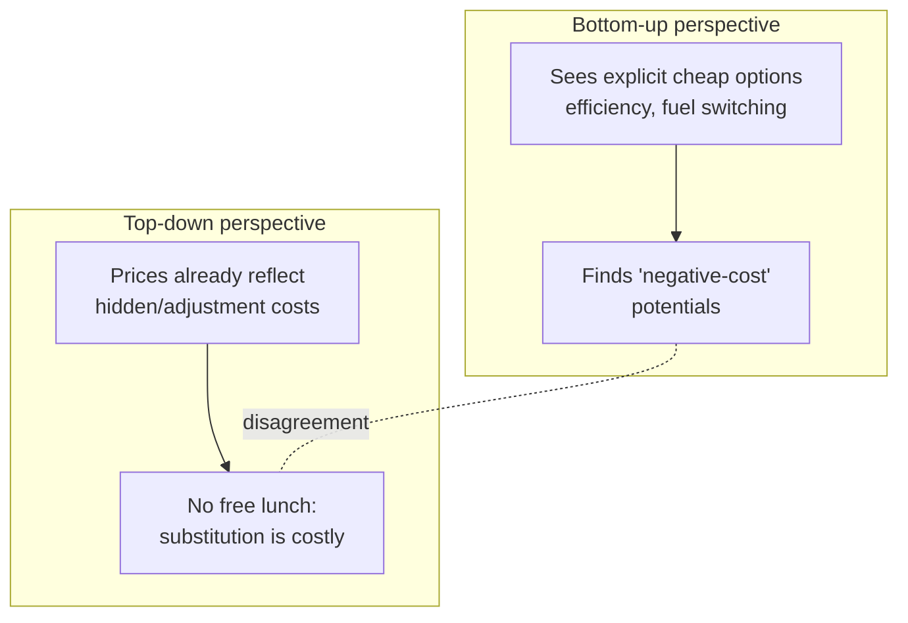
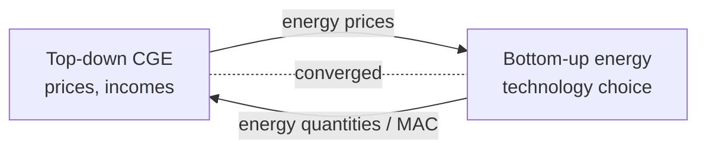

# Top-Down vs Bottom-Up

!!! abstract "Two ways to represent an economy's technology"
    A vocabulary born in energy-economics and now used everywhere.
    **Top-down** models see the economy through *aggregate relationships* — production
    functions and elasticities calibrated to macro data. **Bottom-up** models see it as
    an *explicit inventory of technologies* — power plants, vehicles, boilers, each with
    engineering detail. The gap between them — the **"energy-economy gap"** — is one of
    the most consequential and best-documented disagreements in policy modeling, and
    closing it is the defining challenge of modern integrated assessment.

## The two representations

=== "Top-down — the economist's view"
    Technology is a **smooth substitution surface**. Firms substitute capital, labor, and
    energy along a production function as relative prices change; the *elasticity of
    substitution* $\sigma$ governs how easily. Captures **macro feedback** (prices,
    incomes, all sectors) but has **no explicit technologies**.

    $$Q = A\Big[\alpha K^{\rho} + \beta L^{\rho} + \gamma E^{\rho}\Big]^{1/\rho}, \quad \sigma=\tfrac{1}{1-\rho}$$

    **Referents:** [CGE](../model-families/economics/cge.md),
    [DSGE](../model-families/economics/dsge.md), [DICE](../model-families/climate-iam/dice.md).

=== "Bottom-up — the engineer's view"
    Technology is a **discrete menu**. Each option has a capacity, efficiency, lifetime,
    and cost; the model picks a portfolio to meet demand. Captures **engineering
    realism** (you can point to the wind farm) but typically **misses macro feedback**.

    $$\min \sum_t \big(\text{CapEx}_t\,\text{NewCap}_t + \text{OpEx}_t\,\text{Act}_t\big)\ \text{s.t. demand, capacity, emissions}$$

    **Referents:** [OSeMOSYS](../model-families/energy/osemosys.md),
    [TIMES](../model-families/energy/times.md), MESSAGEix, PyPSA.

## The comparison matrix

| Dimension | **Top-down** | **Bottom-up** |
|-----------|--------------|---------------|
| Technology representation | Aggregate production function, elasticities | Explicit discrete technologies/processes |
| Disciplinary home | Economics | Engineering / operations research |
| Captures macro feedback | **Yes** (prices, incomes, all sectors) | Usually **no** (partial equilibrium) |
| Captures technology detail | **No** (smooth substitution) | **Yes** (vintages, efficiencies) |
| Behavior | Optimizing agents, market prices | Least-cost planner |
| Mitigation cost tendency | Often **higher** (hidden adjustment costs, no "free" tech) | Often **lower** (identifies cheap technical potentials) |
| Data basis | National accounts, SAM, elasticities | Techno-economic databases |
| Policy questions | Tax incidence, GDP/welfare, trade | Capacity planning, technology pathways |
| Typical method | MCP / NLP equilibrium | LP / MILP optimization |
| Key weakness | Technology is a black box | Economy is exogenous |

## The "energy-economy gap"

A famous empirical regularity: for the *same* carbon target, **bottom-up models tend to
report lower mitigation costs than top-down models**. Why?

- **Bottom-up** identifies technically available, apparently cost-effective options
  ("negative-cost" efficiency measures) that engineering cost curves reveal.
- **Top-down** counters that if those options were truly free, rational markets would
  already have adopted them; observed prices embed hidden costs (transaction costs,
  hassle, risk, unmodeled preferences) that bottom-up engineering misses.

Neither is simply "right" — they encode different theories of **why cost-effective
technologies do or don't get adopted**. Documenting *both* is exactly the atlas's method.

## When each is appropriate

- **Top-down** when the question is **economy-wide**: GDP, welfare, tax incidence,
  competitiveness, income distribution, trade — anything needing the circular flow.
- **Bottom-up** when the question is **technological**: which plants to build, feasible
  decarbonization pathways, infrastructure and dispatch — anything needing to name the
  hardware.

## The hybrid synthesis

Because each misses what the other captures, the frontier is **hybrid** coupling:

- **Soft-linking** — run a bottom-up energy model and a top-down CGE iteratively,
  passing prices ↔ quantities until they agree (e.g., many national exercises).
- **Hard-linking / embedding** — a technology-explicit module inside an economic core:
  **[REMIND](../model-families/climate-iam/remind.md)** (Ramsey growth + energy detail),
  **MESSAGEix-MACRO** (bottom-up energy + top-down macro), **[GEM-E3](../model-families/economics/gem-e3.md)**,
  **[AIM](../model-families/climate-iam/aim.md)** (CGE + end-use).
- **Reduced-form representation** — approximate one paradigm inside the other (marginal
  abatement cost curves as a bottom-up summary handed to a top-down model).

### Lesson for the integrated simulator

!!! quote "If we were designing the world's most capable policy simulator today…"
    The top-down/bottom-up split is not a problem to be solved by picking a winner — it
    is a **coupling contract to be designed**. An integrated simulator should let a
    **bottom-up technology module and a top-down economic module coexist**, exchanging a
    minimal, well-typed interface — *prices in, quantities (and marginal abatement costs)
    out* — and iterate to consistency. The deeper lesson from the energy-economy gap is
    epistemic: the two paradigms disagree because they hold different theories of
    technology adoption, so the simulator should **make adoption assumptions an explicit,
    inspectable component** (engineering potential vs revealed-preference cost), letting a
    user see how much of a cost estimate is technology and how much is behavior — rather
    than burying that judgment inside either an elasticity or a cost curve.

## See also

- [Taxonomy — Axis 2](../foundations/taxonomy.md)
- Referents: [CGE](../model-families/economics/cge.md)/[DICE](../model-families/climate-iam/dice.md) (top-down) · [OSeMOSYS](../model-families/energy/osemosys.md)/[TIMES](../model-families/energy/times.md) (bottom-up) · [REMIND](../model-families/climate-iam/remind.md) (hybrid)
- Related: [Optimization vs Simulation](optimization-vs-simulation.md) · [Comparative hub](index.md)
