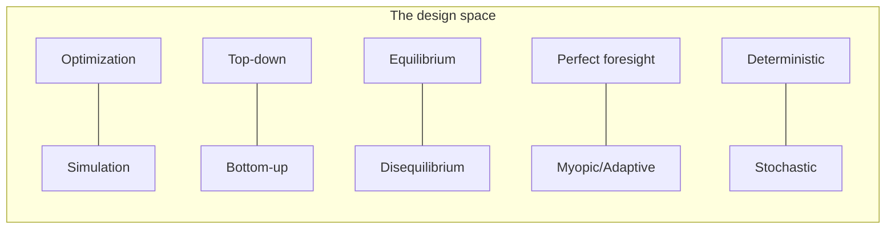

# A Taxonomy of Policy Simulation Models

To compare a DSGE model with an agent-based epidemic model with an energy-system
linear program, we need a shared coordinate system. This chapter defines the **axes**
along which every computational policy model differs. Each dossier positions its
model against these axes in its opening lines.

No single axis is fundamental; a model is a **point in this multi-dimensional space**.
The axes are correlated but not redundant — CGE models cluster in one region,
agent-based models in another, and the interesting frontier is the space *between*
the clusters.

---

## Axis 1 — Optimization vs Simulation

The deepest divide. Does the model **solve for** a best outcome, or **evolve** a
system forward and observe what happens?

- **Optimization** models posit an objective and constraints and compute the
  decision path that extremizes the objective. A *single* solve returns the optimum.
  Formally: choose controls $u(t)$ to solve
  $$\max_{u(\cdot)} \; \int_0^T \mathcal{U}\big(x(t),u(t)\big)\,dt \quad \text{s.t.}\quad \dot{x}=f(x,u),\; g(x,u)\le 0.$$
  Examples: DICE, TIMES, OSeMOSYS, most CGE welfare formulations.

- **Simulation** models specify *rules* — behavioral equations, transition
  probabilities, agent decision heuristics — and step the system forward in time.
  Outcomes are *emergent*, not chosen. There is no objective being maximized at the
  system level.
  Examples: agent-based models (Mesa, NetLogo), system dynamics (Vensim),
  microsimulation (MATSim, UrbanSim).

!!! note "Why the divide matters for a simulator designer"
    Optimization answers *"what is the best we could do?"* (a **normative** question).
    Simulation answers *"what will actually happen given how agents behave?"* (a
    **positive** question). An integrated simulator must decide, per subsystem, which
    question it is asking — and many failures come from answering one with a tool
    built for the other. See [Optimization vs Simulation](../comparative/index.md).

---

## Axis 2 — Top-Down vs Bottom-Up

A vocabulary inherited from energy-economics, now used everywhere.

- **Top-down** models represent the economy through aggregate relationships
  (production functions, elasticities of substitution) calibrated to macro data.
  They capture feedbacks between sectors and prices but treat technology as a smooth
  substitution surface. Examples: CGE, DSGE, macroeconometric (E3ME).

- **Bottom-up** models represent the system as an explicit inventory of
  *technologies* and *processes* (power plants, vehicles, boilers) with engineering
  detail — efficiencies, costs, capacities. They capture technological realism but
  often miss macroeconomic feedback. Examples: TIMES, OSeMOSYS, PyPSA.

- **Hybrid** models couple the two (e.g., IMAGE, REMIND, WITCH, GCAM) — a central
  theme for any integrated simulator.

$$\underbrace{\text{elasticities, aggregate production}}_{\text{top-down}} \;\longleftrightarrow\; \underbrace{\text{explicit technology vintages}}_{\text{bottom-up}}$$

---

## Axis 3 — Equilibrium vs Disequilibrium

Does the model assume markets **clear** (supply = demand at a price the model solves
for), or does it allow persistent imbalances, unemployment, and out-of-equilibrium
dynamics?

- **Equilibrium** (CGE, DSGE, GTAP): elegant, tractable, welfare-interpretable;
  assumes agents are on their supply/demand curves simultaneously.
- **Disequilibrium** (many ABMs, some system-dynamics and macroeconometric models):
  allows rationing, inventories, adaptive expectations, path dependence.

The choice encodes a *theory of how coordination happens* in an economy — arguably
the single most consequential and contested assumption in policy modeling.

---

## Axis 4 — Foresight: Perfect vs Myopic vs Adaptive

*How much of the future does the decision-maker see?*

- **Perfect foresight / intertemporal optimization**: agents optimize over the whole
  horizon $[0,T]$ at once, knowing all future prices and policies (DICE, REMIND,
  perfect-foresight TIMES). Efficient, but assumes clairvoyance.
- **Recursive-dynamic / myopic**: the model solves one period, carries state forward,
  and re-solves — agents see only the present (recursive-dynamic CGE, GCAM).
- **Adaptive / learning**: agents update beliefs from experience (RL policies,
  adaptive-expectation ABMs).

See [Recursive Dynamic vs Perfect Foresight](../comparative/index.md).

---

## Axis 5 — Deterministic vs Stochastic

Does the model produce one trajectory, or a distribution?

- **Deterministic**: one run, one answer (classic DICE). Uncertainty explored *around*
  the model via scenario ensembles and Monte Carlo sampling of parameters.
- **Stochastic**: randomness is *inside* the model — stochastic programming, DSGE
  shocks, epidemic transmission draws (Covasim), stochastic optimal control
  (e.g., DSICE). Outputs are distributions; the objective is often an expectation
  $\mathbb{E}[\cdot]$ or a risk measure (CVaR).

---

## Axis 6 — Continuous vs Discrete (time, space, agents)

- **Time**: continuous ODEs/optimal control vs discrete time steps (annual, 5-yearly).
- **Space**: aggregated regions vs gridded/GIS raster (MODFLOW, SWAT, GLOBIOM) vs
  network graphs (PyPSA, SUMO).
- **Agents**: representative agent (one "average" household) vs heterogeneous
  populations of individuals (ABM, microsimulation).

Discretization is where mathematical elegance meets computational cost — and where
most implementation effort actually goes.

---

## Axis 7 — Resolution: Temporal, Spatial, Sectoral

Independent of the discrete/continuous choice, models differ in *granularity*:

| Resolution | Coarse end | Fine end |
|-----------|-----------|----------|
| Temporal | decadal steps (DICE: 5 yr) | sub-hourly dispatch (PyPSA) |
| Spatial | global aggregate (DICE) | 100 m raster (SWAT, MODFLOW) |
| Sectoral | single good | hundreds of technologies (TIMES) |
| Agents | representative agent | millions of individuals (TRANSIMS) |

Resolution trades **fidelity against tractability** — the recurring engineering
tension of the whole field.

---

## Axis 8 — Solution Method

The mathematical machinery, which strongly constrains everything else:

- **Linear Programming (LP)** — convex, globally optimal, scales to millions of
  variables (OSeMOSYS, PyPSA-linear).
- **Mixed-Integer LP (MILP)** — adds discrete decisions (build/don't-build,
  unit commitment); NP-hard, but powerful (unit-commitment models). See
  [LP vs MILP](../comparative/index.md).
- **Nonlinear Programming (NLP)** — smooth non-convex objectives (DICE via GAMS/CONOPT).
- **Complementarity / MCP** — the natural form for market equilibria (MPSGE, CGE).
- **Dynamic Programming / Optimal Control** — Bellman recursion, HJB equations.
- **Fixed-point / iterative** — Gauss–Seidel across coupled modules (many IAMs).
- **Monte Carlo / simulation stepping** — ABM, microsimulation, epidemic models.
- **Reinforcement Learning** — policy learned from simulated experience.

---

## Putting it together: a positioning card

Every dossier opens with a card like this, locating the model in the taxonomy:

| Axis | DICE (illustrative) |
|------|---------------------|
| Optimization vs Simulation | **Optimization** (intertemporal welfare max) |
| Top-down vs Bottom-up | **Top-down** (aggregate, no explicit technologies) |
| Equilibrium | **Equilibrium** (Ramsey optimal growth) |
| Foresight | **Perfect foresight** |
| Deterministic vs Stochastic | **Deterministic** (stochastic variant: DSICE) |
| Time / Space | **Discrete, 5-yr steps / global single region** |
| Solution method | **NLP** (GAMS + CONOPT / Pyomo + IPOPT) |

!!! quote "The taxonomy's purpose"
    Not to file models into boxes, but to make their **assumptions explicit and
    comparable**. Two models that disagree usually do so because they sit at
    different points on Axes 1, 3, or 4 — and naming that point is the first step to
    reconciling them in an integrated system.

## See also

- [The Three-Track Method](three-track-method.md)
- [Comparative Analyses](../comparative/index.md) — the matrices that live on these axes
- Flagship dossier: [DICE](../model-families/climate-iam/dice.md)
