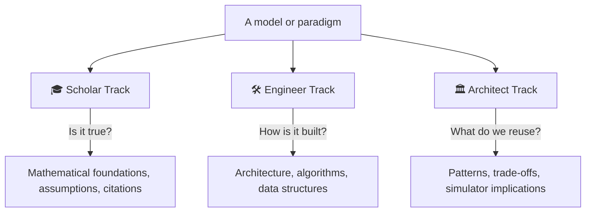

# The Three-Track Method

Every topic in this atlas is documented three times, for three readers who ask
different questions of the same model. This is not redundancy — it is the mechanism
that lets one knowledge base serve research, implementation, and system design at once.

## 🎓 Scholar Track — *"Is it true, and why?"*

Textbook-quality exposition for a researcher.

- The scientific motivation and the question the model answers.
- The full mathematical formulation: state variables, decision variables, objective,
  constraints — written as equations, not prose gestures.
- The assumptions, stated as assumptions (and what breaks if they fail).
- Calibration, validation, and the empirical basis.
- Primary citations. Peer-reviewed papers, official docs, IPCC/OECD/World Bank
  reports — never a superficial summary.

## 🛠️ Engineer Track — *"How is it actually built?"*

For someone who has to implement, extend, or run the model.

- Software architecture and module decomposition.
- The solution algorithm and the solver stack (GAMS/CONOPT, Pyomo/IPOPT, CPLEX, …).
- Data structures, file formats, I/O, and the data pipeline.
- Computational complexity and where the time/memory actually goes.
- Language, open-source status, extensibility, and the practical gotchas.

## 🏛️ Architect Track — *"What do we carry forward?"*

For the designer of the future integrated simulator.

- The reusable design pattern (Scenario Engine, Optimization Engine, Climate Engine…).
- The trade-offs the model made and why.
- What alternatives existed, and when they'd be superior.
- The one or two transferable lessons — the reason this model earns a place in the atlas.

## Keeping the tracks in sync

The tracks describe **one** object, so they must not contradict each other. Rules:

1. The **Scholar Track equations** are the source of truth; the Engineer Track
   implements exactly those equations; the Architect Track abstracts exactly those
   trade-offs.
2. Cross-link aggressively. An assumption named in Scholar should link to the failure
   mode discussed in Architect.
3. Every claim that could be disputed carries a citation or is marked as the atlas's
   own synthesis.

!!! example "Same model, three sentences"
    - **Scholar:** *DICE maximizes discounted utility of per-capita consumption subject
      to a Ramsey capital-accumulation constraint and a carbon-cycle–temperature chain.*
    - **Engineer:** *DICE is ~30 equations solved as a nonlinear program in GAMS/CONOPT;
      the modern Python port uses Pyomo + IPOPT over a 5-year-step horizon.*
    - **Architect:** *DICE demonstrates the "minimal coupled Climate + Economy Engine"
      pattern — small enough to audit, which is precisely why its damage function
      became the field's most-criticized single equation.*

See how this plays out end-to-end in the flagship **[DICE dossier](../model-families/climate-iam/dice.md)**.
