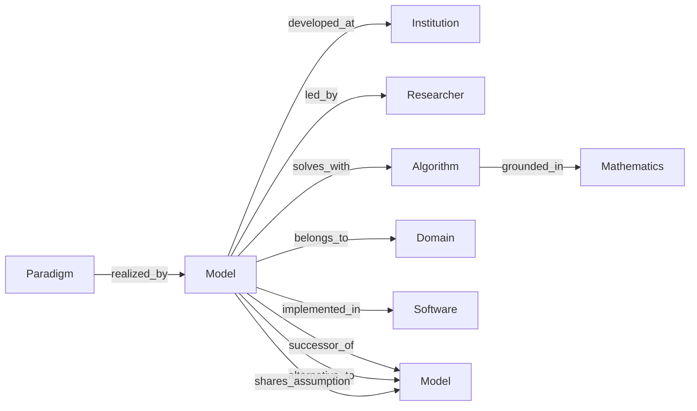
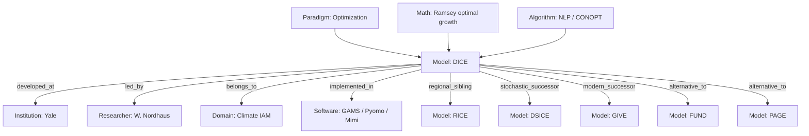

# Knowledge Graph

A semantic graph linking every entity in the atlas — **paradigms, algorithms, models,
institutions, researchers, domains, mathematics, and software** — with edges for
*successor-of*, *depends-on*, *shares-assumption-with*, and *alternative-to*.

The graph is the payoff of the whole atlas: it makes the *relationships* between
modeling traditions queryable, which is exactly what an integrated simulator's designer
needs.

## Schema

## Seed graph (from the DICE dossier)

## Planned representation

- **Source of truth**: a `graph.json` (nodes + typed edges) generated from dossier
  front-matter, so the graph stays consistent with the prose.
- **Rendering**: Mermaid for embedded views here; an interactive HTML view for the
  full graph.
- **Queries** the graph should answer: *"what depends on LP?"*, *"what are the
  perfect-foresight IAMs?"*, *"which models share the equilibrium assumption?"*,
  *"what succeeded MARKAL?"*

!!! tip "Tie-in"
    This dovetails with the local **`/graphify`** workflow (input → knowledge graph →
    clustered communities). Each completed dossier contributes its entities and edges
    to the growing atlas graph.
