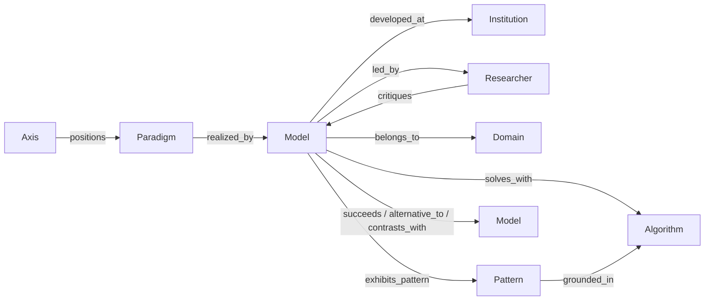
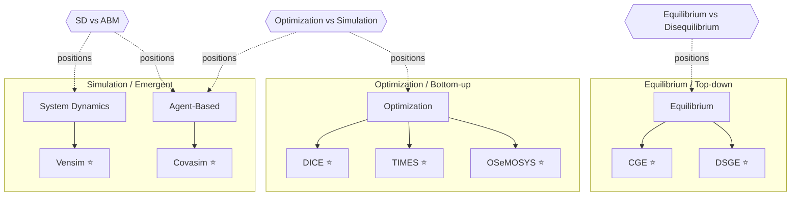
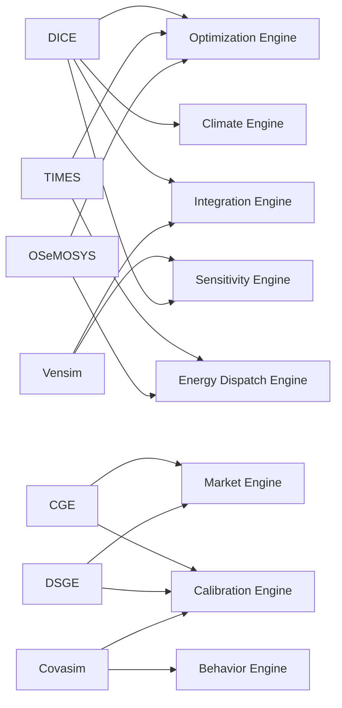
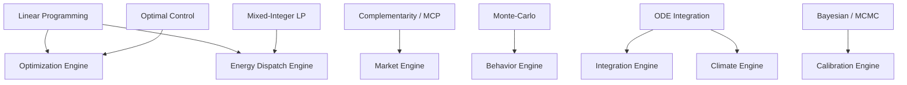

# Knowledge Graph

A semantic graph linking every entity in the atlas — **paradigms, models, institutions,
researchers, algorithms, architecture patterns, domains, and comparative axes** — with
typed edges. The graph is the payoff of the whole atlas: it makes the *relationships*
between modeling traditions queryable, which is exactly what an integrated simulator's
designer needs.

!!! success "The graph is now a data artifact"
    The source of truth is **[`graph.json`](graph.json)** — **84 typed nodes** and
    **117 typed edges** curated from the Gold dossiers, comparative chapters, and pattern
    pages. The views below are rendered *from* that data. As dossiers are promoted, their
    entities and edges are added to the JSON and these views grow with them.

## Schema

**Node types** (8): `paradigm` · `model` · `institution` · `researcher` · `algorithm` ·
`pattern` · `domain` · `axis`.

**Edge types** (12): `realized_by` · `developed_at` · `led_by` · `solves_with` ·
`belongs_to` · `exhibits_pattern` · `contrasts_with` · `succeeds` · `alternative_to` ·
`critiques` · `grounded_in` · `positions`.

## View 1 — Paradigms realized by the Gold models

The backbone: which modeling **paradigm** each flagship embodies, and the **axis** that
contrasts them.

⭐ = Gold dossier.

## View 2 — Models → patterns (the reuse map)

The **`exhibits_pattern`** edges (21 of them) are the heart of the "design foundation"
mission: they show the *same engines* recurring across unrelated models.

**Reading it:** the *Optimization Engine* is shared by DICE, TIMES, and OSeMOSYS; the
*Market Engine* by CGE and DSGE; the *Calibration Engine* by three models that calibrate in
completely different ways (SAM, Bayesian, black-box) — precisely the plurality the
[Calibration Engine](../patterns/calibration-engine.md) page argues for.

## View 3 — Algorithms grounding the patterns

## Worked queries

The graph is built to answer relational questions. A few, resolved from `graph.json`:

=== "What solves with LP?"
    Follow `solves_with → lp` and `grounded_in → lp`:
    **OSeMOSYS**, **TIMES** (models), and the **Optimization** & **Energy-Dispatch**
    engines. → the bottom-up least-cost family.

=== "Which models share the equilibrium assumption?"
    Follow `realized_by` from **Equilibrium**: **CGE**, **DSGE**, **GTAP** — and note the
    `alternative_to` edge to **E3ME** (disequilibrium), the contrast drawn in
    [Equilibrium vs Disequilibrium](../comparative/equilibrium-vs-disequilibrium.md).

=== "What contrasts with Covasim?"
    Follow `contrasts_with`: **DICE**, **CGE**, **Vensim** — the optimizing, equilibrium,
    and aggregate-simulation flagships, i.e. every *other* corner of the paradigm space.
    These are exactly the [ABM vs CGE](../comparative/abm-vs-cge.md) and
    [SD vs ABM](../comparative/system-dynamics-vs-abm.md) matrices.

=== "What succeeded MARKAL?"
    Follow `succeeds`: **TIMES** succeeds **MARKAL/EFOM**; **RICE** succeeds **DICE**;
    **GTAP** succeeds **CGE**.

## Graph statistics

| Node type | Count | Edge type | Count |
|-----------|------:|-----------|------:|
| model | 25 | exhibits_pattern | 29 |
| institution | 11 | realized_by | 14 |
| algorithm | 10 | developed_at | 12 |
| pattern | 12 | belongs_to | 11 |
| paradigm | 8 | positions | 10 |
| researcher | 8 | solves_with | 10 |
| domain | 5 | grounded_in | 10 |
| axis | 5 | contrasts_with | 6 |
| **Total nodes** | **84** | **Total edges** | **117** |

## Roadmap

- **Generation from front-matter** — the next step is to emit `graph.json` *automatically*
  from a `graph:` block in each dossier's front-matter, so prose and graph never drift.
- **Interactive view** — a self-contained HTML force-directed view (no external CDN) for
  the full 80-node graph, complementing the curated Mermaid slices above.
- **Growth** — every newly promoted dossier contributes its nodes/edges; the graph is the
  running integral of the atlas.

!!! tip "Tie-in with `/graphify`"
    This dovetails with the local **`/graphify`** workflow (input → knowledge graph →
    clustered communities). The atlas graph is the domain-specific instance of exactly that
    idea.

## See also
- Data: **[graph.json](graph.json)** · Positioning: [Taxonomy](../foundations/taxonomy.md)
- [Architecture Patterns](../patterns/index.md) · [Comparative hub](../comparative/index.md)
