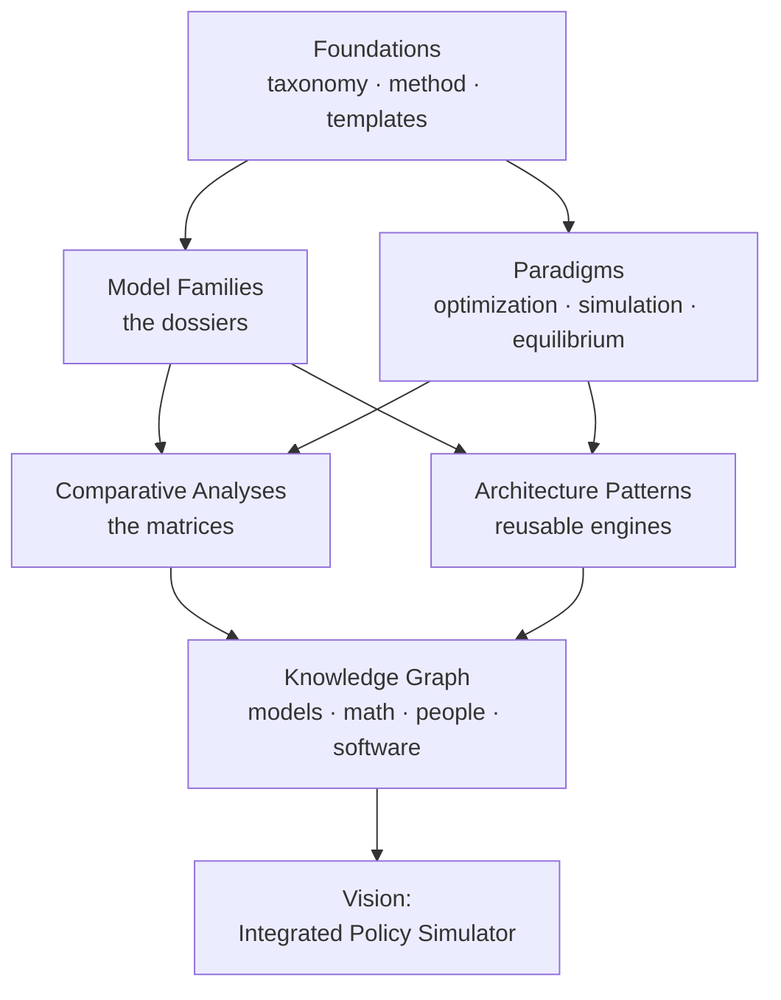

# The Atlas of Computational Policy Simulation

!!! abstract "What this is"
    A comprehensive reconnaissance of computational policy simulation models across
    every scientific discipline — climate, energy, economics, transport, urban,
    agriculture, water, health — and the **paradigms** and **algorithms** beneath
    them. The deliverable is a knowledge base and technical book, intended to become
    the **design foundation** of a next-generation integrated policy simulator.

Every model in this atlas answers, in its own way, one overarching question:

> **If we were designing the world's most capable computational policy simulator
> today, what should we learn from this model?**

## The overarching question, decomposed

For every model and every paradigm we insist on answering:

1. **Why** does it exist? (the scientific motivation and the question it was built to answer)
2. **What** does it assume? (equilibrium? optimizing agents? perfect foresight?)
3. **When** is it appropriate? (the regime where its assumptions hold)
4. **Where** does it fail? (documented breakdowns and criticisms)
5. **What** is reusable? (the design pattern worth carrying into a new system)

## How the atlas is organized

| Section | What you'll find |
|---------|------------------|
| **[Foundations](foundations/index.md)** | The taxonomy, the three-track method, and how to read a dossier |
| **[Model Families](model-families/index.md)** | Full technical dossiers, one per model |
| **[Paradigms](paradigms/index.md)** | Why each modeling philosophy exists, and its trade-offs |
| **[Comparative Analyses](comparative/index.md)** | Side-by-side matrices (Optimization vs Simulation, ABM vs CGE, …) |
| **[Architecture Patterns](patterns/index.md)** | Reusable engines distilled across models |
| **[Knowledge Graph](graph/index.md)** | The semantic web linking paradigms, math, people, and code |

## The Three-Track method

Every topic is written three times, for three readers:

- :mortar_board: **Scholar Track** — textbook explanation, mathematical foundations, citations.
- :hammer_and_wrench: **Engineer Track** — architecture, algorithms, data structures, implementation notes.
- :classical_building: **Architect Track** — distilled lessons, reusable patterns, trade-offs for the future simulator.

See **[The Three-Track Method](foundations/three-track-method.md)**.

## Start here

- New to the field → **[Taxonomy of Policy Models](foundations/taxonomy.md)**
- Want to see the quality bar → the flagship dossier: **[DICE](model-families/climate-iam/dice.md)**
- Want to contribute a dossier → **[How to Read (and Write) a Dossier](templates/dossier-template.md)**

!!! note "Method discipline"
    When modeling philosophies disagree, this atlas **documents every viewpoint**
    rather than choosing one. Superficial summaries are not acceptable; every
    mathematical concept is stated rigorously, with equations and primary citations.
