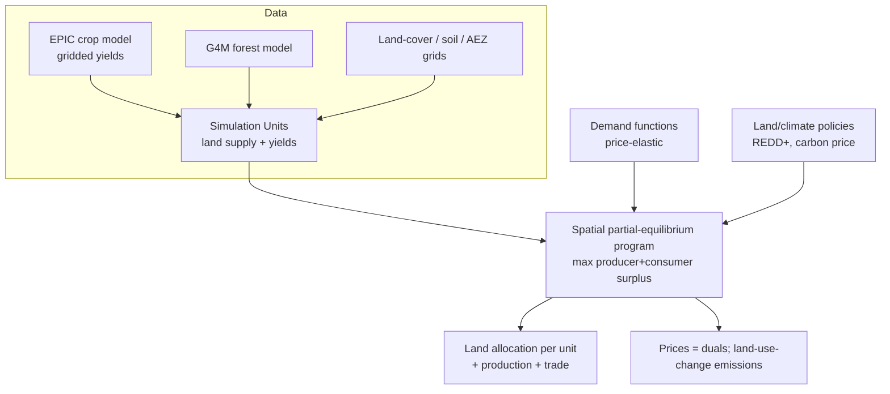

# GLOBIOM — Global Biosphere Management Model

!!! success "Gold dossier"
    GLOBIOM is the atlas's flagship **land-use** model — a spatially explicit global
    **partial-equilibrium** program that allocates the world's land among agriculture,
    forestry, and bioenergy by maximizing economic surplus on a fine grid. It is where the
    [Optimization](../../patterns/optimization-engine.md),
    [Spatial](../../patterns/spatial-engine.md), and **[Land](../../patterns/land-engine.md)**
    engines meet, and the land-use counterpart to the energy models
    [TIMES](../../model-families/energy/times.md)/[OSeMOSYS](../../model-families/energy/osemosys.md).

> A spatially explicit global partial-equilibrium land-use model that allocates land among
> agriculture, forestry and bioenergy by maximizing producer + consumer surplus on a fine
> grid.

## Positioning card

| Axis (see [Taxonomy](../../foundations/taxonomy.md)) | GLOBIOM |
|------|------|
| Optimization vs Simulation | **Optimization** (surplus maximization) |
| Top-down vs Bottom-up | **Bottom-up** (gridded land units) |
| Equilibrium | **Partial equilibrium** (land/ag/forest markets) |
| Foresight | Recursive-dynamic (myopic 10-yr steps) |
| Deterministic vs Stochastic | Deterministic (+ scenarios) |
| Time / Space | 10-year steps / gridded (Simulation Units → 0.5°) |
| Solution method | LP / (nonlinear) surplus maximization |

| Field | Value |
|-------|-------|
| Full name | GLOBIOM — Global Biosphere Management Model |
| Domain | Agriculture & Land |
| First release / current | ~2007 / ongoing |
| Institution · lead | IIASA (Michael Obersteiner, Petr Havlík et al.) |
| Language · solver | GAMS (LP/NLP solvers) |
| License / access | Research/open collaboration; documentation public |

---

## 🎓 Scholar Track

### History & motivation

GLOBIOM was developed at **IIASA** (International Institute for Applied Systems Analysis)
from around 2007, led by **Michael Obersteiner** and **Petr Havlík**, to answer questions at
the intersection of **food, land, water, bioenergy, and climate** that neither pure economic
models nor pure biophysical models could handle alone. Its distinctive move is to fuse
**economic optimization** with **spatially explicit biophysical detail**: crop yields, forest
growth, and land availability come from process models (EPIC for crops, G4M for forests) on a
fine grid, while an economic program decides *what to grow/harvest where* by maximizing
market surplus. It is a core tool in **IPCC** land-use scenarios, the **SSP** land pathways,
and analyses of REDD+, bioenergy, and dietary change.

For the atlas, GLOBIOM is the **land-use exemplar** and a beautiful case of coupling an
[Optimization Engine](../../patterns/optimization-engine.md) to a
[Spatial Engine](../../patterns/spatial-engine.md) over biophysically-derived data.

### Mathematical formulation

GLOBIOM is a **spatial partial-equilibrium** model solved as a mathematical program. The
objective is the **sum of producer and consumer surplus** across agricultural, forestry, and
bioenergy markets — the standard Samuelson–Takayama–Judge (STJ) spatial-equilibrium result
that *maximizing surplus reproduces the competitive market equilibrium*:

$$
\max \;\; \underbrace{\sum_{m} \int_0^{q_m} p_m(q)\,dq}_{\text{consumer side (demand)}}
\;-\; \underbrace{\sum_{u,\,a} c_{u,a}\, x_{u,a}}_{\text{production \& land-use cost}}
\;-\; \text{trade \& processing costs}
$$

subject to:

- **Land balance** per spatial unit $u$: $\sum_a x_{u,a} \le L_u$ — land allocated across
  activities $a$ (crops, grassland, forest, plantation, other) cannot exceed available land.
- **Land-use change** accounting (with conversion costs and, for climate, emissions).
- **Supply = demand + net trade** for each commodity and region.
- **Biophysical yields** $y_{u,a}$ supplied exogenously by EPIC/G4M per grid cell.

The **decision variables** are land-use allocations, production, processing, and bilateral
trade; **prices are dual variables** on the commodity-balance constraints (as in any
[LP](../../paradigms/algorithms/lp.md)-based partial-equilibrium model). Because demand is
price-responsive, the objective's demand integral makes it a (nonlinear) surplus program
rather than pure least cost — the same **elastic-demand partial equilibrium** idea as
[TIMES](../../model-families/energy/times.md).

### Spatial resolution

The signature feature: land is represented at **Simulation Units** — homogeneous-response
clusters aggregated from a 5–30 arc-minute grid by agro-ecological zone, altitude, slope, and
soil — so the model reasons about *where specifically* production happens while staying
computationally feasible.

### Solution algorithm

A large **LP/NLP** solved in **GAMS** and stepped **recursive-dynamically** in ~10-year
intervals: solve the spatial equilibrium for a period, carry land-use state forward, update
demands/technology, and re-solve (myopic foresight — see
[Recursive-Dynamic vs Perfect Foresight](../../comparative/recursive-vs-perfect-foresight.md)).

### Calibration & validation

Calibrated so the base period reproduces **observed land use, production, and trade** (FAO
statistics), with biophysical parameters from **EPIC/G4M**. Validated against historical
land-use change and cross-checked against other land-use models in **AgMIP** and IIASA
model-comparison exercises.

### Strengths, weaknesses, criticisms

=== "Strengths"
    - **Spatial + economic fusion** — decides land use *where* it physically happens, with
      market feedback.
    - **Cross-sector** — agriculture, forestry, and bioenergy compete for the *same* land in
      one consistent frame (captures indirect land-use change / iLUC).
    - **Policy-rich** — REDD+, carbon pricing on land, bioenergy mandates, diet shifts.
    - **Bridges to climate/energy** — links to IAMs (e.g. MESSAGEix-GLOBIOM) and emissions.

=== "Weaknesses / criticisms"
    - **Recursive myopia** — no forward-looking land investment; can misjudge anticipatory
      behavior.
    - **Aggregation of Simulation Units** — smooths within-unit heterogeneity; smallholder
      dynamics are coarse.
    - **Data-hungry & GAMS-bound** — heavy biophysical inputs; less open than
      [OSeMOSYS](../../model-families/energy/osemosys.md).
    - **Partial (not general) equilibrium** — macro feedbacks (income, labor) are outside the
      frame.

## 🛠️ Engineer Track

### Software architecture (engines)

The recognizable reusable engines (see [patterns](../../patterns/index.md)): an
**[Optimization Engine](../../patterns/optimization-engine.md)** (surplus maximization), a
**[Spatial Engine](../../patterns/spatial-engine.md)** (Simulation-Unit grid), the
**[Land Engine](../../patterns/land-engine.md)** (allocation/competition — grounded here), a
**[Data Pipeline](../../patterns/data-pipeline.md)** (EPIC/G4M biophysical coupling), and a
**[Policy Engine](../../patterns/policy-engine.md)** (land/climate instruments).

### Data structures & pipeline

The heart is the **Simulation Unit** table: each unit carries land availability by class and
per-activity yields from the biophysical models. The economic program is generated in **GAMS**
from these plus demand systems and trade costs. Outputs are land-use allocations, production,
prices, trade flows, and **land-use-change emissions** — the last being the key hand-off to
climate models.

### Computational complexity

A large sparse LP/NLP; cost scales with (Simulation Units × activities × commodities ×
regions), solved per 10-year step. Spatial aggregation to Simulation Units is precisely what
keeps a *global gridded* land model tractable.

### Language, openness, extensibility

**GAMS**-based; documented publicly with growing openness, but heavier and less
plug-and-play than [OSeMOSYS](../../model-families/energy/osemosys.md). Extended via linkage
to IAMs (**MESSAGEix-GLOBIOM**), water, and biodiversity modules.

## 🏛️ Architect Track

### Reusable design patterns

- **Surplus-maximization = market equilibrium** — the STJ trick: a *single optimization*
  reproduces a competitive spatial [market](../../patterns/market-engine.md) with elastic
  demand (shared with [TIMES](../../model-families/energy/times.md)).
- **Biophysical–economic coupling** — process models supply yields as data to an economic
  optimizer: a template for any nature-economy model.
- **Homogeneous-response spatial units** — aggregate a fine grid into behavior-homogeneous
  clusters to make global-scale spatial optimization feasible.

### Trade-offs & alternatives

Against **MAgPIE** (PIK): both are global land-use optimizers, but MAgPIE *minimizes cost*
and couples tightly to the REMIND IAM, while GLOBIOM *maximizes surplus* with elastic demand
and richer bottom-up detail. Against **CGE land modules**: GLOBIOM has far more spatial and
biophysical detail but only partial (not general) equilibrium. See
[Top-Down vs Bottom-Up](../../comparative/top-down-vs-bottom-up.md).

### Adoption

Used by **IIASA, the European Commission, IPCC (land scenarios), the SSP process, FAO-linked
studies**, and REDD+/bioenergy policy analysis; embedded in **MESSAGEix-GLOBIOM** for
integrated climate-land assessment.

### Ecosystem

- **Peers:** MAgPIE (PIK), IMPACT (IFPRI), FABLE Calculator, AIM/land.
- **Coupled models:** MESSAGEix-GLOBIOM, EPIC (crops), G4M (forests), water/biodiversity.

### Research gaps

- **Forward-looking land investment** — moving beyond recursive myopia.
- **Smallholder & heterogeneity** — finer behavioral resolution within Simulation Units.
- **Tighter food–energy–water–climate coupling** — consistent multi-sector land competition.

!!! quote "Lesson for the integrated simulator — if we were designing it today"
    GLOBIOM shows how to make **land a first-class, contested resource** in an integrated
    simulator: represent space as behavior-homogeneous units, let **process models supply the
    biophysics** (yields, growth) as data, and let a **single surplus-maximizing program**
    allocate that land across competing uses so that food, forest, and bioenergy demands trade
    off *explicitly* — with land-use-change emissions falling out as the hand-off to the
    [climate engine](../../patterns/climate-engine.md). The deeper lesson is the
    **biophysical–economic coupling pattern**: neither a pure economic optimizer nor a pure
    land-cover model suffices, but wiring the two — biophysics as data into economics as
    allocator — captures indirect land-use change and the real competition for a finite
    surface. For the simulator, land is exactly the kind of subsystem that must be *shared*:
    the energy model's bioenergy demand, the climate model's carbon sink, and the food
    system's cropland are all claims on the **same** GLOBIOM-style land account.

## Major publications

- Havlík, P., et al. (2011). "Global land-use implications of first- and second-generation
  biofuel targets." *Energy Policy* 39(10).
- Havlík, P., et al. (2014). "Climate change mitigation through livestock system
  transitions." *PNAS* 111(10).
- Obersteiner, M., et al. — GLOBIOM documentation (IIASA).

## See also
- Patterns: [Land Engine](../../patterns/land-engine.md) · [Optimization Engine](../../patterns/optimization-engine.md) · [Spatial Engine](../../patterns/spatial-engine.md)
- Contrast: [Top-Down vs Bottom-Up](../../comparative/top-down-vs-bottom-up.md) · [IAM vs Energy-System Models](../../comparative/iam-vs-energy.md)
- Positioning: [Taxonomy](../../foundations/taxonomy.md) · Quality bar: [DICE dossier](../../model-families/climate-iam/dice.md)
