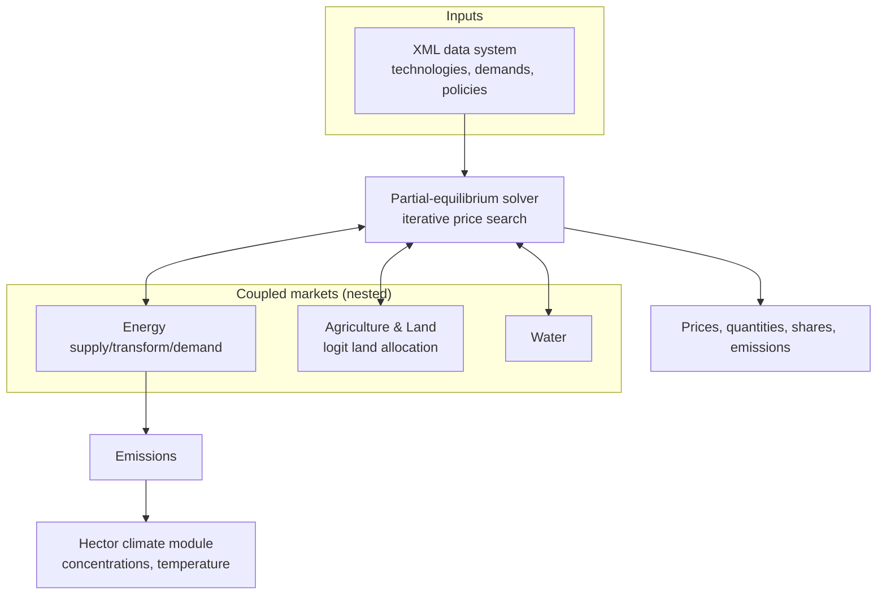

# GCAM — Global Change Analysis Model

!!! success "Gold dossier"
    GCAM is the atlas's flagship **process-based (detailed) integrated assessment model** —
    the counterpoint to the tiny cost-benefit [DICE](dice.md). Where DICE compresses the world
    into ~30 equations, GCAM couples **economy, energy, land, water, and climate** across 32
    regions with hundreds of explicit technologies, and finds **prices that clear every market
    each period**. It is the archetype for the
    **[Technology-Adoption Engine](../../patterns/technology-adoption-engine.md)** (logit
    market-share) and a bridge across nearly every domain in this atlas.

> A market-driven, technology-rich partial-equilibrium IAM coupling economy, energy, land,
> water and climate across 32 regions; solves for prices that clear each market each period.

## Positioning card

| Axis (see [Taxonomy](../../foundations/taxonomy.md)) | GCAM |
|------|------|
| Optimization vs Simulation | **Simulation via market clearing** (no global objective) |
| Top-down vs Bottom-up | **Hybrid** (bottom-up technologies + economic demands) |
| Equilibrium | **Partial equilibrium** (each market clears by price) |
| Foresight | **Recursive-dynamic** (myopic 5-year steps) |
| Deterministic vs Stochastic | Deterministic (+ scenario / UQ ensembles) |
| Time / Space | 5-year steps / 32 regions + land subregions + climate |
| Solution method | **Iterative price search** to market clearance |

| Field | Value |
|-------|-------|
| Full name | GCAM — Global Change Analysis Model |
| Domain | Climate — Integrated Assessment (process-based) |
| First release / current | 1980s (as MiniCAM) / GCAM 6+ |
| Institution · lead | PNNL / Joint Global Change Research Institute (JGCRI) |
| Language · solver | C++ core (XML inputs); R (`rgcam`) analysis |
| License / access | Open source (ECL 2.0 / BSD-style), on GitHub |

---

## 🎓 Scholar Track

### History & motivation

GCAM descends from **MiniCAM**, begun in the 1980s at Pacific Northwest National Laboratory
(**PNNL**) by **Jae Edmonds** and **John Reilly** — one of the very first integrated
assessment models. Over four decades it grew into **GCAM**, maintained by the **Joint Global
Change Research Institute (JGCRI)**, a flagship **process-based IAM** used heavily in the
**IPCC** process (it produced marker scenarios, including a representative RCP pathway) and
the **Shared Socioeconomic Pathways (SSPs)**.

Its philosophy is the opposite of [DICE](dice.md)'s: rather than a small optimizable
cost-benefit core, GCAM is a **large, market-driven simulation** that represents the *systems*
— energy supply chains, land use, water, and a simple climate model — in enough technological
detail to ask *how* a transition unfolds, not just *how much* it optimally should. For the
atlas it is the exemplar of the **detailed-process IAM** that
[IAM vs Energy-System Models](../../comparative/iam-vs-energy.md) names as the *synthesis* of
cost-benefit IAMs and bottom-up energy models.

### Mathematical formulation

GCAM is **not** an optimization — it has no welfare objective and no least-cost program.
Instead it is a **recursive-dynamic partial equilibrium** solved by finding, each period, the
vector of **market prices** that clears every market simultaneously.

**Market clearing.** For each market $m$ (a fuel, a crop, a factor, an emissions permit) in
each period $t$, GCAM searches for a price $p_m$ such that supply equals demand:

$$
\sum \text{supply}_m(\mathbf{p}) \;=\; \sum \text{demand}_m(\mathbf{p}), \qquad \forall m
$$

solved by an **iterative price-search / Newton-like solver** over the coupled markets (a
[Market Engine](../../patterns/market-engine.md), but *partial* — it clears sector markets, not
a full Walrasian [CGE](../../model-families/economics/cge.md) with income loops).

**Technology choice — the logit share.** GCAM's signature mechanism: competing technologies
(or land uses) supplying the same service are allocated **market share** by a **logit**
function of their costs, *not* a winner-take-all least-cost pick:

$$
s_i \;=\; \frac{\alpha_i\, c_i^{\,-\beta}}{\sum_j \alpha_j\, c_j^{\,-\beta}}
$$

where $s_i$ is the share of option $i$, $c_i$ its cost, $\alpha_i$ a share-weight (calibrated),
and $\beta$ a **logit exponent** governing how sharply share responds to cost differences.
This smoothly represents **heterogeneity and imperfect substitution** — cheaper options gain
share gradually rather than instantly dominating (contrast the knife-edge of an
[LP](../../paradigms/algorithms/lp.md) least-cost solution). It is the heart of the
[Technology-Adoption Engine](../../patterns/technology-adoption-engine.md).

**Recursive dynamics.** Each 5-year period is solved for equilibrium, then capital vintages,
resource depletion, and land state carry forward — **myopic**, no perfect foresight (see
[Recursive-Dynamic vs Perfect Foresight](../../comparative/recursive-vs-perfect-foresight.md)).

### Solution algorithm

Per period: **guess prices → evaluate all supplies & demands (via nested logit choices) →
measure excess demand → update prices → iterate to clearance**; then advance the state and
repeat. No optimization solver — a **root-finder on market excess-demand**.

### Calibration

Calibrated to a **base-year** of energy, agriculture, and economic data (IEA balances, FAO,
national accounts); the **logit share-weights** $\alpha_i$ are set so the base year reproduces
observed market shares — a **calibration-by-share-weight** analogue of
[CGE](../../model-families/economics/cge.md)'s SAM benchmarking (see the
[Calibration Engine](../../patterns/calibration-engine.md)).

### Validation

Evaluated by **historical back-testing**, participation in **model-comparison exercises**
(EMF, IAMC, AgMIP), and cross-checking against energy/land data. As a scenario tool its test
is *plausibility of pathways*, not point prediction (see the
[Validation Engine](../../patterns/validation-engine.md)).

### Strengths, weaknesses, criticisms

=== "Strengths"
    - **Breadth** — energy + land + water + climate in one consistent, market-linked frame.
    - **Technological richness** — hundreds of technologies with realistic, gradual
      substitution via logit shares.
    - **Fast & open** — a full global run in minutes; open source with a large community.
    - **Scenario workhorse** — SSP/RCP pathways, net-zero, and sectoral deep-dives.

=== "Weaknesses / criticisms"
    - **No welfare metric** — being a simulation, it cannot say what is *optimal* (unlike
      [DICE](dice.md)); it answers "what happens," not "what's best."
    - **Recursive myopia** — no forward-looking investment; can misjudge anticipation.
    - **Logit share-weights are calibrated, not derived** — behavior is partly fitted (a
      Lucas-critique-adjacent concern).
    - **Partial (not general) equilibrium** — no full income-expenditure loop; macro feedback
      is limited.

## 🛠️ Engineer Track

### Software architecture (engines)

The recognizable reusable engines (see [patterns](../../patterns/index.md)): a
**[Market Engine](../../patterns/market-engine.md)** (partial-equilibrium price search), the
**[Technology-Adoption Engine](../../patterns/technology-adoption-engine.md)** (nested logit
shares — grounded here), a **[Land Engine](../../patterns/land-engine.md)** (logit land
allocation), a **[Climate Engine](../../patterns/climate-engine.md)** (the **Hector** simple
climate model), and a **[Data Pipeline](../../patterns/data-pipeline.md)** (the XML input
system + `gcamdata`).

### Data structures & pipeline

GCAM is driven by a vast **XML data system**: every technology, resource, demand, and policy
is an XML object assembled by the **`gcamdata`** R package from raw sources. The core is C++;
outputs are queried via **`rgcam`** into R/databases. This data-as-XML design makes GCAM a
**model generator** (like [TIMES](../../model-families/energy/times.md)) — new technologies and
policies are *data*, not code.

### Computational complexity

A full global run (32 regions × sectors × ~20 periods) completes in **minutes** — orders of
magnitude cheaper than optimizing IAMs or ESMs, because each period is a **root-finding**
problem, not a horizon-wide optimization. This speed enables large **scenario and UQ
ensembles**.

### Language, openness, extensibility

**C++** core, **R** tooling, **open source** on GitHub with documentation and training. Highly
modular — sectors, regions, and policies are added via XML; community variants exist (GCAM-USA
with state detail, GCAM-China, etc.).

## 🏛️ Architect Track

### Reusable design patterns

- **Logit market-share allocation** — the smooth, heterogeneity-respecting alternative to
  least-cost winner-take-all; the core of technology *and* land adoption.
- **Partial-equilibrium price search** — clear many coupled sector markets by iterating on
  prices, without a full CGE income loop.
- **Data-as-XML model generator** — separate a huge model's *data* from its *solver*.
- **Coupled-systems IAM** — energy↔land↔water↔climate in one market-linked frame.

### Trade-offs & alternatives

Against [DICE](dice.md): GCAM trades a clean welfare optimum and transparency for
technological/sectoral breadth and *how*-detail (see
[IAM vs Energy-System Models](../../comparative/iam-vs-energy.md)). Against
[MESSAGEix](messageix.md)/[REMIND](remind.md) (optimizing IAMs): GCAM is a **simulation**
(market clearing + logit), not an intertemporal optimization — cheaper and more myopic, with
smoother technology dynamics. Against bottom-up energy models
([TIMES](../../model-families/energy/times.md)): GCAM is broader (adds land/water/climate) but
less deep within energy.

### Adoption

A cornerstone of the **IPCC** (marker scenarios; WG III), the **SSP** database, U.S.
interagency and DOE analysis, and countless academic studies; widely taught and used in
model-comparison consortia (EMF, IAMC).

### Ecosystem

- **Peers:** MESSAGEix-GLOBIOM (IIASA), IMAGE (PBL), REMIND-MAgPIE (PIK), AIM (NIES),
  WITCH (EIEE).
- **Coupled modules:** **Hector** (climate), **GLOBIOM/gcamdata** land data, water modules;
  regional variants (GCAM-USA, GCAM-China).

### Research gaps

- **Beyond myopia** — hybridizing recursive dynamics with limited foresight.
- **Endogenous share-weights** — deriving logit parameters from behavior rather than
  calibration.
- **Tighter macro coupling** — linking partial-equilibrium sectors to a full
  [CGE](../../model-families/economics/cge.md)/macro core.

!!! quote "Lesson for the integrated simulator — if we were designing it today"
    GCAM is the closest existing thing to the **multi-domain simulator this atlas is designing
    toward** — energy, land, water, and climate clearing together, fast enough for big
    ensembles. Two lessons stand out. First, the **logit market-share** mechanism is the
    reusable answer to a recurring modeling problem: how to let a cleaner or cheaper option
    gain ground *gradually and partially* rather than through the brittle winner-take-all of
    [least-cost optimization](../../patterns/optimization-engine.md) — capturing real
    heterogeneity, imperfect information, and inertia in one differentiable rule. Second,
    GCAM's **partial-equilibrium-by-price-search** shows a middle path between imposed
    [Walrasian clearing](../../comparative/equilibrium-vs-disequilibrium.md) and pure
    [emergence](../../patterns/behavior-engine.md): clear each sector market by iterating on
    prices, cheaply, without a full income loop. The caution GCAM carries into the design is
    equally clear — a market-clearing *simulation* has **no welfare metric**, so it must be
    paired with a cost-benefit core (à la [DICE](dice.md)) when the question is not "what
    happens?" but "what is best?" — precisely the multi-paradigm routing the atlas keeps
    arriving at.

## Major publications

- Calvin, K., et al. (2019). "GCAM v5.1: representing the linkages between energy, water,
  land, climate, and economic systems." *Geoscientific Model Development* 12(2).
- Edmonds, J., & Reilly, J. (1985). *Global Energy: Assessing the Future*. (MiniCAM lineage)
- Wise, M., et al. (2009). "Implications of limiting CO₂ concentrations for land use and
  energy." *Science* 324.

## See also
- Patterns: [Technology-Adoption Engine](../../patterns/technology-adoption-engine.md) · [Market Engine](../../patterns/market-engine.md) · [Land Engine](../../patterns/land-engine.md) · [Climate Engine](../../patterns/climate-engine.md)
- Contrast: [DICE](dice.md) · [IAM vs Energy-System Models](../../comparative/iam-vs-energy.md) · [Recursive-Dynamic vs Perfect Foresight](../../comparative/recursive-vs-perfect-foresight.md)
- Positioning: [Taxonomy](../../foundations/taxonomy.md) · Quality bar: [DICE dossier](dice.md)
