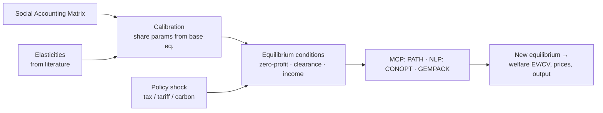

# CGE — Computable General Equilibrium

> The workhorse of economy-wide policy analysis. A CGE model makes **Walrasian general
> equilibrium computable**: dozens of interlinked markets for goods and factors, each
> clearing at prices the model solves for, so a tax, tariff, or carbon price ripples
> through the *entire* economy — production, trade, incomes, and welfare — at once.
> Where [DICE](../climate-iam/dice.md) has one aggregate good and
> [TIMES](../energy/times.md) optimizes one sector, CGE closes the whole circular flow.

## Positioning card

| Axis (see [Taxonomy](../../foundations/taxonomy.md)) | CGE (model class) |
|------|------|
| Optimization vs Simulation | **Equilibrium solve** — agents optimize; system solves a fixed point |
| Top-down vs Bottom-up | **Top-down** — aggregate sectors, elasticities of substitution |
| Equilibrium | **General equilibrium** (all markets clear simultaneously) |
| Foresight | **Static**, **recursive-dynamic** (myopic), or **intertemporal** (perfect foresight) |
| Deterministic vs Stochastic | **Deterministic** (systematic sensitivity analysis) |
| Time / Space | Comparative-static or period steps / single- or multi-region |
| Solution method | **Mixed Complementarity Problem (MCP)** / NLP / Johansen linearization |

| Field | Value |
|-------|-------|
| Full name | Computable General Equilibrium (a modeling class, not one model) |
| Domain | Economics — Equilibrium & Macro |
| Intellectual lineage | Walras (1874) → Arrow–Debreu (1954) → Scarf's algorithm (1967/73) → Shoven–Whalley (applied CGE) |
| Key toolchains | **GAMS/MPSGE** (Rutherford), **GEMPACK** (Harrison–Pearson), Python (`gamspy`, custom) |
| Prominent instances | [GTAP](gtap.md), [GEM-E3](gem-e3.md), [ENVISAGE](envisage.md), MONASH/USAGE, ORANI |
| Calibration data | **Social Accounting Matrix (SAM)** + imposed elasticities |

---

## 🎓 Scholar Track

### History & motivation

CGE realizes the dream of **Léon Walras**: a mathematical economy where everything
depends on everything else through prices. **Arrow and Debreu (1954)** proved such an
equilibrium *exists* under convexity; **Herbert Scarf (1967, 1973)** gave the first
algorithm to *compute* it; **Shoven and Whalley (1970s–80s)** turned it into an applied
policy tool for tax analysis. The motivation is precisely the **feedback** that
partial-equilibrium and sectoral models miss: a carbon tax raises energy prices, which
shifts production and consumption across *all* sectors, changes factor demands and hence
wages and capital returns, alters household incomes and thus final demand — a circular
flow that only a general-equilibrium closure captures.

### The modeling question

Given an economy described by a **Social Accounting Matrix** (a consistent snapshot of
all flows among sectors, factors, households, government, and the rest of the world),
find the **vector of prices and quantities at which every market clears simultaneously**,
and compare equilibria **before and after** a policy shock to read its effects on
output, trade, income distribution, and welfare.

### Mathematical formulation

A CGE model is a square system of **nonlinear equations** characterizing equilibrium.
In the **complementarity (MCP)** formulation popularized by Rutherford's **MPSGE**, it
is three families of weak inequalities, each *complementary* to a variable:

**1. Zero-profit** (no activity earns pure profit; complementary to activity level $y_s$):
$$
\Pi_s(p) = \text{cost}_s(p) - \text{revenue}_s(p) \ge 0 \;\perp\; y_s \ge 0
$$

**2. Market clearance** (supply ≥ demand for each commodity/factor; complementary to price $p_i$):
$$
\sum_s y_s\,\frac{\partial \text{(net supply)}}{\partial p_i} + \bar{e}_i \;\ge\; d_i(p, M) \;\perp\; p_i \ge 0
$$

**3. Income balance** (each agent's expenditure equals income from endowments + transfers; complementary to income $M_h$):
$$
M_h = \sum_i p_i \,\bar{\omega}_{h,i} + T_h
$$

Here "$\perp$" means *complementary slackness*: either the inequality binds or the
associated variable is zero. Only **relative prices** are determined (Walras' law makes
one market redundant); a numéraire is chosen.

#### Functional forms

Production and consumption use nested **CES** (constant elasticity of substitution)
functions; trade uses the **Armington** assumption (domestic and imported varieties are
imperfect substitutes) with **CET** on the export side:

$$
Q = A\Big[\sum_i \alpha_i\, X_i^{\,\rho}\Big]^{1/\rho}, \qquad \sigma = \frac{1}{1-\rho}
$$

The **substitution elasticities** $\sigma$ are the parameters that most drive results —
and, controversially, are usually *imposed from literature*, not estimated.

#### The variable ledger

| Kind | Content |
|------|---------|
| **Endogenous variables** | commodity & factor prices, activity levels, incomes, quantities traded |
| **Equilibrium conditions** | zero-profit, market clearance, income balance |
| **Exogenous / calibrated** | SAM base flows, elasticities, tax rates, endowments |
| **Policy levers** | tax/tariff/subsidy rates, carbon price/cap, factor supplies |
| **Closure choices** | savings-investment, government balance, factor mobility, trade balance |

### Solution & algorithms

Three dominant traditions:

- **MCP / MPSGE (GAMS)** — cast equilibrium as a complementarity problem, solved by
  **PATH**. Elegant for equilibria with corner solutions and taxes.
- **NLP** — solve the square nonlinear system directly (e.g., with CONOPT).
- **Johansen/Euler linearization (GEMPACK)** — solve in *percentage-change* form,
  stepping to control linearization error. Standard in the GTAP/ORANI/MONASH lineage.

### Calibration

The defining CGE method is **calibration, not estimation**: parameters are chosen so
the model *exactly reproduces the base-year SAM* as an equilibrium. Share parameters
come from the SAM; **elasticities are imposed** from econometric literature. This makes
CGE reproducible and transparent but is also its most-criticized feature (see below).

### Validation

CGE models are **hard to validate** by prediction — they are counterfactual
comparative-static tools. Practice relies on: **systematic sensitivity analysis** over
elasticities (Monte-Carlo or Gaussian-quadrature, as in GTAP), reproduction of the base
year by construction, back-of-envelope consistency (Harberger triangles), and model
intercomparison.

### Scenario generation

A **policy shock** changes an exogenous variable (a tax rate, a tariff, a carbon
constraint, a productivity or endowment change); the model re-solves for the new
equilibrium; welfare is read from **equivalent/compensating variation**. Dynamic CGE
sequences these over time (recursive) or optimizes over the path (intertemporal).

### Strengths / Weaknesses / Known criticisms

=== "Strengths"
    - **Economy-wide consistency** — captures inter-sectoral and income feedbacks by construction.
    - **Welfare-theoretic** — grounded in microeconomic theory; clean welfare measures.
    - **Transparent & reproducible** — calibrated to a public SAM; results decomposable.
    - **Flexible closure** — can represent very different macro theories via closure choice.

=== "Weaknesses / Criticisms"
    - **Calibration to a single year** — no statistical estimation, no confidence
      intervals; "one observation, many parameters." (Key critique, e.g., McKitrick; Jorgenson's estimated-CGE response.)
    - **Imposed elasticities** — results hinge on parameters borrowed from elsewhere.
    - **Equilibrium & full-employment assumptions** — no involuntary unemployment or
      disequilibrium unless closure is engineered; the heterodox **[E3ME](e3me.md)** rejects this outright.
    - **Representative agent / aggregation** — limited distributional and behavioral realism.
    - **"Black box" perception** — many nested elasticities make results hard to trace.

### Major publications

- Arrow, K. & Debreu, G. (1954). *Existence of an Equilibrium for a Competitive Economy.* Econometrica.
- Scarf, H. (1973). *The Computation of Economic Equilibria.* Yale UP.
- Shoven, J. & Whalley, J. (1984). *Applied General-Equilibrium Models of Taxation and International Trade.* J. Econ. Literature.
- Rutherford, T. (1999). *Applied General Equilibrium Modeling with MPSGE as a GAMS Subsystem.* Comp. Economics.
- Dixon, P. & Jorgenson, D. (eds., 2013). *Handbook of Computable General Equilibrium Modeling.*

---

## 🛠️ Engineer Track

### Software architecture

A CGE model is essentially **data (SAM + elasticities) + a set of equilibrium equations
+ a solver**, wrapped in calibration and reporting:

This is a **Market Engine** (see [Architecture Patterns](../../patterns/index.md)): its
job is to *clear markets*, in contrast to the *Optimization Engine* of DICE/TIMES.
Notably, competitive equilibrium can itself be posed as an optimization (a welfare
maximization, via the **Negishi** approach) — the two engines meet here.

### Data structures & pipeline

- **SAM**: a square matrix of all economic flows — the single most important artifact.
- Sets over sectors, factors, agents, regions; parameters for shares, elasticities, tax rates.
- **MPSGE** offers a compact high-level syntax for nested CES production/demand blocks
  that auto-generates the MCP; GEMPACK uses `.tab` files with percentage-change equations.

### Computational complexity

Static single-region CGE: **small** nonlinear system, solves in seconds. Large
multi-region, many-sector, recursive-dynamic models (GTAP with 100+ regions × many
sectors × many years) are substantial but still far cheaper than agent-based or hourly
energy models. The hard part is **specification and calibration**, not CPU.

### Language · ecosystem

| Toolchain | Style | Notes |
|-----------|-------|-------|
| **GAMS + MPSGE** | MCP, PATH solver | compact CES nesting; Rutherford school |
| **GAMS (raw)** | NLP/MCP | full control |
| **GEMPACK** | linearized, `.tab` | GTAP/ORANI/MONASH standard |
| **Python** | `gamspy`, bespoke | growing, for integration/automation |

---

## 🏛️ Architect Track

### Reusable design patterns

- **Market Engine** — the canonical "clear all markets at equilibrium prices" component;
  the counterpart to the Optimization Engine and the natural home for tax/tariff/price policy.
- **SAM as a typed data contract** — a balanced, auditable snapshot of the whole economy;
  a model of how an integrated simulator should keep its accounts *consistent by construction*.
- **Closure as configuration** — the same equations yield neoclassical or Keynesian
  behavior depending on which variables are fixed vs free. A powerful pattern: **encode
  competing theories as swappable closure rules**, not separate models.
- **Complementarity formulation** — inequalities-with-slackness elegantly handle
  taxes, corner solutions, and inactive technologies.

### Trade-offs & alternatives

| CGE chose | It gave up | The alternative wins when… |
|-----------|-----------|----------------------------|
| Top-down aggregation | Technology detail | you need explicit technologies → **[TIMES](../energy/times.md)/[OSeMOSYS](../energy/osemosys.md)** (hence *hybrid* IAMs) |
| General equilibrium | Disequilibrium realism | unemployment/demand-led dynamics matter → **[E3ME](e3me.md)**, ABM |
| Calibration | Statistical inference | you need estimated params + uncertainty → **[DSGE](dsge.md)**, estimated CGE (Jorgenson) |
| Representative agent | Heterogeneity | distribution/micro-behavior matters → microsimulation, ABM |
| Comparative statics | Rich dynamics | you need transition paths → recursive-dynamic / intertemporal CGE |

### Adoption

- **Government/Treasury**: tax and trade-reform analysis worldwide (Australia's
  MONASH/ORANI tradition is the archetype); ministries and the **World Bank**
  ([ENVISAGE](envisage.md)) and **OECD**.
- **Trade**: [GTAP](gtap.md) is the global standard for quantifying trade agreements.
- **Climate/energy**: [GEM-E3](gem-e3.md), ENV-Linkages, and hybrid IAMs
  ([AIM](../climate-iam/aim.md), and the CGE cores inside many IAMs).

### Ecosystem

- **Global/trade CGE**: [GTAP](gtap.md). **Climate-energy CGE**: [GEM-E3](gem-e3.md),
  [ENVISAGE](envisage.md). **Single-country dynamic**: MONASH/USAGE.
- **Contrast within economics**: [DSGE](dsge.md) (estimated, stochastic, forward-looking,
  macro-focused) and [Input–Output](input-output.md) (linear, no substitution — the
  fixed-coefficient ancestor of CGE).
- **Disequilibrium rival**: [E3ME](e3me.md) (macro-econometric, non-equilibrium).

### Research gaps & future directions

- **Heterogeneous-agent CGE** (bringing distribution and micro-behavior inside).
- **Estimated / Bayesian CGE** to attach uncertainty to elasticities.
- **Hybrid top-down/bottom-up** coupling with process-rich energy models (the central
  IAM design problem — see [Top-Down vs Bottom-Up](../../comparative/top-down-vs-bottom-up.md)).
- Relaxing equilibrium toward **agent-based macro** while keeping accounting consistency.

### Lesson for the integrated simulator

!!! quote "If we were designing the world's most capable policy simulator today…"
    CGE contributes three durable ideas. First, the **Market Engine** as a first-class
    component — a subsystem whose job is to *clear markets at endogenous prices* — is the
    natural complement to the Optimization and Simulation engines, and the right home for
    price-based policy (taxes, tariffs, carbon prices). Second, the **SAM is a model of
    disciplined accounting**: an integrated simulator should keep a balanced, typed,
    economy-wide ledger that every module must respect, so consistency holds *by
    construction*, not by hope. Third, and most transferable, **closure-as-configuration**:
    CGE shows that deep theoretical disagreements (neoclassical vs Keynesian, full
    employment vs demand-led) can be represented as *swappable closure rules over the same
    core equations* rather than rival codebases — exactly the "document every viewpoint"
    discipline this atlas demands, made executable.

## See also

- Contrast: [DICE](../climate-iam/dice.md) (top-down, one good) · [TIMES](../energy/times.md) (bottom-up, one sector)
- Within economics: [DSGE](dsge.md) · [Input–Output](input-output.md) · [GTAP](gtap.md) · [E3ME](e3me.md)
- Synergy: [Top-Down vs Bottom-Up](../../comparative/top-down-vs-bottom-up.md) · [Optimization vs Simulation](../../comparative/optimization-vs-simulation.md)
- Reusable engines: [Architecture Patterns](../../patterns/index.md)
