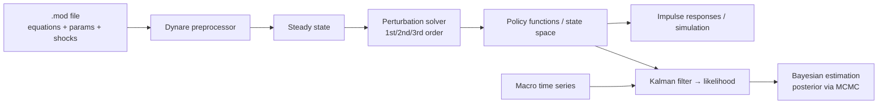

# DSGE — Dynamic Stochastic General Equilibrium

> The modern macroeconomics workhorse and the engine inside most central banks. DSGE
> builds the whole economy up from **micro-foundations**: forward-looking agents
> optimize intertemporally under **rational expectations**, **stochastic shocks**
> perturb the system, and everything sits in **general equilibrium**. Where
> [CGE](cge.md) is calibrated and comparative-static, DSGE is **econometrically
> estimated** and fundamentally about **dynamics and uncertainty**.

## Positioning card

| Axis (see [Taxonomy](../../foundations/taxonomy.md)) | DSGE |
|------|------|
| Optimization vs Simulation | **Optimization + equilibrium** — agents optimize; model solves a stochastic equilibrium |
| Top-down vs Bottom-up | **Top-down** — representative (or few) agents, aggregate |
| Equilibrium | **General equilibrium** with rational (model-consistent) expectations |
| Foresight | **Rational expectations** — agents know the model's stochastic structure |
| Deterministic vs Stochastic | **Stochastic** — shocks are the core object |
| Time / Space | Discrete (quarterly) / typically a single closed or small-open economy |
| Solution method | **Perturbation** (log-linearization) around steady state; projection for nonlinear |

| Field | Value |
|-------|-------|
| Full name | Dynamic Stochastic General Equilibrium (a modeling class) |
| Domain | Economics — Equilibrium & Macro |
| Lineage | Lucas critique (1976) → RBC (Kydland–Prescott 1982) → New Keynesian (1990s–2000s) → HANK (2010s) |
| Canonical model | **Smets–Wouters (2003, 2007)** estimated NK-DSGE |
| Toolchain | **Dynare** (MATLAB/Octave/Julia); `gEcon`, custom Julia/Python |
| Estimation | **Bayesian** (MCMC) — unlike calibrated CGE |

---

## 🎓 Scholar Track

### History & motivation

DSGE is the direct response to the **Lucas critique (1976)**: reduced-form
macro-econometric relationships are not policy-invariant, because they blend together
the *deep parameters* (preferences, technology) with agents' *expectations of policy*.
Change the policy and the correlations shift. The remedy is to model the **deep
structural parameters** and let behavior — and hence the reduced form — be *derived* from
optimization under expectations.

Two waves built the paradigm. **Real Business Cycle** theory (Kydland–Prescott, 1982)
showed a frictionless, competitive stochastic growth model driven by technology shocks
could generate business-cycle-like fluctuations. The **New Keynesian** synthesis
(1990s–2000s) added **nominal rigidities** (sticky prices via Calvo staggering,
monopolistic competition) so that **monetary policy has real effects** — making DSGE
useful for central banks. The **Smets–Wouters** models became the template, estimated on
macro data by Bayesian methods and adopted at the ECB, Fed, and beyond.

### The modeling question

What are the **dynamic responses** of output, inflation, employment, and interest rates
to **structural shocks** (technology, monetary, fiscal, demand), and how do alternative
**policy rules** (e.g., a central bank's interest-rate rule) change those responses and
welfare — all under the discipline that agents' expectations are consistent with the
model itself?

### Mathematical formulation

A DSGE model is a system of **stochastic difference equations** derived from agents'
first-order conditions plus market clearing. The core of the canonical New Keynesian
model:

**Household intertemporal optimization** →
$$
\max \; \mathbb{E}_0 \sum_{t=0}^{\infty} \beta^t\, U(C_t, N_t), \qquad
U'(C_t) = \beta\,\mathbb{E}_t\!\left[U'(C_{t+1})\,\frac{1+i_t}{1+\pi_{t+1}}\right]
$$
the **consumption Euler equation** — today's marginal utility equals discounted expected
marginal utility scaled by the real return.

**Firms with Calvo pricing** → the **New Keynesian Phillips Curve**:
$$
\pi_t = \beta\,\mathbb{E}_t[\pi_{t+1}] + \kappa\, \tilde{y}_t
$$
inflation depends on expected future inflation and the output gap $\tilde{y}_t$.

**Monetary policy** → a **Taylor-type rule**:
$$
i_t = \rho\, i_{t-1} + (1-\rho)\big(\phi_\pi \pi_t + \phi_y \tilde{y}_t\big) + \varepsilon_t^m
$$

Together with a **dynamic IS curve** (the log-linearized Euler equation),
$$
\tilde{y}_t = \mathbb{E}_t[\tilde{y}_{t+1}] - \tfrac{1}{\sigma}\big(i_t - \mathbb{E}_t[\pi_{t+1}] - r_t^n\big),
$$
these form the **canonical 3-equation NK model**. Shocks follow stochastic processes,
e.g. $a_t = \rho_a a_{t-1} + \varepsilon_t^a$.

#### The variable ledger

| Kind | Content |
|------|---------|
| **State variables** | capital, lagged variables, shock processes $a_t, \varepsilon_t$ |
| **Control / jump variables** | consumption, inflation, output gap, interest rate |
| **Deep (structural) parameters** | $\beta$ (discount), $\sigma$ (risk aversion), $\kappa$ (price stickiness), Taylor coefficients |
| **Shocks** | technology, monetary, demand, markup, fiscal |
| **Equilibrium conditions** | Euler, Phillips, policy rule, resource constraint, rational expectations |

### Solution & algorithms

- **Perturbation** — log-linearize (1st order) or higher-order Taylor-expand the
  equilibrium conditions around the deterministic steady state; solve the resulting
  linear rational-expectations system (Blanchard–Kahn / Klein / Sims `gensys`). This is
  **Dynare**'s default and is fast.
- **Projection / global methods** — for strong nonlinearity (occasionally binding
  constraints like the **zero lower bound**, large risk), approximate policy functions
  over the state space.
- **Estimation** — **Bayesian**: combine priors on deep parameters with the likelihood
  (via the Kalman filter on the linearized state space) and sample the posterior by MCMC.

### Calibration & estimation

Unlike [CGE](cge.md)'s pure calibration, DSGE is typically **estimated**: some
parameters calibrated to long-run ratios, the rest given priors and estimated from macro
time series (output, inflation, wages, interest rates). This yields **posterior
distributions** — genuine uncertainty quantification.

### Validation

Assessed by: fit to data (marginal likelihood, comparison to VAR benchmarks),
**impulse-response** plausibility, forecasting performance, and out-of-sample checks.
The paradigm's validation crisis is itself famous (below).

### Scenario generation

**Impulse-response functions** to structural shocks; **counterfactual policy rules**
(change the Taylor rule, evaluate welfare); **forecasting** and scenario fans;
**optimal policy** analysis (Ramsey policy within the model).

### Strengths / Weaknesses / Known criticisms

=== "Strengths"
    - **Micro-founded & Lucas-critique-robust** — deep parameters, policy-invariant structure.
    - **Internally consistent expectations** — rational expectations close the model coherently.
    - **Genuine uncertainty** — stochastic by design; Bayesian estimation gives posteriors.
    - **Central-bank standard** — the common language of modern monetary policy analysis.

=== "Weaknesses / Criticisms"
    - **Missed the 2008 crisis.** Frictionless finance and linearization around a stable
      steady state cannot produce crises — a defining failure (Blanchard; Romer, *The
      Trouble with Macroeconomics*, 2016; Stiglitz).
    - **Representative agent** — hides distribution and heterogeneity; partly answered by
      **HANK** (Heterogeneous-Agent New Keynesian: Kaplan–Moll–Violante).
    - **Rational expectations** — a strong, contested assumption; alternatives use
      learning or bounded rationality.
    - **Linearization** — first-order solutions omit risk and nonlinearity that matter in crises.
    - **Thin financial sector** in baseline models (improved post-2008 with financial frictions, à la Bernanke–Gertler–Gilchrist).

### Major publications

- Lucas, R. (1976). *Econometric Policy Evaluation: A Critique.*
- Kydland, F. & Prescott, E. (1982). *Time to Build and Aggregate Fluctuations.* Econometrica. (RBC)
- Smets, F. & Wouters, R. (2007). *Shocks and Frictions in US Business Cycles.* AER.
- Galí, J. (2008/2015). *Monetary Policy, Inflation, and the Business Cycle.* (NK textbook)
- Kaplan, Moll & Violante (2018). *Monetary Policy According to HANK.* AER.
- Romer, P. (2016). *The Trouble with Macroeconomics.* (critique)

---

## 🛠️ Engineer Track

### Software architecture

DSGE practice is dominated by **Dynare**, a domain-specific layer over MATLAB/Octave/Julia:

You **declare the model** (endogenous vars, exogenous shocks, parameters, equilibrium
equations); the toolchain finds the steady state, computes the perturbation solution, and
runs estimation. This is a clean **declarative-model + solver** pattern, like
[CGE](cge.md)/[TIMES](../energy/times.md) but for **stochastic dynamic** equilibria.

### Data structures & pipeline

- A `.mod` file: variable/parameter declarations, the model block (equilibrium
  equations), shock covariances, and commands (`stoch_simul`, `estimation`).
- State-space representation for the Kalman filter; posterior draws for estimation.

### Computational complexity

Linearized estimation of a medium DSGE (Smets–Wouters scale) is **minutes to hours**
(MCMC dominates). **Global/nonlinear** solutions and **HANK** models (with a distribution
as a state variable) are dramatically heavier — HANK needs specialized methods (e.g.,
sequence-space Jacobians, Reiter's method) and is an active computational frontier.

### Language · ecosystem

| Tool | Role |
|------|------|
| **Dynare** (MATLAB/Octave/Julia) | de-facto standard: solving + Bayesian estimation |
| **Dynare.jl / DifferentiableStateSpaceModels** | Julia performance |
| **`gEcon`**, **IRIS**, **RISE** | alternatives / regime-switching |
| **HANK toolkits** (SSJ) | heterogeneous-agent frontier |

---

## 🏛️ Architect Track

### Reusable design patterns

- **Micro-foundations as policy-invariance** — model deep parameters, derive behavior;
  the structural answer to "will this relationship survive the policy change?"
- **Rational-expectations fixed point** — expectations consistent with the model's own
  dynamics; a specific, powerful **closure** (contrast the adaptive/learning closures of
  simulation models).
- **Perturbation-around-steady-state** — a general technique: solve a hard stochastic
  system by expanding around a tractable point (with the documented caveat that it hides
  far-from-steady-state crises).
- **Bayesian estimation with priors** — carries uncertainty as posteriors; a model for
  how an integrated simulator should treat its own parameters.

### Trade-offs & alternatives

| DSGE chose | It gave up | The alternative wins when… |
|------------|-----------|----------------------------|
| Representative agent | Heterogeneity/distribution | inequality/MPC-heterogeneity matter → **HANK**, microsimulation, ABM |
| Rational expectations | Behavioral realism | expectations are adaptive/biased → **learning models, ABM** |
| Linearization | Nonlinearity/crises | ZLB, financial crises, big shocks → **global/nonlinear**, [E3ME](e3me.md), ABM |
| Equilibrium | Disequilibrium dynamics | persistent unemployment/imbalance → **[E3ME](e3me.md), agent-based macro** |
| Estimated micro-macro | Sectoral/technology detail | you need sectors/technologies → **[CGE](cge.md), hybrid IAMs** |

### Adoption

- **Central banks**: ECB, Federal Reserve, Bank of England, and many others run DSGE for
  forecasting and monetary-policy analysis (Smets–Wouters lineage; the Fed's **FRB/US**
  is a related large-scale model).
- **International**: IMF, and academic macro globally.
- Less used for climate/energy (where CGE and IAMs dominate), though DSGE-IAM hybrids
  and climate-DSGE ("E-DSGE") are a growing research area.

### Ecosystem

- **Within economics**: [CGE](cge.md) (calibrated, sectoral, comparative-static — the
  cross-sectional complement), [Input–Output](input-output.md) (linear ancestor).
- **Heterodox contrast**: [E3ME](e3me.md) (macro-econometric, disequilibrium) — the
  sharpest methodological opposite; see
  [Equilibrium vs Disequilibrium](../../comparative/equilibrium-vs-disequilibrium.md).
- **Successors/variants**: HANK, financial-friction DSGE, regime-switching, E-DSGE (climate).

### Research gaps & future directions

- **Heterogeneity at scale** (HANK) as standard, not frontier.
- **Expectations beyond rationality** — learning, bounded rationality, survey-consistent expectations.
- **Financial instability & nonlinearity** endogenous to the model.
- **Climate-DSGE** integrating carbon and transition risk into monetary/fiscal analysis.

### Lesson for the integrated simulator

!!! quote "If we were designing the world's most capable policy simulator today…"
    DSGE's enduring lesson is the **Lucas critique operationalized**: if you want a model
    whose relationships *survive the policy you are testing*, model the deep parameters
    and let behavior be derived — do not hard-code reduced-form correlations that will
    shift the moment policy changes. Equally instructive is DSGE's **failure**: its
    linearization around a stable steady state and its representative agent made the 2008
    crisis literally unrepresentable. The design implication is to treat the
    **expectations mechanism** and the **solution approximation** as *explicit, swappable
    components* — rational-expectations *or* learning; local perturbation *or* global
    nonlinear — so the simulator can be pushed into the far-from-equilibrium regimes where
    the single most important policy events actually happen. And DSGE's **Bayesian
    estimation** is the template for parameter humility: carry posteriors, not point
    estimates.

## See also

- Within economics: [CGE](cge.md) · [Input–Output](input-output.md)
- Sharpest contrast: [E3ME](e3me.md) (disequilibrium)
- Synergy: [Equilibrium vs Disequilibrium](../../comparative/equilibrium-vs-disequilibrium.md) · [Deterministic vs Stochastic](../../comparative/index.md)
- Reusable engines: [Architecture Patterns](../../patterns/index.md)
