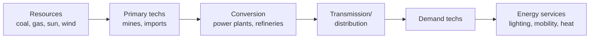
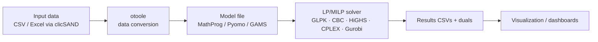

# OSeMOSYS — Open Source energy MOdelling SYStem

> The bottom-up counterpoint to DICE. Where DICE optimizes one aggregate welfare
> number, OSeMOSYS optimizes an explicit inventory of technologies and fuels to meet
> energy demand at least cost. It is deliberately simple, fully open, and has become
> the default capacity-planning tool for governments that cannot afford proprietary
> licenses — the democratizing move in energy-system modeling.

## Positioning card

| Axis (see [Taxonomy](../../foundations/taxonomy.md)) | OSeMOSYS |
|------|------|
| Optimization vs Simulation | **Optimization** — least-cost (cost minimization) |
| Top-down vs Bottom-up | **Bottom-up** — explicit technologies, fuels, processes |
| Equilibrium | **Partial equilibrium** (energy sector; demand exogenous) |
| Foresight | **Perfect foresight** over the horizon (myopic variant possible) |
| Deterministic vs Stochastic | **Deterministic** (stochastic/Monte-Carlo add-ons exist) |
| Time / Space | **Flexible time-slices** (seasons × day-types × brackets) / **multi-region** |
| Solution method | **Linear Programming (LP)** — occasionally MILP |

| Field | Value |
|-------|-------|
| Full name | Open Source energy MOdelling SYStem |
| Domain | Energy Systems (bottom-up optimization) |
| First release / current | 2008 (Howells et al.) / actively maintained |
| Institution · lead | KTH Royal Institute of Technology (Mark Howells and collaborators) + open community |
| Implementations | GNU MathProg (reference), Python (PuLP/Pyomo), GAMS |
| Data/tooling | `otoole` (data conversion), `MoManI`, `clicSAND` (Excel front-end) |
| License | **Open — Apache 2.0** (code and datasets community-shared) |

---

## 🎓 Scholar Track

### History & motivation

OSeMOSYS was introduced in 2008–2011 by **Mark Howells and colleagues at KTH** (with
UNIDO, IAEA, and other partners) and formally published in *Energy Policy* (2011). The
motivation was explicitly **political-economic, not just scientific**: the dominant
energy-system optimization tools — **MARKAL/TIMES** (IEA-ETSAP) and **MESSAGE** (IIASA)
— were powerful but had steep learning curves, proprietary components, and licensing
costs that locked out analysts in developing countries. OSeMOSYS was designed to be:

1. **Free and open** — no license fees, source fully inspectable.
2. **Small enough to learn in days**, not months — a few "blocks" of equations.
3. **Solver-agnostic** — runnable on free solvers (GLPK/CBC) as well as commercial ones.

It has since become the analytical backbone of capacity-building programmes such as the
UN **Climate Compatible Growth (CCG)** initiative and numerous national electricity- and
energy-planning studies across Africa, South Asia, and Latin America.

### The modeling question

Given projected **energy service demands** (electricity, heat, transport fuels) over a
multi-decade horizon, and a menu of **technologies** (each with costs, efficiencies,
lifetimes, and emission factors) connected by **fuels/commodities**, find the
**least-cost investment and operation schedule** that satisfies demand and all physical
and policy constraints. This is a *least-cost* framing — it does not maximize welfare
(as DICE does); it minimizes system cost to meet an exogenous demand.

### The Reference Energy System (RES)

OSeMOSYS represents the energy system as a directed graph — the **Reference Energy
System** — of `TECHNOLOGY` nodes linked by `FUEL` (commodity) flows, from primary
resources through conversion to final demand:



### Mathematical formulation

OSeMOSYS is a **linear program**. Sets index the problem: years $y$, technologies $t$,
fuels $f$, regions $r$, and time-slices $l$ (intra-year load blocks). The reference
formulation is organized into modular **blocks** (Objective, Costs, Storage, Capacity
Adequacy, Energy Balance, Emissions, …).

#### Objective — minimize total discounted system cost

$$
\min \; \sum_{r}\sum_{y} \frac{\text{TotalCost}_{r,y}}{(1+d)^{\,(y - y_0)}}
$$

where the annual cost aggregates capital, fixed O&M, variable O&M, and emission penalties:

$$
\text{TotalCost}_{r,y} = \underbrace{\sum_t CC_{t}\,\text{NewCapacity}_{r,t,y}}_{\text{capital (annualized)}}
+ \sum_t FC_{t}\,\text{TotalCapacity}_{r,t,y}
+ \sum_t VC_{t}\,\text{TotalActivity}_{r,t,y}
+ \sum_e \text{EmissionPenalty}_{r,e,y}
$$

#### Key decision variables

| Variable | Meaning |
|----------|---------|
| $\text{NewCapacity}_{r,t,y}$ | capacity built of technology $t$ in year $y$ |
| $\text{AccumulatedNewCapacity}$ / $\text{TotalCapacity}$ | capacity in place (respecting operational life) |
| $\text{RateOfActivity}_{r,t,m,l,y}$ | operating level by mode $m$, time-slice $l$ |
| $\text{Production}/\text{Use}_{r,l,f,y}$ | fuel produced / consumed |
| $\text{StorageLevel}$, $\text{NewStorageCapacity}$ | storage state and investment |

#### Core constraints (selected)

**Energy balance** — for every fuel, region, time-slice and year, production plus
imports must meet use plus demand:

$$
\sum_t \text{Production}_{r,t,l,f,y} + \text{Import} \;\ge\; \sum_t \text{Use}_{r,t,l,f,y} + \text{Demand}_{r,l,f,y}
$$

**Capacity adequacy** — activity in any time-slice cannot exceed installed capacity
(scaled by capacity factor and availability):

$$
\text{RateOfActivity}_{r,t,m,l,y} \le \text{TotalCapacity}_{r,t,y}\cdot \text{CapacityFactor}_{r,t,l,y}\cdot \text{CapacityToActivityUnit}_t
$$

**Capacity accounting** — installed capacity is the sum of surviving vintages:

$$
\text{TotalCapacity}_{r,t,y} = \text{ResidualCapacity}_{r,t,y} + \!\!\sum_{y'\,:\,y-y' < LT_t}\!\! \text{NewCapacity}_{r,t,y'}
$$

**Emissions & policy** — emissions accumulate from activity and may be capped or priced:

$$
\text{AnnualEmissions}_{r,e,y} = \sum_{t}\text{EmissionActivityRatio}_{r,t,e}\cdot \text{TotalActivity}_{r,t,y} \;\le\; \text{AnnualEmissionLimit}_{r,e,y}
$$

Additional blocks handle **reserve margins**, **renewable-generation targets (RE
targets)**, **capacity/activity bounds**, and **storage** dynamics.

#### The variable ledger

| Kind | Content |
|------|---------|
| **State-like accumulations** | installed capacity by vintage, cumulative emissions, storage level |
| **Decision variables** | new capacity, activity rates, storage investment |
| **Objective** | discounted total system cost (minimized) |
| **Exogenous inputs** | demand projections, technology costs/efficiencies, resource limits, discount rate $d$ |
| **Policy levers** | emission caps/prices, RE targets, reserve margins, build limits |

### Solution & algorithms

A pure **LP** — convex, so any optimum is the *global* optimum, and duals
(shadow prices) are meaningful (e.g., the marginal cost of a fuel, the shadow price of
a CO₂ cap). Solved with **GLPK/CBC** (free) or **CPLEX/Gurobi/HiGHS** (faster). Adding
integer build decisions (indivisible plants, unit commitment) makes it a **MILP** and
sacrifices convexity for realism. The reference model is written in **GNU MathProg**;
Python ecosystems (`OSeMOSYS-PuLP`, Pyomo ports) and GAMS versions coexist.

### Calibration

- **Demand**: exogenous service-demand projections (often from GDP/population drivers or
  a separate demand model).
- **Techno-economic parameters**: capital/O&M costs, efficiencies, lifetimes, capacity
  factors from technology databases (IRENA, IEA, national sources).
- **Base-year calibration**: `ResidualCapacity` and existing stock set to match the
  observed system in the start year.

### Validation

Like all planning-optimization models, OSeMOSYS is **normative** — it computes what a
least-cost planner *should* build, not a forecast of what *will* happen. Validation is
therefore about **plausibility and reproducibility**: base-year calibration against
statistics, benchmarking against other models (model-intercomparison), and open data so
results are independently reproducible — a deliberate answer to the "black-box" critique
of proprietary tools.

### Scenario generation

Policy experiments are built by changing inputs/constraints: **carbon prices or caps**,
**RE/technology targets**, **cost trajectories** (e.g., falling solar CapEx), **resource
or import limits**, and **demand growth** variants. Ensembles over uncertain parameters
(costs, demand) produce robustness analysis.

### Strengths / Weaknesses / Known criticisms

=== "Strengths"
    - **Openness & accessibility** — no license barrier; auditable; teachable in days.
    - **Convex LP** — global optimum, meaningful shadow prices, fast, scalable.
    - **Modular blocks** — add/remove emissions, storage, reserve margin cleanly.
    - **Capacity-building fit** — the tool of choice for national planning in the Global South.

=== "Weaknesses / Criticisms"
    - **Perfect foresight & perfect competition** — a single optimizing planner is a
      strong idealization; real investment is myopic, strategic, and financed under risk.
    - **Exogenous demand** — no feedback from energy prices to the economy (no
      macro loop); addressed only by coupling (cf. MESSAGEix–MACRO).
    - **Temporal aggregation** — a handful of time-slices can miss the sub-hourly
      variability that matters for high-renewable systems (where **PyPSA**'s hourly
      resolution wins).
    - **Linearity** — economies of scale, lumpy investments, and unit commitment need
      MILP extensions that erode tractability.
    - **Least-cost ≠ realistic** — ignores non-cost adoption barriers, politics, and behavior.

### Major publications

- Howells, M. et al. (2011). *OSeMOSYS: The Open Source Energy Modeling System.*
  **Energy Policy**, 39(10), 5850–5870.
- Gardumi, F. et al. (2018). *From the development of an open-source energy modelling
  tool to its application…* **Energy Strategy Reviews**.
- Climate Compatible Growth (CCG) programme documentation and **OSeMOSYS Global** (2022+).

---

## 🛠️ Engineer Track

### Software architecture

OSeMOSYS is a **declarative optimization model** plus a **data/tooling ecosystem**:



The **model file is the algebra** (sets, parameters, variables, the block constraints);
solving is delegated to a standard LP solver. This separation — *model expresses
constraints, solver optimizes* — is the same **Optimization Engine over declared
constraints** pattern seen in [DICE](../climate-iam/dice.md), but here the constraints
describe a technology network rather than a growth economy.

### Data structures & pipeline

- **Inputs** are large **sparse parameter tables** indexed over (region, technology,
  fuel, mode, time-slice, year). `otoole` converts between human-friendly CSV/Excel and
  the solver's datafile format; `clicSAND` offers an Excel front-end for non-programmers.
- **Time-slices** (`SEASON × DAYTYPE × DAILYTIMEBRACKET`) are the key modeling knob
  trading fidelity for size.
- **Outputs** are result CSVs (capacities, activity, emissions, costs) plus **duals**
  (fuel marginal costs, emission shadow prices).

### Computational complexity

Model size grows roughly with $|\text{regions}|\times|\text{techs}|\times|\text{fuels}|
\times|\text{time-slices}|\times|\text{years}|$. A national model with modest
time-slices is a **small-to-medium LP** solving in seconds–minutes on free solvers;
high time-slice resolution or many regions (e.g., **OSeMOSYS Global**) pushes into
large LPs where commercial solvers and careful aggregation matter. MILP extensions are
dramatically harder (NP-hard).

### Language · open-source · extensibility

| Implementation | Stack | Notes |
|----------------|-------|-------|
| Reference | **GNU MathProg** (`.txt` model + datafile) | canonical, solver GLPK |
| Python | **OSeMOSYS-PuLP**, Pyomo ports | scripting, integration |
| GAMS | GAMS version | for GAMS shops |
| Tooling | `otoole`, `MoManI`, `clicSAND`, `OSeMOSYS Global` | data, GUI, global dataset |

Extensibility is by **adding constraint blocks** (e.g., a new policy target) and new
`TECHNOLOGY`/`FUEL` entries — no need to touch the solver. Fully **Apache-2.0 open**.

### How to run it (conceptual)

```bash
# Reference path (free stack):
otoole convert csv datafile data/ model_data.txt config.yaml   # build datafile
glpsol -m OSeMOSYS.txt -d model_data.txt -o results.txt        # solve LP with GLPK
otoole results glpk results/ ...                               # extract tidy CSVs
```

---

## 🏛️ Architect Track

### Reusable design patterns

- **Energy Dispatch + Investment Engine** — co-optimizes what to *build* and how to
  *run* it; the canonical bottom-up engine (see [Architecture Patterns](../../patterns/index.md)).
- **Declared-constraint Optimization Engine** — identical top-level contract to DICE:
  modules declare constraints, a solver optimizes. Reinforces that an integrated
  simulator should treat "the optimizer" as a service consuming a constraint graph.
- **Commodity-network (RES) data model** — technologies-as-nodes / fuels-as-edges is a
  clean, extensible schema for *any* flow system (energy, water, materials).
- **Shadow-price extraction** — carbon/fuel marginal values come free from LP duals,
  exactly as SCC comes from DICE's duals.
- **Open-data reproducibility** — the *social* design choice (openness) is itself a
  transferable pattern for a public-interest simulator.

### Trade-offs & alternatives

| OSeMOSYS chose | It gave up | The alternative wins when… |
|----------------|-----------|----------------------------|
| Bottom-up technology detail | Macro feedback | you need economy-wide effects → **CGE / MESSAGEix-MACRO / REMIND** |
| Coarse time-slices | Sub-hourly realism | high-VRE grids → **PyPSA / Calliope** (hourly, network flow) |
| LP (convex) | Lumpy/discrete realism | plant indivisibility, unit commitment → **MILP** |
| Least-cost planner | Behavioral/strategic realism | investors are myopic/strategic → **simulation / ABM / recursive-dynamic** |
| Openness & simplicity | Feature richness of TIMES | you need TIMES' full flexibility and have the license/skills |

### Adoption

- **Government**: national energy/electricity plans across Africa, South/Southeast Asia,
  and Latin America; used by ministries and utilities for capacity expansion.
- **UN / international**: **UN DESA**, **UNDP**, IAEA training; anchor tool of the
  FCDO-funded **Climate Compatible Growth (CCG)** programme; **OSeMOSYS Global**
  provides an open global electricity dataset.
- **Academia**: widely taught (KTH, ICTP, and CCG open courses).

### Ecosystem

- **Competing / sibling tools**: **TIMES/MARKAL** (IEA-ETSAP; richer, license-gated),
  **MESSAGEix** (IIASA; adds MACRO GE link), **PyPSA / Calliope** (open, high-resolution
  power-focused), **EnergyPLAN** (simulation, not optimization).
- **Extensions**: **OSeMOSYS Global**, sector-coupling and storage add-ons, MILP variants.

### Research gaps & future directions

- Reconciling **temporal aggregation vs high-VRE fidelity** without blowing up size
  (time-slice selection, clustering).
- **Endogenous demand / macro coupling** while keeping the model open and light.
- Native **uncertainty & robustness** (stochastic/robust optimization) as first-class.
- **Myopic/agent variants** to relax perfect foresight where it distorts investment.

### Lesson for the integrated simulator

!!! quote "If we were designing the world's most capable policy simulator today…"
    OSeMOSYS teaches two things DICE cannot. First, the **commodity-network data model**
    (technologies-as-nodes, fuels-as-edges) is a reusable substrate for *any* flow
    system — the integrated simulator should adopt a graph-native representation of
    stocks and flows that energy, water, and materials modules all share. Second,
    **openness is an architectural property, not an afterthought**: reproducibility,
    free solvers, and inspectable equations are what let a tool be *trusted and adopted*
    by the governments that most need it. A next-generation simulator should treat the
    optimizer as a **solver-agnostic service consuming a declared constraint graph**
    (so LP, MILP, or a myopic simulation can be swapped behind one interface), expose
    **duals as first-class policy outputs**, and make **open data and reproducibility a
    hard requirement** — the same discipline that made this small model globally influential.

## See also

- The contrast that motivates this dossier: [DICE](../climate-iam/dice.md) (top-down welfare optimization)
- Foundations: [Taxonomy](../../foundations/taxonomy.md) · [Three-Track Method](../../foundations/three-track-method.md)
- Emerging matrices: [Comparative Analyses](../../comparative/index.md)
- Reusable engines: [Architecture Patterns](../../patterns/index.md)
