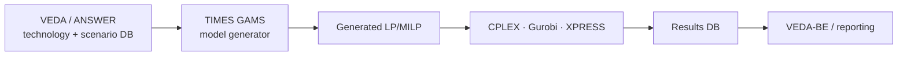

# TIMES — The Integrated MARKAL-EFOM System

> The professional heavyweight of bottom-up energy-system optimization. Where
> [OSeMOSYS](osemosys.md) minimizes cost to meet fixed demand, TIMES maximizes **total
> surplus** with price-elastic demands — turning a least-cost planner into a
> **partial-equilibrium** market model. It is the IEA-ETSAP community's flagship, the
> engine behind national low-carbon strategies and the IEA's *Energy Technology
> Perspectives*.

## Positioning card

| Axis (see [Taxonomy](../../foundations/taxonomy.md)) | TIMES |
|------|------|
| Optimization vs Simulation | **Optimization** — maximize total surplus (≡ least-cost when demand inelastic) |
| Top-down vs Bottom-up | **Bottom-up** — very rich technology/process detail |
| Equilibrium | **Partial equilibrium** (price-responsive demands clear the energy market) |
| Foresight | **Perfect foresight** (also *time-stepped/myopic* mode) |
| Deterministic vs Stochastic | **Deterministic** (native **stochastic programming** support) |
| Time / Space | **User-defined time-slices** / **multi-region** with trade |
| Solution method | **LP** (MILP for lumpy/discrete features) |

| Field | Value |
|-------|-------|
| Full name | The Integrated MARKAL-EFOM System |
| Domain | Energy Systems (bottom-up optimization) |
| Lineage | **MARKAL** (1970s) + **EFOM** → TIMES (2000s) |
| Institution | **IEA-ETSAP** (Energy Technology Systems Analysis Program) |
| Language · solver | **GAMS** + LP/MILP solver (CPLEX, Gurobi, XPRESS) |
| Front-ends | **VEDA** (commercial), **ANSWER** — data & scenario management |
| License | Model source available via ETSAP; front-ends/solvers commercial |

---

## 🎓 Scholar Track

### History & motivation

TIMES descends from **MARKAL** (MARKet ALlocation), built in the late 1970s under the
IEA's **ETSAP** implementing agreement in response to the oil crises, and **EFOM**. By
the early 2000s the two were unified and generalized into **TIMES**, a model *generator*:
you supply a database describing a Reference Energy System, and TIMES emits the
corresponding optimization problem. Its purpose is **long-horizon technology and
investment planning** — which technologies to deploy, when, and at what cost to meet
energy service demands under emissions and policy constraints.

The defining conceptual step beyond least-cost planning is the **elastic-demand partial
equilibrium**: demands respond to their own marginal cost, so TIMES doesn't just meet a
fixed demand at least cost — it finds the **market equilibrium** where supply and
price-responsive demand balance, maximizing the sum of producer and consumer surplus.

### The modeling question

Over a multi-decade horizon and many regions, choose investments and operations across
the whole energy system to **maximize discounted total economic surplus** (or,
equivalently for fixed demand, minimize total system cost), subject to commodity
balances, capacity dynamics, and policy constraints.

### Mathematical formulation

TIMES is a large **linear program** (optionally MILP). Its objective is the negative of
the discounted total system cost, or — with elastic demands — the total surplus.

#### Objective — maximize discounted total surplus (≡ minimize system cost)

$$
\min \; \text{NPV} = \sum_{r}\sum_{y} (1+d_{r})^{-(y-y_0)} \, \text{ANNCOST}(r,y)
$$

where `ANNCOST` aggregates investment, fixed and variable O&M, fuel and import costs,
taxes/subsidies, decommissioning, and salvage. With **elastic demands**, the objective
becomes maximization of consumer + producer surplus, solved as a linear (or piecewise-
linearized) complementarity/optimization problem:

$$
\max \; \Big[\underbrace{\textstyle\int \! p(D)\,dD}_{\text{gross consumer benefit}} - \; \text{total system cost}\Big]
$$

#### Key decision variables

| Variable | Meaning |
|----------|---------|
| $\text{VAR\_NCAP}(r,t,y)$ | new capacity of technology/process $t$ |
| $\text{VAR\_CAP}$ | installed capacity (vintaged) |
| $\text{VAR\_ACT}(r,t,y,s)$ | activity by time-slice $s$ |
| $\text{VAR\_FLO}$ / $\text{VAR\_IRE}$ | commodity flows / inter-regional trade |
| $\text{VAR\_DEM}$ | (elastic) demand level |

#### Core constraints (selected)

**Commodity balance** — supply of each commodity ≥ demand, per region, time-slice, period:

$$
\sum \text{production} + \text{imports} \;\ge\; \sum \text{consumption} + \text{exports} + \text{DEM}
$$

**Capacity transfer** — capacity available is the sum of surviving vintages minus retirements:

$$
\text{VAR\_CAP}(r,t,y) = \sum_{v\,:\,\text{alive}(v,y)} \text{VAR\_NCAP}(r,t,v) + \text{residual}(r,t,y)
$$

**Use/activity coupling, peaking & reserve** — activity bounded by capacity and
availability; a **peaking constraint** ensures firm capacity plus a reserve margin
covers peak load. **User constraints** encode arbitrary policy (RE shares, phase-outs,
emission caps).

### Solution & algorithms

A large-scale **LP**, solved with commercial solvers (CPLEX/Gurobi/XPRESS) via **GAMS**.
Native modes extend the basic LP:

- **Perfect foresight** (default) vs **time-stepped (myopic)** solving.
- **Elastic demand** → partial-equilibrium via sequential LP or piecewise linearization.
- **Stochastic programming** — scenario trees over uncertain parameters, hedging under
  uncertainty (a first-class feature, unlike most peers).
- **MILP** — lumpy investments, discrete unit sizes, unit commitment.

### Calibration

Calibrated to a base-year energy balance (IEA statistics, national data): existing
capacities, efficiencies, costs, and resource supply curves. Demand drivers
(GDP/population/sector activity) and technology cost trajectories are supplied by the
analyst, typically through the **VEDA** database environment.

### Validation

As a normative planning model, TIMES is validated by **base-year calibration**,
cross-model comparison (e.g., EMF, EU reference-scenario exercises), and structural
sensitivity — not by forecast accuracy. Its long institutional track record and
standardized ETSAP methodology are part of its credibility.

### Scenario generation

Rich scenario management is TIMES's hallmark: layered scenario files combine **carbon
budgets/prices, technology availability, resource limits, demand variants, and policy
user-constraints**. VEDA/ANSWER organize hundreds of such scenarios for national
strategy work.

### Strengths / Weaknesses / Known criticisms

=== "Strengths"
    - **Partial-equilibrium with elastic demand** — captures demand response and welfare, beyond pure least-cost.
    - **Feature depth** — trade, vintaging, stochastics, MILP, peaking/reserve, sophisticated policy constraints.
    - **Institutional standard** — decades of ETSAP methodology, national teams, documentation.
    - **Scenario management at scale** via VEDA.

=== "Weaknesses / Criticisms"
    - **Perfect-foresight optimality** — the same "clairvoyant social planner" idealization as all optimization IAMs/energy models.
    - **Cost/licensing barrier** — GAMS + commercial solver + VEDA; the very barrier [OSeMOSYS](osemosys.md) was built to remove.
    - **Complexity & opacity** — the flip side of feature depth; hard to fully audit.
    - **Temporal aggregation** — time-slices can under-resolve high-VRE variability vs hourly tools (**PyPSA**).
    - **No macro feedback** by default — partial (energy-sector) equilibrium, not economy-wide (cf. hybrid IAMs).

### Major publications

- Loulou, R., Remme, U., Kanudia, A., Lehtila, A., Goldstein, G. (2005/2016).
  *Documentation for the TIMES Model.* IEA-ETSAP.
- Loulou, R. & Labriet, M. (2008). *ETSAP-TIAM: the TIMES integrated assessment model.*
  Computational Management Science.
- Fishbone, L. & Abilock, H. (1981). *MARKAL… a linear-programming model for energy
  systems analysis.* (lineage)

---

## 🛠️ Engineer Track

### Software architecture

TIMES is a **model generator**: a fixed body of GAMS code reads a scenario/technology
database and *generates* the LP for the specific system.

Conceptually it is the same **Optimization Engine over a declared constraint set** as
[OSeMOSYS](osemosys.md) and [DICE](../climate-iam/dice.md); TIMES differs in the
**richness of the declared constraints** and a heavyweight **data-management layer**
(VEDA) around it.

### Data structures & pipeline

Large, layered databases: base commodities/technologies plus stacked **scenario files**.
The **time-slice** structure (seasonal/weekly/diurnal) and **region** set define problem
size. VEDA-FE prepares inputs; VEDA-BE handles results.

### Computational complexity

A serious multi-region, many-period, fine-time-slice TIMES model is a **large LP**
(hundreds of thousands to millions of variables/constraints), needing commercial
solvers and substantial memory. MILP or stochastic modes multiply difficulty.

### Language · open-source · extensibility

| Layer | Tech | Openness |
|-------|------|----------|
| Model core | **GAMS** | source via ETSAP (registration) |
| Solver | CPLEX/Gurobi/XPRESS | commercial |
| Data/UI | **VEDA** (or ANSWER) | commercial |
| Community | IEA-ETSAP, TIMES user group | organized, documented |

Extensible via **user constraints** and database additions; but the toolchain cost is
the standing criticism.

---

## 🏛️ Architect Track

### Reusable design patterns

- **Model-generator pattern** — separate the *fixed algebra* from the *data-defined
  problem instance*; the database, not the code, defines the system. Powerful for a
  configurable integrated simulator.
- **Elastic-demand partial equilibrium** — the bridge from "least-cost engine" to
  "market engine": endogenize demand response and read welfare, not just cost.
- **Declared-constraint Optimization Engine** + **shadow-price extraction** (marginal
  abatement costs from duals), shared with OSeMOSYS/DICE.
- **First-class uncertainty** — native stochastic programming as a built-in mode, not a
  bolt-on Monte-Carlo wrapper.

### Trade-offs & alternatives

| TIMES chose | It gave up | The alternative wins when… |
|-------------|-----------|----------------------------|
| Feature depth + VEDA | Accessibility/cost | you need free & simple → **OSeMOSYS** |
| Partial equilibrium (energy) | Economy-wide feedback | you need macro effects → **MESSAGEix-MACRO / REMIND / CGE** |
| Time-slices | Sub-hourly VRE realism | high-renewable grids → **PyPSA / Calliope** |
| Perfect foresight | Behavioral realism | myopic/strategic actors → **simulation / recursive-dynamic** |
| LP/MILP optimization | Emergent dynamics | you want "what happens", not "what's optimal" → **EnergyPLAN / ABM** |

### Adoption

- **Government**: national energy/climate strategies across the EU, UK, US, Ireland,
  and many ETSAP member countries; long-term decarbonization pathway analysis.
- **International**: the IEA's **Energy Technology Perspectives**; **ETSAP-TIAM** as a
  global integrated-assessment TIMES; EU reference scenario exercises.
- **Academia/industry**: extensive, via the ETSAP network.

### Ecosystem

- **Predecessors**: MARKAL, EFOM. **Global IAM variant**: ETSAP-TIAM.
- **Open counterparts**: **OSeMOSYS** (the deliberate open, simple alternative);
  **MESSAGEix** (adds macro link); **PyPSA/Calliope** (open, high-resolution power).
- **Simulation alternative**: **EnergyPLAN** (deterministic, non-optimizing).

### Research gaps & future directions

- Lowering the **accessibility barrier** (open solvers, open data layers).
- **High-VRE temporal fidelity** without intractable LPs (representative periods,
  clustering, soft-linking to hourly models).
- **Macro coupling** (hybrid top-down/bottom-up) as standard rather than bespoke.
- Mainstreaming **stochastic/robust** planning in practice.

### Lesson for the integrated simulator

!!! quote "If we were designing the world's most capable policy simulator today…"
    TIMES contributes two patterns worth carrying forward. First, the **model-generator
    architecture**: keep the algebra fixed and let a **data layer define the problem
    instance**, so the same engine can express a tiny teaching model or a
    million-variable national system — exactly the configurability an integrated
    simulator needs. Second, **elastic-demand partial equilibrium** is the clean bridge
    from a least-cost *engine* to a market *engine*: by endogenizing demand response you
    recover welfare and price signals without paying for a full economy-wide CGE. The
    cautionary lesson is equally important — TIMES's power came bundled with a
    proprietary toolchain, and [OSeMOSYS](osemosys.md) arose precisely to remove that
    barrier. A next-generation simulator should aim for **TIMES-grade capability on an
    OSeMOSYS-grade open stack**: rich, data-configurable optimization with elastic
    demand and native uncertainty, delivered on open solvers and open data.

## See also

- The open, simple counterpart: [OSeMOSYS](osemosys.md) · the top-down welfare view: [DICE](../climate-iam/dice.md)
- Synergy: [Optimization vs Simulation](../../comparative/optimization-vs-simulation.md) · [Comparative Analyses](../../comparative/index.md)
- Reusable engines: [Architecture Patterns](../../patterns/index.md)
