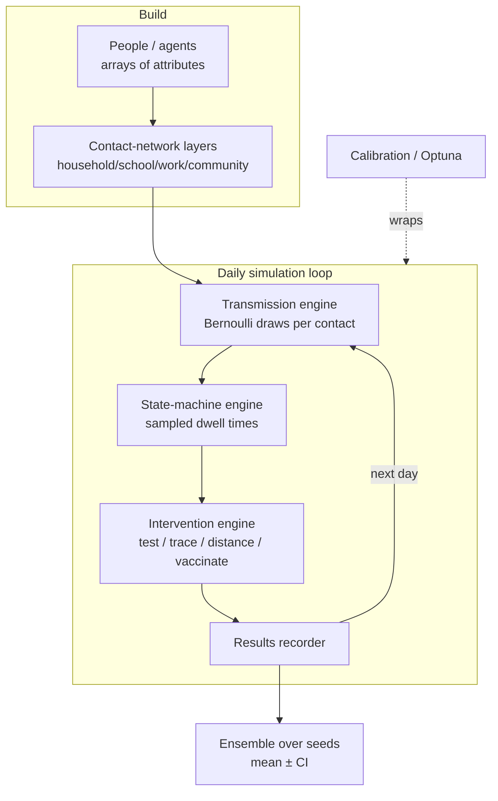

# Covasim — COVID-19 Agent-based Simulator

!!! success "Gold dossier"
    Covasim is the atlas's flagship **agent-based simulation** — the pure counterpoint
    to the optimizing, equilibrium models (DICE, CGE, DSGE) documented elsewhere. Where
    those compute a system-level optimum or a market-clearing fixed point, Covasim
    computes **nothing global at all**: it steps millions of individual agents through
    stochastic state transitions and lets the epidemic *emerge*. Read it alongside
    [ABM vs CGE](../../comparative/abm-vs-cge.md) and
    [Optimization vs Simulation](../../comparative/optimization-vs-simulation.md).

> A detailed stochastic agent-based epidemic model with realistic contact networks and
> intervention modeling, used for COVID-19 policy analysis by governments worldwide
> during 2020–2022.

## Positioning card

| Axis (see [Taxonomy](../../foundations/taxonomy.md)) | Covasim |
|------|------|
| Optimization vs Simulation | **Simulation** (agent-based, no objective) |
| Top-down vs Bottom-up | **Bottom-up** (individual agents) |
| Equilibrium | N/A — no market, no clearing |
| Foresight | None; interventions are reactive/scheduled |
| Deterministic vs Stochastic | **Stochastic** (Monte-Carlo over seeds) |
| Time / Space | Daily time-step / population + layered contact networks |
| Solution method | Forward Monte-Carlo agent stepping |

| Field | Value |
|-------|-------|
| Full name | Covasim — COVID-19 Agent-based Simulator |
| Domain | Health / Epidemiology |
| First release / current | March 2020 / ongoing (v3.x) |
| Institution · lead | Institute for Disease Modeling (IDM), Gates Foundation · Cliff Kerr et al. |
| Language · solver | Python (NumPy-vectorized); optional Numba |
| License / access | Open source (MIT), `pip install covasim` |

---

## 🎓 Scholar Track

### History & motivation

Covasim was written in **March 2020** by a team at the Institute for Disease Modeling
(then part of the Gates Foundation, later IHME/Gates) led by **Cliff Kerr**, as an
urgent response to the COVID-19 pandemic. The design goal was a model that was
**mechanistically rich enough** to represent the specific non-pharmaceutical
interventions governments were actually deploying — testing, contact tracing, school
closures, masking, quarantine, and later vaccination — rather than the coarse levers of
a compartmental (SEIR) differential-equation model. Within months it was adopted for
official policy analysis in the UK, Australia (notably Victoria's second-wave response),
Vietnam, several US states, and by numerous academic groups. The reference paper (Kerr
et al., *PLOS Computational Biology*, 2021) is one of the most-cited computational
epidemiology papers of the pandemic.

Its significance for this atlas is **paradigmatic**: Covasim is a mature, influential,
policy-consequential model that is **purely simulation** — it contains no optimization
and no equilibrium. It is the cleanest available referent for the emergent-dynamics
worldview.

### Mathematical formulation

Covasim is not defined by an objective function or an equilibrium condition but by a
**stochastic state-transition process over a population of agents**.

**State variables.** Each agent $i \in \{1,\dots,N\}$ carries a disease state
$s_i(t)$ drawn from an extended SEIR compartment set:

$$
s_i(t) \in \{\text{S}, \text{E}, \text{I}_{\text{asym}}, \text{I}_{\text{pre}},
\text{I}_{\text{mild}}, \text{I}_{\text{sev}}, \text{I}_{\text{crit}},
\text{R}, \text{D}\}
$$

plus per-agent attributes (age, comorbidity-linked susceptibility/severity, and
diagnosis/quarantine/vaccination flags). There is **no decision variable** — agents do
not optimize; the "policy" is exogenous interventions applied to the population.

**Contact structure.** Agents are embedded in **multiple contact layers**
$\ell \in \{\text{household}, \text{school}, \text{work}, \text{community}, \dots\}$,
each a separate network $G_\ell$. The per-contact transmission probability combines a
layer-specific weight $\beta_\ell$, viral-load/time-since-infection modifiers, and the
susceptibility of the target:

$$
p_{i \to j}(t) = \beta_{\ell} \cdot w_{ij} \cdot v_i(\tau_i) \cdot \sigma_j
$$

where $v_i(\tau_i)$ is agent $i$'s infectiousness as a function of time since infection
$\tau_i$ and $\sigma_j$ is $j$'s relative susceptibility (age- and immunity-dependent).

**Dynamics.** Each daily step: for every infectious $i$ and each susceptible contact
$j$ in each layer, $j$ becomes exposed with probability $p_{i\to j}$; exposed and
infectious agents advance through the state machine with **sampled dwell times** drawn
from calibrated distributions (e.g. lognormal incubation). Because transitions are
Bernoulli/Monte-Carlo draws, a single run is one realization; policy conclusions come
from **ensembles over random seeds**.

### Solution algorithm

There is no solver in the optimization sense. The "solution" is **forward simulation**:

```
for t in days:
    update viral loads and per-agent infectiousness
    for each layer ℓ:
        find infectious–susceptible contact pairs
        draw new infections ~ Bernoulli(p_{i→j})
    advance disease states by sampled dwell times
    apply interventions (testing, tracing, distancing, vaccination)
    record daily results
repeat over N_seeds; aggregate mean ± CI
```

The inner loops are **vectorized in NumPy** (operating on arrays of agents rather than
Python-level loops), which is what makes million-agent runs tractable in pure Python.

### Calibration

Covasim is calibrated by **fitting a small number of free parameters** (overall
transmissibility $\beta$, importation rate, intervention efficacies) so simulated
diagnoses/hospitalizations/deaths match observed epidemic time-series. Because each
evaluation is a stochastic simulation, calibration uses **derivative-free / Bayesian
optimization** — the companion tool **Optuna** (and IDM's `Fit` object) searches
parameter space by repeated simulation. This is the characteristic ABM calibration
pattern: *the model is a black box you can only sample*, so you wrap it in an outer
search loop (contrast the analytic gradient available to DICE).

### Validation

Validation is by **retrospective fit and out-of-sample projection** against real
surveillance data (cases, hospitalizations, deaths, seroprevalence) across many
settings. Covasim was validated against the observed dynamics of specific outbreaks
(e.g. Victoria, Australia). The known epistemics: good ABM fit does **not** prove the
mechanism is right (equifinality — many parameter sets fit), and projection skill
degrades quickly once behavior changes.

### Strengths, weaknesses, criticisms

=== "Strengths"
    - **Mechanistic intervention fidelity** — models testing, tracing, quarantine,
      school/work closure, and vaccination as explicit processes, not lumped rate cuts.
    - **Heterogeneity** — age, network structure, and superspreading (overdispersion)
      emerge naturally from the agent/contact representation.
    - **Stochasticity as output** — produces distributions and extinction probabilities,
      not just a mean trajectory.
    - **Fast to deploy, open, well-documented** — usable within days by public-health teams.

=== "Weaknesses / criticisms"
    - **Computational cost** — a Monte-Carlo ensemble is far heavier than integrating an
      SEIR ODE; large populations × many seeds × calibration is expensive.
    - **Parameter identifiability / equifinality** — many combinations fit the data;
      mechanism is under-determined.
    - **Behavior is exogenous** — agents don't endogenously change behavior in response
      to risk (no economic/optimizing feedback); this is the standard critique that ABMs
      "assume the behavior they should explain."
    - **Validation is hard** — counterfactual intervention effects are rarely observable.

## 🛠️ Engineer Track

### Software architecture (engines)



The recognizable reusable engines (see [patterns](../../patterns/index.md)): a
**Behavior/State-machine Engine** (agent transitions), a **Market/Interaction Engine**
analogue (the contact-network transmission step), an **Intervention/Policy Engine**
(composable intervention objects), and a **Scenario/Ensemble Engine** (seeds + parameter
sweeps).

### Data structures & pipeline

The core performance idea: **structure-of-arrays, not array-of-structures.** Agents are
*not* Python objects in a list; the population is a set of parallel NumPy arrays (age,
state, date-of-next-transition, …). Every daily update is an array operation over the
whole population, so the interpreter overhead is amortized. Contact layers are stored as
edge arrays; interventions are first-class objects with an `apply(sim)` method, making
policy packages composable.

### Computational complexity

Per day, cost scales with the **number of active contacts**, roughly
$O(N \cdot \bar{k})$ for mean degree $\bar{k}$ per layer, times the number of days,
times seeds, times calibration evaluations. Memory is $O(N + E)$ for agents plus edges.
Vectorization keeps the constant factor low; Numba/parallel seeds scale it out.

### Language, open-source status, extensibility

Pure **Python** (`pip install covasim`), MIT-licensed, on GitHub with extensive docs and
tutorials. Highly extensible: custom interventions, variants/immunity (added for
Delta/Omicron), and analyzers plug in. It seeded a **family** — **HPVsim**, **FPsim**,
and the general **Starsim** framework generalize the same agent/layer/intervention engine
to other diseases.

## 🏛️ Architect Track

### Reusable design patterns

- **Structure-of-arrays agents** — the key to ABM scale in a high-level language; a
  direct lesson for any agent subsystem of the integrated simulator.
- **Interventions as composable objects** — policy is data/objects applied to the
  simulation, not hard-coded branches (mirrors CGE's *closure-as-configuration* and the
  [Policy Engine](../../patterns/index.md) pattern).
- **Ensemble-first outputs** — uncertainty is native (seeds), not bolted on.
- **Black-box + outer search calibration** — the generic pattern when a model has no
  analytic gradient.

### Trade-offs & alternatives

Against a **compartmental SEIR ODE**: Covasim trades speed and analytic tractability for
heterogeneity, network structure, and intervention realism. Against
**metapopulation/GLEAM**-style models: Covasim goes deeper on within-population contact
detail but is not global-mobility-first. The choice is regime-dependent — the atlas
documents both (see [ABM vs CGE](../../comparative/abm-vs-cge.md) for the general form of
this trade-off).

### Adoption

Used by public-health decision-makers and academics across the UK, Australia, Vietnam,
US states, and elsewhere during 2020–2022; widely cited; institutionally backed by IDM.
It is one of the few ABMs to have **directly informed live government policy at scale**.

### Ecosystem

- **Competitors / siblings:** OpenABM-Covid19 (Oxford), EpiABM, GLEAM (metapopulation),
  classic SEIR models.
- **Successors / generalizations:** **Starsim**, **HPVsim**, **FPsim** — the engine
  generalized beyond COVID.

### Research gaps

- **Endogenous behavior** — coupling agent behavior to perceived risk / economic
  incentives (the bridge toward economic ABMs and, ultimately, toward the equilibrium
  models in this atlas).
- **Coupled health–economy simulation** — linking an epidemic ABM to a
  [CGE](../../model-families/economics/cge.md)/[DSGE](../../model-families/economics/dsge.md)
  economy for lockdown cost–benefit analysis remains largely ad hoc.
- **Calibration under equifinality** — principled uncertainty quantification for
  richly-parameterized ABMs.

!!! quote "Lesson for the integrated simulator — if we were designing it today"
    Covasim teaches that a policy simulator's **agent hemisphere** can be
    production-grade in a high-level language *if the data layout is right*: represent
    agents as parallel arrays, express interventions as composable objects, and make
    **ensembles the unit of output** so uncertainty is first-class. But it also marks the
    frontier: Covasim's agents don't optimize or respond to prices, while the atlas's
    economic models are *all* optimization/equilibrium. The world's most capable
    simulator must let an **emergent agent subsystem (à la Covasim) and an
    equilibrium/optimizing subsystem (à la CGE/DICE) run in the same study and exchange
    state** — the epidemic drives labor supply; the economy drives compliance and
    resources — with each subsystem kept in the regime where it is actually valid.

## Major publications

- Kerr, C. C., et al. (2021). "Covasim: An agent-based model of COVID-19 dynamics and
  interventions." *PLOS Computational Biology* 17(7): e1009149.
- Panovska-Griffiths, J., et al. (2020). School reopening / test-trace analyses using
  Covasim (*Lancet Child & Adolescent Health*).
- IDM Covasim documentation and GitHub repository.

## See also
- Contrast: [ABM vs CGE](../../comparative/abm-vs-cge.md) · [Optimization vs Simulation](../../comparative/optimization-vs-simulation.md)
- Positioning system: [Taxonomy](../../foundations/taxonomy.md)
- Quality bar: [DICE dossier](../../model-families/climate-iam/dice.md)
- Family roadmap: [Model Families](../../model-families/index.md)
