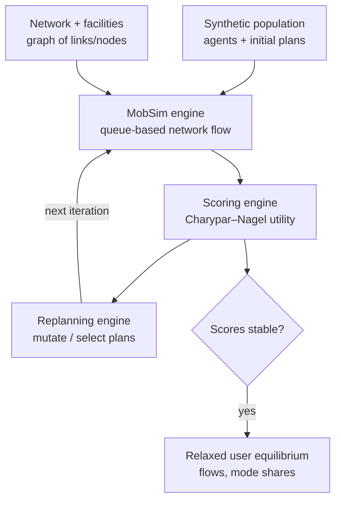

# MATSim — Multi-Agent Transport Simulation

!!! success "Gold dossier"
    MATSim is the atlas's flagship **transport** model and its clearest example of
    **equilibrium as an *emergent* outcome of agent learning** rather than an imposed
    solution concept. Synthetic travelers iteratively co-evolve daily plans until the system
    relaxes toward a Nash-like *user equilibrium* — a fascinating hybrid of
    [simulation](../../comparative/optimization-vs-simulation.md) and equilibrium. It is a
    Gold referent for the [Behavior Engine](../../patterns/behavior-engine.md) and the
    [Spatial Engine](../../patterns/spatial-engine.md).

> A large-scale agent-based transport simulator where synthetic travelers iteratively
> co-evolve daily activity plans toward a Nash-like equilibrium via a scoring/replanning
> loop.

## Positioning card

| Axis (see [Taxonomy](../../foundations/taxonomy.md)) | MATSim |
|------|------|
| Optimization vs Simulation | **Simulation** (agent-based, co-evolutionary) |
| Top-down vs Bottom-up | **Bottom-up** (individual travelers) |
| Equilibrium | **Emergent** — relaxes to a stochastic user equilibrium |
| Foresight | Adaptive (iterative learning across days) |
| Deterministic vs Stochastic | Stochastic (choice models, replanning) |
| Time / Space | Second-scale / road & transit **network** + activity locations |
| Solution method | Queue-based mobility sim + evolutionary replanning |

| Field | Value |
|-------|-------|
| Full name | MATSim — Multi-Agent Transport Simulation |
| Domain | Transportation |
| First release / current | mid-2000s / ongoing |
| Institution · lead | ETH Zürich (Kai Nagel, Kay Axhausen) & TU Berlin |
| Language · solver | Java (multi-threaded) |
| License / access | Open source (GPL); `matsim.org` |

---

## 🎓 Scholar Track

### History & motivation

MATSim grew out of the **queue-based traffic microsimulation** work of **Kai Nagel** (of
Nagel–Schreckenberg cellular-automaton fame) and the **activity-based travel-behavior**
research of **Kay Axhausen**, developed jointly at **ETH Zürich** and **TU Berlin** from the
mid-2000s. Its motivating idea: classic transport planning used *static* aggregate traffic
assignment (the "four-step model"), which cannot represent *when* people travel, the
*sequence of activities* that generates trips, or *individual heterogeneity*. MATSim instead
simulates **every traveler as an agent** with a full **daily plan** (home → work → shop →
home, with times, modes, and routes) and lets the population **learn** good plans through
repeated "days." It has been applied to whole metropolitan regions (Zürich, Berlin,
Singapore, and many others) with millions of agents.

For the atlas, MATSim is important because it dissolves a supposed dichotomy: it is a
**pure agent-based simulation** that nonetheless **converges to an equilibrium** — but an
*emergent, learned* one, not an imposed fixed point (contrast
[ABM vs CGE](../../comparative/abm-vs-cge.md)).

### Mathematical formulation

**Agents and plans.** Each agent $n$ holds a set of daily **plans**; a plan is a sequence of
activities and legs (mode + route). The quality of an executed plan is its **score**,
typically a utility of the Charypar–Nagel form:

$$
S_{\text{plan}} = \sum_{q=1}^{Q} S_{\text{act},q} \;+\; \sum_{q=1}^{Q} S_{\text{travel},q}
$$

- **Activity utility** is usually logarithmic in duration (marginal utility of time spent),
  rewarding performing activities near their "typical" durations:
  $S_{\text{act},q} = \beta_{\text{dur}}\, t_{\text{typ},q} \ln\!\big(t_q / t_{0,q}\big)$.
- **Travel disutility** penalizes time (and money) spent traveling:
  $S_{\text{travel},q} = \beta_{\text{trav},\text{mode}}\, t_{\text{trav},q} + \beta_m\, \Delta m$.

**The equilibrium concept.** Agents adjust plans to raise their own score given everyone
else's choices; at rest, no agent can improve unilaterally — a **stochastic user
equilibrium** (a Nash-like relaxed state). Crucially this is reached by **co-evolutionary
learning**, not by solving a fixed-point system directly.

### Solution algorithm — the co-evolutionary loop

```
initialize each agent with an initial plan
repeat (each iteration = one "day"):
    MOBSIM   : execute all agents' selected plans on the network
               (queue simulation → congestion emerges from interactions)
    SCORING  : score each executed plan (Charypar–Nagel utility)
    REPLAN   : a fraction of agents mutate a plan
               (reroute / retime / change mode) or select among
               remembered plans (multinomial-logit over scores)
until scores stabilize (relaxed user equilibrium)
```

This is a **genetic-algorithm-like** search over the joint plan space, with the mobility
simulation providing the "fitness" via realized congestion. The **queue (MobSim)** models
each road link as a FIFO queue with a flow capacity and storage limit — cheap yet capturing
spillback and congestion.

### Calibration

Calibrated by matching **traffic counts, mode shares, and travel-time distributions** to
observed data — tuning the utility coefficients and the synthetic-population generation.
Like other ABMs, evaluation requires running the (stochastic, iterative) simulation, so
calibration is a black-box outer search (cf. the
[Calibration Engine](../../patterns/calibration-engine.md)).

### Validation

Validated against **independent sensor counts, household travel surveys, and observed mode
splits** not used in fitting. As with all agent models, matching aggregates does not prove
individual behavior is correct (equifinality), and forecasts degrade when the built
environment or preferences shift.

### Strengths, weaknesses, criticisms

=== "Strengths"
    - **Activity-based & temporally explicit** — represents *why* and *when* trips happen,
      not just origin–destination flows.
    - **Emergent congestion & equilibrium** — network dynamics and user equilibrium arise
      from individual interaction, not assumption.
    - **Scales to metro regions** — millions of agents via an efficient queue sim + parallelism.
    - **Policy-rich** — road pricing, new transit lines, mobility-as-a-service, and
      autonomous-vehicle scenarios are natural experiments.

=== "Weaknesses / criticisms"
    - **Computationally heavy** — many iterations × millions of agents; large memory/CPU.
    - **Data-hungry** — needs a synthetic population, networks, and facilities.
    - **Convergence is empirical** — the relaxed state is not a proven unique equilibrium.
    - **Behavioral simplicity** — utility-based replanning may miss habit, information, and
      bounded rationality subtleties.

## 🛠️ Engineer Track

### Software architecture (engines)



The recognizable reusable engines (see [patterns](../../patterns/index.md)): a
**[Behavior Engine](../../patterns/behavior-engine.md)** (agents + plan choice), a
**[Spatial Engine](../../patterns/spatial-engine.md)** (the network/queue mobility sim), a
**Scenario/Ensemble** frame, and a **[Calibration Engine](../../patterns/calibration-engine.md)**
wrapping it — with the distinctive **co-evolutionary replanning loop** as the solver.

### Data structures & pipeline

The **network** is a directed graph of links (with capacity, free-speed, length) and nodes;
the **population** is a stream of agents each owning a small set of `Plan` objects
(activities + legs). The MobSim advances a global event queue second-by-second; **events**
(link enter/leave, arrival, departure) are emitted as a stream that downstream analyzers
consume. Modular **contribs** extend it (public transit, signals, electric vehicles,
DRT/ride-hailing).

### Computational complexity

Per iteration, MobSim is roughly $O(\text{agents} \times \text{legs})$ in processed events;
total cost multiplies by the **number of iterations to relaxation** (often 100–1000).
Memory holds the population, their remembered plans, and the network. Multi-threaded MobSim
(QSim) and cluster runs make metro-scale feasible.

### Language, open-source status, extensibility

Pure **Java**, GPL, with a strong **contrib** ecosystem and an active community
(`matsim.org`, annual user meetings). Highly extensible via the plugin/module system; Python
tooling (e.g. via the `eqasim`/`matsim-libs` bindings) supports scenario building.

## 🏛️ Architect Track

### Reusable design patterns

- **Co-evolutionary equilibrium** — reach an equilibrium by *iterated best-response learning*
  rather than a direct fixed-point solve; a template for equilibria too complex to state
  analytically.
- **Event-stream architecture** — the mobility sim emits a decoupled event stream that
  analyzers subscribe to (clean separation of simulation and measurement).
- **Plans-as-genome** — candidate behaviors as mutable objects scored by realized outcomes.
- **Queue mobility model** — a cheap, robust abstraction of network congestion.

### Trade-offs & alternatives

Against **static traffic assignment** (four-step): MATSim trades speed for temporal detail,
heterogeneity, and activity realism. Against **SUMO** (microscopic car-following,
second-by-second vehicle dynamics): MATSim is faster/coarser per vehicle but scales to whole
regions and daily activity patterns. Against **ActivitySim** (activity-based demand only):
MATSim couples demand *and* network supply in one co-evolutionary loop. The regimes are
complementary — see [Continuous vs Discrete](../../comparative/continuous-vs-discrete.md).

### Adoption

Used by **transport authorities, consultancies, and universities** worldwide for congestion
pricing, transit planning, electric-vehicle and autonomous-mobility studies, and emissions
assessment; metro-scale scenarios exist for Zürich, Berlin, Paris, Singapore, and others. A
mainstay of academic transport research.

### Ecosystem

- **Competitors / siblings:** SUMO (microscopic), ActivitySim/TRANSIMS (activity-based
  demand), POLARIS, Aimsun/PTV Visum (commercial).
- **Extensions:** public-transit, signals, DRT/ride-hailing, electric vehicles, carrier/
  freight, noise & emissions contribs.

### Research gaps

- **Coupling to energy/emissions and land use** — feeding MATSim's second-by-second traffic
  into emissions and then into a climate/[energy](../../model-families/energy/osemosys.md)
  model; and closing the land-use↔transport loop (with UrbanSim-type models).
- **Richer behavior** — habits, information, bounded rationality beyond utility maximization.
- **Faster convergence & UQ** — principled uncertainty over the relaxed equilibrium.

!!! quote "Lesson for the integrated simulator — if we were designing it today"
    MATSim demonstrates a profound architectural option: an **equilibrium reached by
    learning, not by assumption**. Where a [CGE](../../model-families/economics/cge.md) *imposes*
    market clearing as its solution concept, MATSim lets a user equilibrium **emerge** from
    millions of agents doing iterated best-response on a congested network — giving both the
    heterogeneity/temporal detail of an [agent model](../../patterns/behavior-engine.md) *and*
    a well-defined equilibrium outcome. For the integrated simulator this suggests a **third
    coordination mode** alongside imposed-clearing and pure emergence: *iterated
    best-response to convergence*, applicable wherever a fixed point exists but is too complex
    to state analytically. MATSim also models best practice for a
    [spatial subsystem](../../patterns/spatial-engine.md): a cheap queue abstraction of the
    network plus a **decoupled event stream** that any downstream module (emissions, energy,
    exposure) can subscribe to — exactly the clean interface a multi-domain simulator needs to
    connect transport to climate and health.

## Major publications

- Horni, A., Nagel, K., & Axhausen, K. W. (eds.) (2016). *The Multi-Agent Transport
  Simulation MATSim*. Ubiquity Press. (the open reference book)
- Charypar, D., & Nagel, K. (2005). "Generating complete all-day activity plans with genetic
  algorithms." *Transportation* 32(4).
- Balmer, M., et al. (2009). "MATSim-T: Architecture and simulation times." In *Multi-Agent
  Systems for Traffic and Transportation Engineering*.

## See also
- Patterns: [Behavior Engine](../../patterns/behavior-engine.md) · [Spatial Engine](../../patterns/spatial-engine.md)
- Contrast: [ABM vs CGE](../../comparative/abm-vs-cge.md) · [System Dynamics vs Agent-Based](../../comparative/system-dynamics-vs-abm.md) · [Continuous vs Discrete](../../comparative/continuous-vs-discrete.md)
- Positioning: [Taxonomy](../../foundations/taxonomy.md) · Quality bar: [DICE dossier](../../model-families/climate-iam/dice.md)
