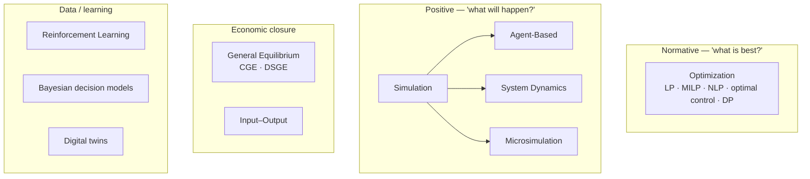

# Paradigms

Where [Model Families](../model-families/index.md) catalogs *instances*, this section
explains the *philosophies* — the recurring ways of thinking about how a policy system
works. For each paradigm the atlas answers: **why it exists, what it assumes, when it
works, when it fails, its trade-offs, and its mathematical and computational foundations.**

## The paradigm map

## Planned paradigm chapters

| Paradigm | Core question | Status |
|----------|---------------|--------|
| Optimization | What decision maximizes an objective under constraints? | ⬜ |
| Simulation | What emerges from these rules over time? | ⬜ |
| Agent-Based Modeling | How does macro behavior emerge from micro interaction? | ⬜ |
| System Dynamics | How do stocks, flows, and feedback loops evolve? | ⬜ |
| General Equilibrium (CGE/DSGE) | What prices clear all markets simultaneously? | ⬜ |
| Input–Output | How do sector demands propagate through the economy? | ⬜ |
| Reinforcement Learning | What policy is learned from simulated experience? | ⬜ |
| Bayesian decision models | How to act optimally under quantified uncertainty? | ⬜ |
| Digital twins | How to mirror a real system in real time? | ⬜ |

Each chapter also covers **data requirements, scalability, interpretability,
uncertainty handling, and sensitivity analysis** — the practical axes on which a
paradigm is chosen or rejected.

!!! note "Cross-reference"
    The **[Comparative Analyses](../comparative/index.md)** section turns these
    paradigms into head-to-head matrices; the **[Architecture Patterns](../patterns/index.md)**
    section extracts the reusable engines they share.
