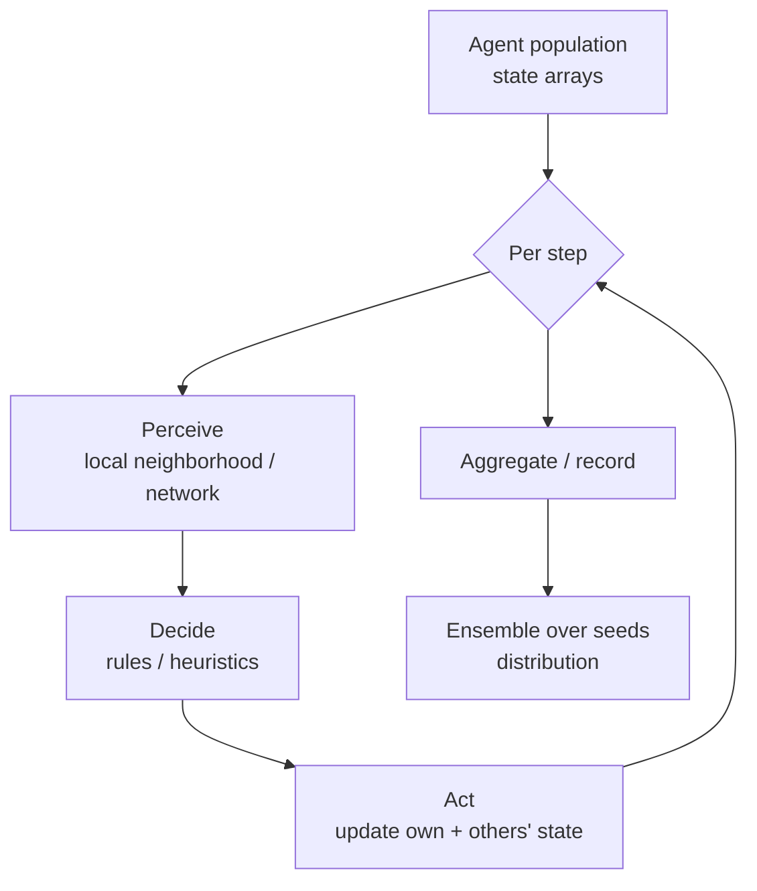

# Pattern — Behavior Engine

!!! abstract "Pattern at a glance"
    **Intent:** generate system outcomes by stepping **many heterogeneous agents** through
    **decision rules** and interactions, letting aggregate behavior *emerge* rather than be
    solved for.
    **Also known as:** agent kernel, decision engine, micro-simulation core.
    **Grounded in:** [Covasim](../model-families/health/covasim.md),
    [MATSim](../model-families/transport/matsim.md).

## Problem & forces

Some systems have **no planner and no clearing price** — outcomes come from individuals
following heuristics and interacting locally on a network. The Behavior Engine represents
each agent explicitly and simulates forward. The forces:

- **Heterogeneity is the point** — averaging over agents destroys the phenomenon
  (superspreaders, segregation, congestion, tail risk).
- **Local interaction** — agents affect neighbors on a network/space, not a global average.
- **Bounded rationality** — rules/heuristics, not global optimization.
- **Stochasticity** — outcomes are distributions over random seeds, not point predictions.
- **Scale** — millions of agents demand a data layout that survives a high-level language.

## Structure



The key engineering pattern (from [Covasim](../model-families/health/covasim.md)) is
**structure-of-arrays**: agents are *not* objects in a list but parallel arrays, so each
step is a vectorized operation over the whole population. Interventions/behaviors are
**composable objects** applied to the population — the same "policy-as-object" idea as
market [closures](market-engine.md).

## Interface

```
Agent   := state + attributes (in columnar arrays)
step()  := for each agent: perceive → decide → act (vectorized)
network := interaction layers (household, work, road, market…)
policy  := composable intervention objects applied to population
run() → time series; repeat over seeds → distribution
```

## Exemplars

| Model | Agents | Interaction | Emergent output |
|-------|--------|-------------|-----------------|
| [Covasim](../model-families/health/covasim.md) | People | Contact-network layers | Epidemic curve, superspreading, extinction prob. |
| [MATSim](../model-families/transport/matsim.md) | Travelers | Road/transit network, co-evolution | Congestion, mode share, equilibrium plans |
| Schelling / ABM macro | Households, firms | Grid / market | Segregation, business cycles |

## Trade-offs & variants

- **Agents vs aggregate stocks** — where heterogeneity is second-order, a
  [System-Dynamics/Integration Engine](integration-engine.md) is far cheaper (see
  [SD vs ABM](../comparative/system-dynamics-vs-abm.md)).
- **Exogenous vs endogenous behavior** — many ABMs *assume* the behavior they should
  explain; coupling behavior to incentives/prices is the frontier.
- **Calibration under equifinality** — many parameter sets fit; needs black-box outer search
  ([Calibration Engine](calibration-engine.md)) and honest uncertainty quantification.
- **Cost** — ensembles of large populations are heavy; vectorization/Numba/parallel seeds
  are essential.

!!! quote "Lesson for the integrated simulator"
    The Behavior Engine is the simulator's **emergence hemisphere** — the tool for
    questions where *who* and *where* change the answer. Its transferable engineering
    lessons are concrete: lay agents out as **arrays, not objects**; express policies as
    **composable intervention objects**; and make the **ensemble the unit of output** so
    uncertainty is native. Its architectural lesson is about *boundaries*: agents should
    generate the demands, shocks, and frictions that the [Market](market-engine.md) and
    [Optimization](optimization-engine.md) engines take as given, and consume prices/incomes
    from them in return — each paradigm kept in the regime where it is valid, exactly the
    routing principle of [ABM vs CGE](../comparative/abm-vs-cge.md).

## See also
- [Market Engine](market-engine.md) · [Integration Engine](integration-engine.md) · [Calibration Engine](calibration-engine.md)
- [ABM vs CGE](../comparative/abm-vs-cge.md) · [System Dynamics vs Agent-Based](../comparative/system-dynamics-vs-abm.md) · [Patterns catalog](index.md)
