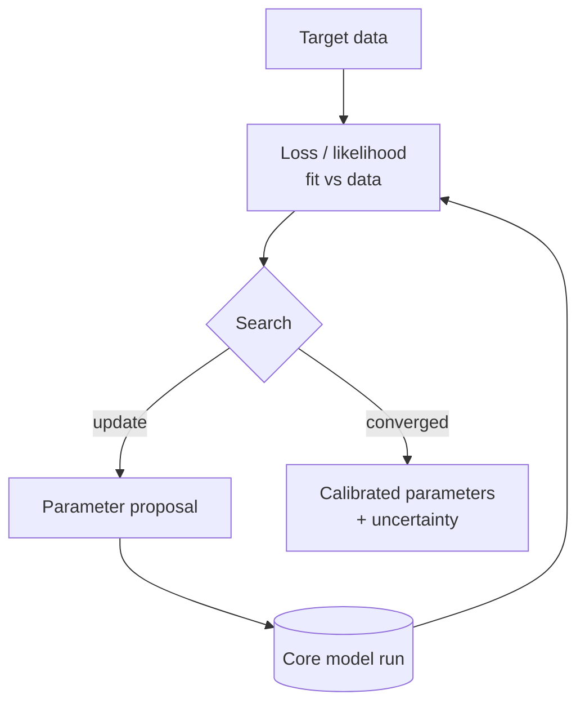

# Pattern — Calibration Engine

!!! abstract "Pattern at a glance"
    **Intent:** choose model parameters so the model **matches data** — by benchmark
    replication, optimization, or Bayesian estimation — turning a structural model into a
    quantitative one.
    **Also known as:** estimation, fitting, tuning, benchmarking.
    **Grounded in:** [CGE](../model-families/economics/cge.md) SAM calibration,
    [DSGE](../model-families/economics/dsge.md) Bayesian estimation,
    [Covasim](../model-families/health/covasim.md) black-box fitting,
    [Vensim](../model-families/frameworks/vensim.md) optimization/Kalman.

## Problem & forces

A model's *structure* encodes theory; its *parameters* must be pinned to the world before
it can produce numbers anyone trusts. The Calibration Engine is the outer loop that finds
those parameters. The forces:

- **Identifiability** — can the data actually distinguish the parameters? (ABMs often can't
  — *equifinality*.)
- **Gradient availability** — smooth models expose gradients; simulation models are black
  boxes needing derivative-free search.
- **Exact vs statistical fit** — some traditions calibrate to a *single* benchmark exactly;
  others estimate distributions over parameters.
- **Overfitting** — a good in-sample fit is not validation (that's the
  [Validation Engine](index.md)'s job).

## Structure



The engine wraps the core model in a **propose → run → score → update** loop. The search
method is dictated by what the model exposes (gradient, likelihood, or only samples).

## The calibration spectrum

| Approach | How | Exemplar |
|----------|-----|----------|
| **Benchmark replication** | Solve params so base-year data is an equilibrium *exactly* | [CGE](../model-families/economics/cge.md) (SAM) |
| **Deterministic optimization** | Minimize weighted SSE (Powell, gradient) | [Vensim](../model-families/frameworks/vensim.md) |
| **Bayesian estimation** | Posterior over params via MCMC + priors | [DSGE](../model-families/economics/dsge.md) |
| **Derivative-free / ABC** | Sample the black box, search (Optuna, ABC) | [Covasim](../model-families/health/covasim.md) |
| **Emulator-assisted** | Fit surrogate, calibrate on it | large IAMs / climate models |

## Interface

```
targets  := observed series / moments
loss     := distance(model(params), targets)   # SSE or −loglik
search   := {benchmark | optimize | MCMC | derivative-free}
calibrate() → { params*, uncertainty }
```

## Trade-offs & variants

- **Exact calibration** (CGE) is fast and reproducible but assumes the base year *is*
  equilibrium and pins only as many parameters as there are data points.
- **Bayesian** (DSGE) yields honest uncertainty but is computationally heavy and
  prior-sensitive.
- **Black-box** (ABM) is general but risks **equifinality** — report the *set* of fitting
  parameters, not one.
- **Calibration vs sensitivity** — calibration *searches* the space for a fit; the
  [Sensitivity Engine](sensitivity-engine.md) *explores* it for robustness. They are duals
  and should share the sampling machinery.

!!! quote "Lesson for the integrated simulator"
    The Calibration Engine must be **method-plural**, because the atlas's models are fit in
    fundamentally different ways: an [equilibrium](market-engine.md) core wants *exact*
    benchmark replication to a social-accounting matrix, a [DSGE](../model-families/economics/dsge.md)
    wants *Bayesian* estimation with priors, and an [agent](behavior-engine.md) core can
    only be *sampled* and searched. A capable simulator therefore treats calibration as a
    pluggable strategy over a common `propose → run → score` loop, **always carries
    parameter uncertainty forward** into the [Sensitivity Engine](sensitivity-engine.md)
    rather than collapsing to point estimates, and never lets a good in-sample fit stand in
    for out-of-sample **validation** — especially for richly-parameterized models where many
    parameter sets fit equally well.

## See also
- [Sensitivity Engine](sensitivity-engine.md) · [Market Engine](market-engine.md) · [Behavior Engine](behavior-engine.md)
- [Patterns catalog](index.md) · [DSGE dossier](../model-families/economics/dsge.md)
