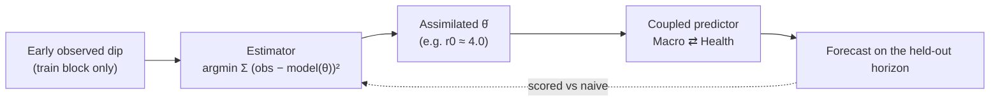

# Data-Assimilation Engine

!!! abstract "Pattern in one line"
    Don't **assume** an uncertain parameter — **estimate it from the early observed data**, then feed the
    estimate into the model. This is the middle limb of the digital-twin loop
    (model ⇄ **assimilation** ⇄ control): fit the state/parameters to observations before you forecast.

!!! note "A Polyphony-contributed engine (the 18th)"
    The atlas's original catalogue has 16 engines; Polyphony added the
    [Welfare/Equity engine](welfare-equity-engine.md) (17th) and this **Data-Assimilation engine** (18th,
    issue #1). It was added because the Macro⇄Health champion **broke under an r0 distribution shift**
    (Iter 10 red team): the coupling was fragile precisely because it *assumed* a reproduction number.
    Assimilation closed that break (Iter 11) — so the pattern earned a place by
    [surviving a red-team attack](../polyphony/04-validation.md), not by fiat. Implemented in
    `polyphony/polyphony/engines/assimilation.py`.

## Intent

Replace a **fixed guess** for an uncertain parameter with a value **inferred from data the world has
already revealed**, so the forecast tracks the actual regime rather than the modeler's prior. Turn
"the model assumes r0 = 2.5" into "the model *reads* r0 ≈ 4.0 off the early dip, then predicts."

## Forces

- A coupling that depends on an assumed parameter is only as good as the assumption — a
  Lucas-critique-style regime change ([DSGE](../model-families/economics/dsge.md)) silently breaks it.
- Early observations carry information about the very parameter that governs the rest of the
  trajectory; ignoring them wastes the signal ([Bayesian estimation](../paradigms/algorithms/bayesian-decision.md)).
- Estimation must respect **causality**: fit on the **train block only**, never peek at the horizon you
  will be scored on — otherwise "skill" is leakage.
- The estimator itself can be wrong; it must be **validated** (recover a known parameter on synthetic
  data) before it is trusted.

## Structure

## Interface

- **Forward map** — `sir_output_track(r0, n)`: the GDP track a reduced-form SIR implies at a candidate
  parameter (the model whose parameter we are fitting).
- **Assimilator** — `estimate_r0(observed, train)`: the parameter whose forward map best fits the
  observed series **on the train slice** (grid least-squares here for transparency; a Kalman/particle
  filter is the natural upgrade). Returns θ̂ for the coupled predictor.
- **Validation hook** — the estimator is unit-tested to **recover a known r0** (2.0, 3.0, 4.5) to within
  0.5, and the red-team round is re-run **with** assimilation to confirm the break is closed.

## Exemplars

[Covasim](../model-families/health/covasim.md) calibrates epidemic parameters to observed case/death
curves before projecting; [DSGE](../model-families/economics/dsge.md) estimates structural parameters
(Bayesian/Kalman) from macro data rather than assuming them. Weather and ocean models are the canonical
home of assimilation (Kalman 1960; ensemble/particle filters). Polyphony uses the minimal grid form to
keep the mechanism inspectable.

## Trade-offs

- **Assimilation fixes the parameter, not the structure** — if the *coupling form* is wrong, a
  well-fit parameter still misleads; it complements, not replaces, model criticism.
- Grid least-squares is transparent but scales badly in dimension; real assimilation needs a filter.
- Fitting on train and scoring on test is essential — the discipline that makes the recovered skill
  honest is the same discipline that makes it modest (still **synthetic** data here; real is issue #9).

!!! quote "Lesson for the integrated simulator"
    A digital-twin instrument that only ever runs *forward* from assumed parameters is a scenario
    generator wearing a forecaster's coat. The assimilation limb is what lets it **listen to the world**:
    read the contested parameter off the data, fit on the past, and be scored on the future. Polyphony
    added this engine only after a red team proved the forward-only champion fragile — the honest way for
    a pattern to enter the catalogue.

## See also
- Grounded in: [Bayesian Decision/Estimation](../paradigms/algorithms/bayesian-decision.md) ·
  [Digital Twins](../paradigms/algorithms/digital-twins.md)
- Complements: [Calibration Engine](calibration-engine.md) (levels) — assimilation fits **parameters**
- Exemplars: [Covasim](../model-families/health/covasim.md) · [DSGE](../model-families/economics/dsge.md)
- Polyphony: [validation](../polyphony/04-validation.md) · [ADR-0001](../decisions/0001-positioning-paradigm-plural-not-world-model.md)
