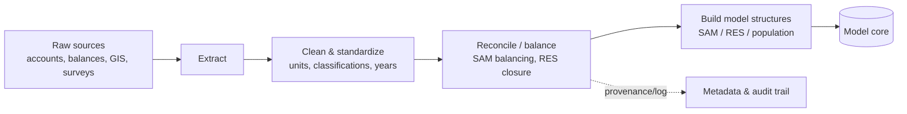

# Pattern — Data Pipeline

!!! abstract "Pattern at a glance"
    **Intent:** ingest, clean, reconcile, and harmonize the heterogeneous input data a model
    needs into the **consistent, balanced structures** its core requires — reproducibly, with
    provenance.
    **Also known as:** ETL front-end, input builder, data harmonization layer.
    **Grounded in:** the **Social Accounting Matrix** build for
    [CGE](../model-families/economics/cge.md), the **Reference Energy System** data for
    [TIMES](../model-families/energy/times.md)/[OSeMOSYS](../model-families/energy/osemosys.md),
    the **synthetic population** for [MATSim](../model-families/transport/matsim.md), and
    epidemic contact/age data for [Covasim](../model-families/health/covasim.md).

## Problem & forces

Every model is only as good as the data feeding it — and that data arrives from many sources
in incompatible units, classifications, and years, often failing to *add up*. The Data
Pipeline is the unglamorous but decisive layer that turns raw inputs into a model-ready
world. The forces:

- **Heterogeneous sources** — national accounts, energy balances, censuses, GIS, surveys —
  different units, classifications, vintages.
- **Consistency is mandatory** — many cores need inputs that **balance** (a SAM must square;
  an energy balance must close); an unbalanced input is not merely inaccurate but
  *infeasible*.
- **Reproducibility & provenance** — the same raw data must rebuild the same inputs, with
  every transformation traceable (essential for the [Validation Engine](validation-engine.md)).
- **Scale & automation** — inputs are large and updated; hand-editing does not survive.

## Structure



## Domain instances

The pipeline's *output structure* is domain-specific, but the pattern is identical:

| Model | Raw inputs | Balancing / build step | Model-ready structure |
|-------|-----------|------------------------|-----------------------|
| [CGE](../model-families/economics/cge.md) | National accounts, I-O tables, trade | **SAM balancing** (RAS/entropy) | Balanced Social Accounting Matrix |
| [TIMES](../model-families/energy/times.md)/[OSeMOSYS](../model-families/energy/osemosys.md) | Energy balances, tech costs, demands | Energy-balance closure | Reference Energy System |
| [MATSim](../model-families/transport/matsim.md) | Census, surveys, networks (OSM) | **Synthetic-population** synthesis (IPF) | Agents + plans + network |
| [Covasim](../model-families/health/covasim.md) | Demographics, contact surveys | Age/contact-matrix construction | Population + contact layers |

Techniques recur across domains: **RAS / iterative proportional fitting (IPF)** to reconcile
marginals, **entropy balancing** to square accounts, **cross-entropy** methods to fuse
conflicting sources.

## Interface

```
extract(sources) → raw
clean(raw)       → standardized (units, classifications, base year)
reconcile(std)   → balanced        # SAM squares, energy balance closes
build(balanced)  → model_structure # SAM | RES | synthetic population
+ provenance log at every step
```

## Trade-offs & variants

- **Automated vs curated** — scripted pipelines are reproducible; expert curation catches
  errors automation misses. Combine: automate, then review.
- **Balancing method** — RAS vs cross-entropy vs manual adjustment differ in how they
  distribute discrepancies; the choice is a modeling decision, not a clerical one.
- **Single-source vs fusion** — fusing conflicting datasets buys coverage at the cost of
  introduced assumptions that must be logged.
- **Static build vs live feed** — one-off construction vs pipelines that refresh as data
  updates.

!!! quote "Lesson for the integrated simulator"
    The Data Pipeline is the simulator's **foundation**, and its cardinal virtues are
    **consistency and provenance**: many cores demand inputs that *balance* — a
    [SAM](../model-families/economics/cge.md) that squares, an
    [energy balance](../model-families/energy/times.md) that closes — so the pipeline must
    treat reconciliation (RAS/IPF/entropy) as a first-class, *inspectable* step, and stamp
    every derived input with the hash and transformations that produced it. For a
    **multi-domain** simulator this layer is where integration is really won or lost:
    transport, energy, economy, and health inputs must share **consistent base-year
    populations, prices, and boundaries**, or the coupled result is meaningless. The design
    imperative is therefore a **shared, harmonized data substrate** — one reconciled account
    of the world that every subsystem draws from — rather than each module ingesting its own
    silo, so that the numbers different engines exchange actually refer to the same reality.

## See also
- [Scenario Engine](scenario-engine.md) · [Calibration Engine](calibration-engine.md) · [Validation Engine](validation-engine.md)
- [Visualization Engine](visualization-engine.md) · [Patterns catalog](index.md)
