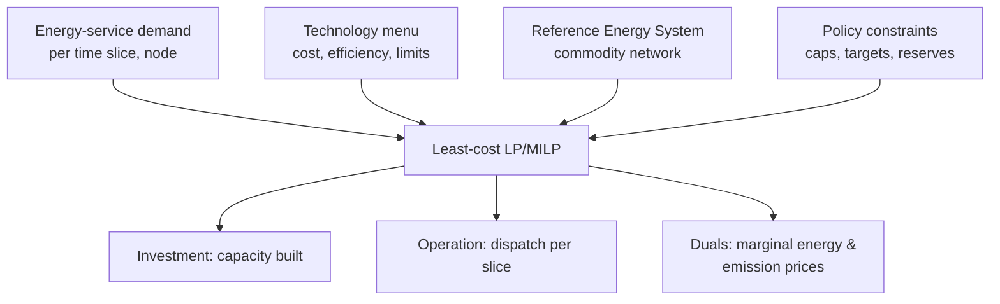

# Pattern — Energy Dispatch Engine

!!! abstract "Pattern at a glance"
    **Intent:** meet energy demand at **least cost** by choosing which technologies run
    (and which get built), subject to **capacity, balance, and network constraints** — the
    techno-economic core of every bottom-up energy model.
    **Also known as:** least-cost dispatch, capacity-expansion, unit-commitment core,
    the reference energy system (RES) solver.
    **Grounded in:** [OSeMOSYS](../model-families/energy/osemosys.md),
    [TIMES](../model-families/energy/times.md); the power-system model **PyPSA**.

## Problem & forces

Given a demand for energy services and a menu of technologies (each with costs,
efficiencies, and limits), find the **cheapest way to supply the demand over time** — both
*operating* existing plants (dispatch) and *building* new ones (expansion). The forces:

- **Balance every period** — supply must equal demand at each time slice and each node.
- **Two coupled decisions** — investment (long-run, lumpy) and operation (short-run,
  continuous), across a multi-decade horizon.
- **Temporal detail** — renewables force sub-annual resolution (time slices / hours) to
  capture variability and storage.
- **Constraints carry the policy** — emission caps, reserve margins, renewable targets are
  all constraints whose **shadow prices** are the policy-relevant marginal costs.

## Structure



The engine is a specialization of the [Optimization Engine](optimization-engine.md): a
least-cost LP over a **Reference Energy System** — a network of commodities (coal, elec,
H₂, useful heat) linked by technologies (converters) from primary resources to final
demand. [OSeMOSYS](../model-families/energy/osemosys.md) and
[TIMES](../model-families/energy/times.md) are model *generators* that build this LP from a
data table.

## Interface

```
sets     := technologies, commodities, time-slices, nodes, years
balance  := Σ production = Σ consumption + demand   (∀ commodity, slice, node)
capacity := activity ≤ capacity;  capacity_t = Σ past investments (vintaged)
objective:= min Σ discounted (capex + fixed + variable + fuel) costs
solve() → { build, dispatch, marginal_prices }
```

## Exemplars

| Model | Scope | Class | Signature output |
|-------|-------|-------|------------------|
| [OSeMOSYS](../model-families/energy/osemosys.md) | Whole energy system, open | LP | Least-cost capacity + dispatch; marginal costs |
| [TIMES](../model-families/energy/times.md) | Whole energy system, partial-equilibrium | LP (elastic demand) | Technology pathways; marginal abatement cost |
| **PyPSA** | Power (+sector-coupled), open | LP/MILP | Optimal grid dispatch + expansion, nodal prices |

## Trade-offs & variants

- **LP vs MILP** — continuous capacity/dispatch (LP) is fast and gives clean duals; unit
  commitment (min-up/down, start-up costs) needs integers (MILP), losing marginal prices
  (a future *LP vs MILP* matrix).
- **Temporal aggregation** — full 8760-hour years are costly; representative days/time
  slices trade fidelity for tractability, and the choice materially affects renewable
  results.
- **Perfect foresight vs myopic** — one horizon-wide solve assumes clairvoyant investment;
  myopic/recursive variants re-decide each period.
- **Partial equilibrium** — TIMES lets demand respond to price (elastic), edging toward the
  [Market Engine](market-engine.md); OSeMOSYS's demand is typically fixed.

!!! quote "Lesson for the integrated simulator"
    The Energy Dispatch Engine shows how to turn an entire physical sector into a
    **data-driven least-cost program**: define a commodity network, attach costs and limits
    to the technologies that link it, and let an [optimizer](optimization-engine.md) pick
    build-and-run — with the constraint **shadow prices** handing back the marginal energy
    and carbon prices for free. Two lessons transfer to the integrated simulator. First,
    the **model-generator pattern** — separate the *data* (the reference energy system)
    from the *solver*, so new technologies and policies are data edits, not code. Second,
    **temporal resolution is a first-class dial**: because the renewable-heavy answer
    depends on how finely time is sliced, the simulator must make that choice explicit and
    let the [Sensitivity Engine](sensitivity-engine.md) test it, rather than baking in an
    aggregation that quietly predetermines the result.

## See also
- [Optimization Engine](optimization-engine.md) · [Market Engine](market-engine.md) · [Scenario Engine](scenario-engine.md)
- [Top-Down vs Bottom-Up](../comparative/top-down-vs-bottom-up.md) · [OSeMOSYS](../model-families/energy/osemosys.md) · [TIMES](../model-families/energy/times.md) · [Patterns catalog](index.md)
