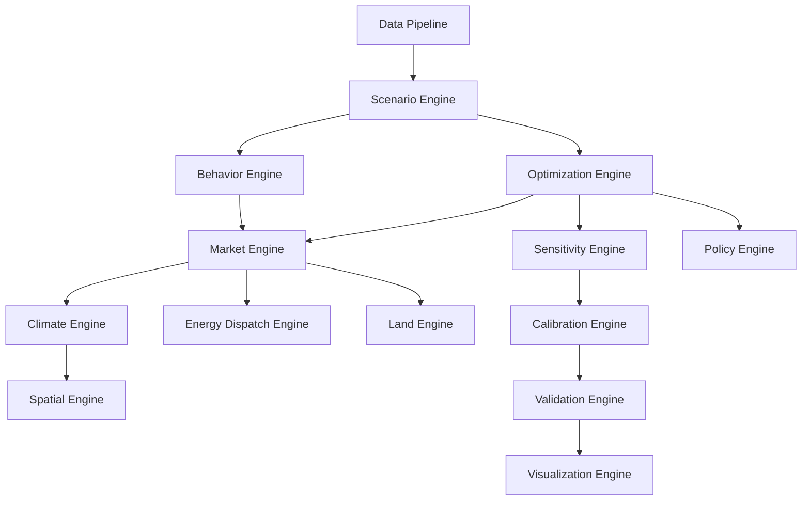

# Architecture Patterns

Across wildly different models, the *same software engines* recur. This section
catalogs them as reusable patterns — the raw material for a future integrated
simulator. Each pattern names its intent, the models that exemplify it, its interface,
and its trade-offs.

## The engine catalog

| Pattern | Intent | Exemplars |
|---------|--------|-----------|
| **Scenario Engine** | Parameterize & manage policy experiments | every IAM; SSP/RCP frameworks |
| **Optimization Engine** | Maximize objective under module-supplied constraints | DICE, TIMES, OSeMOSYS, PyPSA |
| **Behavior Engine** | Agent decision heuristics | MATSim, ABMs |
| **Technology Adoption Engine** | Diffusion / vintage turnover | GCAM, energy models |
| **Market Engine** | Clear supply & demand at a price | CGE, GTAP |
| **Climate Engine** | Emissions → concentration → temperature | DICE carbon/temp boxes, FAIR, MAGICC |
| **Land Engine** | Land-use allocation & competition | GLOBIOM, MAgPIE |
| **Energy Dispatch Engine** | Least-cost dispatch under network constraints | PyPSA, TIMES |
| **Spatial Engine** | Gridded / networked space | SWAT, MODFLOW, SUMO |
| **Sensitivity Engine** | Response to parameter perturbation | Morris, Sobol wrappers |
| **Calibration Engine** | Fit parameters to data | Bayesian calibration, emulators |
| **Validation Engine** | Test against reality / benchmarks | backcasting, module emulation |
| **Policy Engine** | Encode instruments (taxes, standards, caps) | carbon-price modules |
| **Visualization Engine** | Communicate results | dashboards, scenario explorers |
| **Data Pipeline** | Ingest, clean, harmonize inputs | ETL front-ends |

## The recurring meta-pattern

The [DICE dossier](../model-families/climate-iam/dice.md) already shows the most
important one: an **Optimization Engine wrapping coupled domain modules**, with
policy quantities recovered from **shadow prices**, and the **most uncertain
assumption (the damage function) isolated as a swappable component**. Cataloging when
this pattern applies — versus a Behavior/Market-Engine simulation — is a central task
of the atlas.

!!! note "Status"
    Patterns are extracted *from* dossiers as they are written. Expect this catalog to
    deepen with each model family; DICE has seeded the Optimization, Climate,
    Scenario, and Sensitivity engines.
