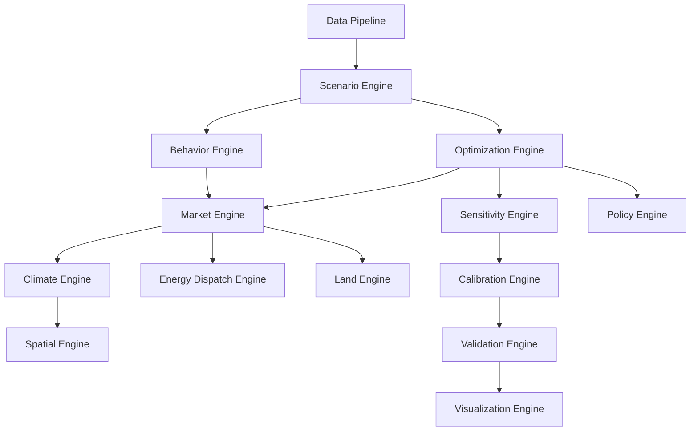

# Architecture Patterns

Across wildly different models, the *same software engines* recur. This section
catalogs them as reusable patterns — the raw material for a future integrated
simulator. Each pattern names its intent, the models that exemplify it, its interface,
and its trade-offs.

## The engine catalog

Legend: ✅ detailed page · ⬜ cataloged, page pending

| Pattern | Intent | Exemplars | |
|---------|--------|-----------|--|
| **[Scenario Engine](scenario-engine.md)** | Parameterize & manage policy experiments | every IAM; SSP/RCP frameworks | ✅ |
| **[Optimization Engine](optimization-engine.md)** | Maximize objective under module-supplied constraints | DICE, TIMES, OSeMOSYS, PyPSA | ✅ |
| **[Market Engine](market-engine.md)** | Clear supply & demand at a price | CGE, GTAP, DSGE | ✅ |
| **[Behavior Engine](behavior-engine.md)** | Heterogeneous agents + decision heuristics | Covasim, MATSim, ABMs | ✅ |
| **[Integration Engine](integration-engine.md)** | Stock-flow / ODE accumulation & feedback | Vensim/SD, DICE climate boxes | ✅ |
| **[Sensitivity Engine](sensitivity-engine.md)** | Response to parameter perturbation | Morris, Sobol, Monte-Carlo | ✅ |
| **[Calibration Engine](calibration-engine.md)** | Fit parameters to data | SAM, Bayesian, ABC, emulators | ✅ |
| **[Climate Engine](climate-engine.md)** | Emissions → concentration → temperature | DICE carbon/temp boxes, FAIR, MAGICC | ✅ |
| **[Energy Dispatch Engine](energy-dispatch-engine.md)** | Least-cost dispatch under network constraints | OSeMOSYS, TIMES, PyPSA | ✅ |
| **[Spatial Engine](spatial-engine.md)** | Gridded / networked space | MATSim, SWAT, MODFLOW, SUMO | ✅ |
| **[Policy Engine](policy-engine.md)** | Encode instruments (taxes, standards, caps, interventions) | DICE/TIMES carbon price, Covasim interventions | ✅ |
| **[Validation Engine](validation-engine.md)** | Test against reality / benchmarks | backcasting, extreme-condition, cross-model | ✅ |
| **[Visualization Engine](visualization-engine.md)** | Communicate results | scenario explorers, En-ROADS dashboards | ✅ |
| **[Data Pipeline](data-pipeline.md)** | Ingest, clean, harmonize, **balance** inputs | SAM build, RES data, synthetic population | ✅ |
| **[Land Engine](land-engine.md)** | Land-use allocation & competition | GLOBIOM, MAgPIE, IMPACT | ✅ |
| **Technology Adoption Engine** | Diffusion / vintage turnover | GCAM, energy models | ⬜ |

## The recurring meta-pattern

The [DICE dossier](../model-families/climate-iam/dice.md) already shows the most
important one: an **Optimization Engine wrapping coupled domain modules**, with
policy quantities recovered from **shadow prices**, and the **most uncertain
assumption (the damage function) isolated as a swappable component**. Cataloging when
this pattern applies — versus a Behavior/Market-Engine simulation — is a central task
of the atlas.

!!! note "Status"
    Patterns are extracted *from* dossiers as they are written. **15 of 16** now have
    detailed pages — every engine except **Technology-Adoption** (awaiting a Gold GCAM). The
    Land Engine was unlocked by promoting [GLOBIOM](../model-families/agriculture/globiom.md)
    to Gold. One pattern to go to complete the catalog.
