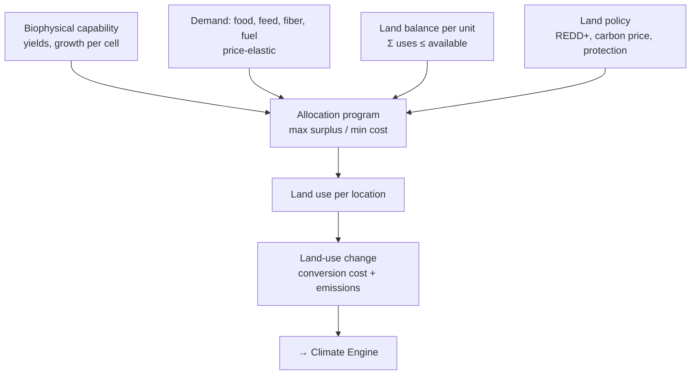

# Pattern — Land Engine

!!! abstract "Pattern at a glance"
    **Intent:** allocate a **finite land surface** among competing uses — crops, grassland,
    forest, bioenergy, settlement, conservation — reconciling **economic demand** with
    **biophysical capability** and tracking **land-use change** (and its emissions).
    **Also known as:** land-use allocation core, spatial-equilibrium land model.
    **Grounded in:** [GLOBIOM](../model-families/agriculture/globiom.md), MAgPIE, IMPACT;
    the land modules of process-based IAMs (GCAM, IMAGE).

## Problem & forces

Land is the ultimate **rival resource**: every hectare grows food *or* forest *or* fuel *or*
houses — not all at once. As climate policy leans on bioenergy and forest carbon, land
competition becomes central, and modeling it means fusing economics with geography. The
forces:

- **Finiteness & rivalry** — the binding constraint is a **land balance** per location;
  more of one use is less of another.
- **Economic + biophysical** — *what is profitable* (prices, demand) meets *what will grow
  here* (soil, climate, slope) — neither alone decides land use.
- **Spatial heterogeneity** — capability and cost vary by location; allocation must be
  spatial (ties to the [Spatial Engine](spatial-engine.md)).
- **Land-use change is the output that matters** — conversions (forest→crop) carry costs and
  **carbon emissions**, the key hand-off to the [Climate Engine](climate-engine.md).

## Structure



The engine is an [optimization](optimization-engine.md) over a
[spatial](spatial-engine.md) domain: maximize economic surplus (or minimize cost) of meeting
demand, subject to a **per-unit land balance** and biophysically-given yields, with prices as
duals and **land-use-change emissions** as a first-class output.

## Interface

```
units      := spatial land units (capability, availability by class)
activities := {crop, grass, forest, plantation, settlement, protected…}
allocate   := max surplus (or min cost) s.t. Σ_a x[u,a] ≤ L[u], demand met
yields     := biophysical(u, a)         # supplied by crop/forest process models
outputs    := land use per unit, prices (duals), land-use-change emissions
```

## Exemplars

| Model | Objective | Spatial unit | Signature output |
|-------|-----------|--------------|------------------|
| [GLOBIOM](../model-families/agriculture/globiom.md) | Max producer+consumer surplus | Simulation Units | Land use, prices, LUC emissions |
| MAgPIE (PIK) | Min production cost | Grid clusters | Cost-optimal land use (REMIND-coupled) |
| GCAM / IMAGE land | Logit land-share allocation | Region × AEZ | Land shares by profitability |

## Trade-offs & variants

- **Surplus-max vs cost-min vs logit-share** — GLOBIOM maximizes surplus (elastic demand),
  MAgPIE minimizes cost, GCAM/IMAGE allocate by a **logit** of relative profitability (a
  smoother, [technology-adoption](index.md)-like share rule). Each implies different land
  responsiveness.
- **Partial vs general equilibrium** — most land engines are *partial* (land/ag markets
  only); macro feedbacks need coupling to a [CGE](../model-families/economics/cge.md).
- **Resolution** — finer units capture heterogeneity but explode cost; homogeneous-response
  clustering (GLOBIOM's Simulation Units) is the standard compromise.
- **Foresight** — usually recursive-dynamic/myopic (see
  [Recursive-Dynamic vs Perfect Foresight](../comparative/recursive-vs-perfect-foresight.md)).

!!! quote "Lesson for the integrated simulator"
    The Land Engine turns **land into a shared, contested account** the whole simulator draws
    on — because the *same* hectare is claimed by the food system, the
    [energy](energy-dispatch-engine.md) model's bioenergy, and the
    [climate](climate-engine.md) model's carbon sink. The transferable design is the
    **biophysical–economic coupling**: let crop/forest process models supply *what grows
    where* as data, and let an [optimization](optimization-engine.md) over a
    [spatial](spatial-engine.md) land-balance decide *what is grown where* — so competition for
    a finite surface, and the **indirect land-use change** it induces, are represented
    explicitly rather than assumed away. Crucially, the engine's **land-use-change emissions**
    must be a first-class output wired straight into the climate account, making land the
    connective tissue between the food, energy, and climate subsystems rather than a silo in
    any one of them.

## See also
- [Optimization Engine](optimization-engine.md) · [Spatial Engine](spatial-engine.md) · [Climate Engine](climate-engine.md)
- [GLOBIOM dossier](../model-families/agriculture/globiom.md) · [Top-Down vs Bottom-Up](../comparative/top-down-vs-bottom-up.md) · [Patterns catalog](index.md)
