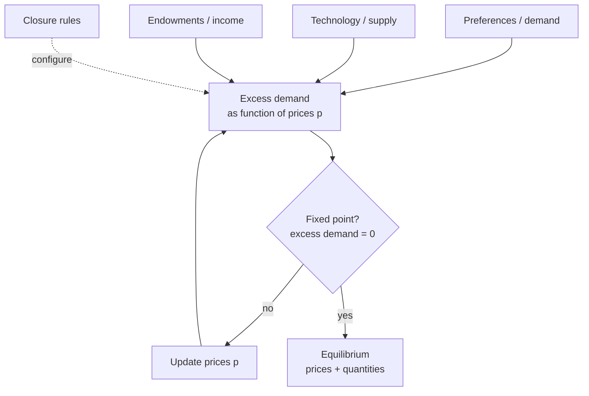

# Pattern — Market Engine

!!! abstract "Pattern at a glance"
    **Intent:** find the **prices at which supply equals demand** across interdependent
    markets simultaneously — coordination by price rather than by a central planner.
    **Also known as:** equilibrium solver, market-clearing engine, complementarity core.
    **Grounded in:** [CGE](../model-families/economics/cge.md),
    [DSGE](../model-families/economics/dsge.md), GTAP.

## Problem & forces

Where the [Optimization Engine](optimization-engine.md) has one planner maximizing one
objective, the Market Engine has **many self-interested agents** whose independent choices
must be made mutually consistent by a **price vector**. The forces:

- **Simultaneity** — every market's clearing depends on prices in every other market
  (general, not partial, equilibrium).
- **No central objective** — the solution is a *fixed point* (prices that clear), not an
  extremum. (In special cases the two coincide — a welfare theorem.)
- **Accounting identities** — zero-profit, market-clearance, and income-balance must hold
  exactly (Walras' law).
- **Closure choices** — what's exogenous vs endogenous (savings, labor, trade balance)
  quietly encodes deep theory (neoclassical vs Keynesian).

## Structure



Mechanically the engine solves a system of **nonlinear equations / a mixed
complementarity problem (MCP)**: find prices $p^\*$ such that excess demand $z(p^\*) \le 0$
with complementary slackness. Calibration is by **benchmark replication** to a Social
Accounting Matrix — the base-year data *is* an equilibrium by construction.

## Interface

```
agents      := demand(p), supply(p) from optimization
market_clear:= excess_demand(p) = 0   ∀ markets   (Walras' law)
closure     := which vars exogenous (savings, labor, trade)
solve() → equilibrium prices p*, quantities, welfare (EV)
```

## Exemplars

| Model | What clears | Solution concept | Signature output |
|-------|-------------|------------------|------------------|
| [CGE](../model-families/economics/cge.md) | All goods & factor markets | MCP / Walrasian fixed point | Welfare (equivalent variation), prices |
| [GTAP](../model-families/economics/cge.md) | Global goods + trade | Multi-region CGE | Trade & tariff-policy effects |
| [DSGE](../model-families/economics/dsge.md) | Goods, labor, assets over time + shocks | Stochastic rational-expectations equilibrium | Impulse responses, welfare |

## Trade-offs & variants

- **Equilibrium vs disequilibrium** — the engine *assumes* markets clear; where they don't
  (unemployment, rationing), use a disequilibrium/[behavioral](behavior-engine.md) approach
  (see [Equilibrium vs Disequilibrium](../comparative/equilibrium-vs-disequilibrium.md)).
- **Closure as a switch** — the *same* accounts can behave neoclassically or Keynesianly by
  changing what's fixed; the engine should treat **closure as configuration**.
- **Static vs recursive-dynamic vs forward-looking** — one period, myopic sequence, or full
  intertemporal equilibrium.
- **Existence & uniqueness** — a fixed point may not be unique; multiplicity is a modeling
  hazard the engine must surface.

!!! quote "Lesson for the integrated simulator"
    The Market Engine is the simulator's **decentralized-coordination core**, and its most
    transferable design idea is **closure-as-configuration**: the market-clearing
    assumption, and *which* variables are held fixed, must be an **explicit, switchable
    dial** — because (as the [Equilibrium vs Disequilibrium](../comparative/equilibrium-vs-disequilibrium.md)
    chapter shows) that dial can flip the *sign* of a headline policy result. Pair it with
    the [Optimization Engine](optimization-engine.md) (they meet at the welfare theorems)
    and with an [agent/Behavior Engine](behavior-engine.md) for regimes where prices don't
    clear, and always report results as **conditional on the closure** so the economics is
    separated from the assumption.

## See also
- [Optimization Engine](optimization-engine.md) · [Behavior Engine](behavior-engine.md) · [Scenario Engine](scenario-engine.md)
- [Equilibrium vs Disequilibrium](../comparative/equilibrium-vs-disequilibrium.md) · [ABM vs CGE](../comparative/abm-vs-cge.md) · [Patterns catalog](index.md)
