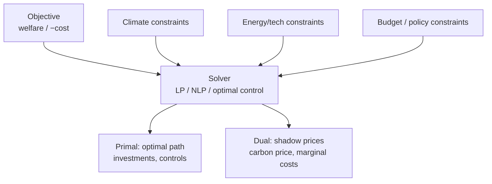

# Pattern — Optimization Engine

!!! abstract "Pattern at a glance"
    **Intent:** compute the *best* trajectory by maximizing (or minimizing) a single
    objective subject to constraints supplied by coupled domain modules — and recover
    **policy signals from the dual solution** (shadow prices).
    **Also known as:** the normative core, planner's problem, least-cost solver.
    **Grounded in:** [DICE](../model-families/climate-iam/dice.md),
    [TIMES](../model-families/energy/times.md),
    [OSeMOSYS](../model-families/energy/osemosys.md).

## Problem & forces

Many policy questions are **normative** — *what should we do?* — not merely predictive. The
Optimization Engine answers them by extremizing an objective (welfare, or minus total
system cost) over decision variables, subject to physical, economic, and policy
constraints. The forces:

- **Single global objective** — everything must be commensurable (utility, or cost).
- **Constraints come from domains** — a climate module, an energy network, a budget all
  contribute constraints to *one* shared program.
- **Duals are the payoff** — the shadow price on a constraint *is* the policy-relevant
  number (the carbon price, the marginal cost of a cap).
- **Foresight assumption** — a single solve over the horizon implies **perfect foresight**
  unless deliberately myopic/recursive.

## Structure



The engine is a **thin optimizer wrapping domain modules**: each module contributes
variables and constraints; the engine owns only the objective and the solve. This is the
"[DICE](../model-families/climate-iam/dice.md) meta-pattern" — coupled modules under one
optimizer, with the most uncertain module (the damage function) kept swappable.

## Interface

```
variables  := decisions (investment, abatement, dispatch…)
objective  := Σ discounted welfare  |  Σ system cost
constraints:= ⋃ module.constraints(variables)
solve() → { primal: paths, dual: shadow_prices }
```

## Exemplars

| Model | Objective | Solver class | Dual of interest |
|-------|-----------|--------------|------------------|
| [DICE](../model-families/climate-iam/dice.md) | Max discounted utility | Nonlinear optimal control | **Social cost of carbon** |
| [TIMES](../model-families/energy/times.md) | Min discounted system cost | LP (partial equilibrium) | Marginal energy/emission prices |
| [OSeMOSYS](../model-families/energy/osemosys.md) | Min system cost | LP | Marginal cost of supply / caps |

## Trade-offs & variants

- **Perfect vs myopic foresight** — one horizon-wide solve assumes clairvoyance; a
  **recursive-dynamic** variant re-solves period-by-period (a future
  *Recursive-Dynamic vs Perfect-Foresight* matrix).
- **LP vs MILP vs NLP** — linearity buys global optimality and duals cheaply; integers
  (lumpy investment) buy realism but lose clean shadow prices (a future *LP vs MILP*
  matrix).
- **Normative vs positive** — an optimum is *what's best*, not *what will happen*; where
  agents don't optimize, use a [Behavior Engine](behavior-engine.md) instead (see
  [Optimization vs Simulation](../comparative/optimization-vs-simulation.md)).

!!! quote "Lesson for the integrated simulator"
    The Optimization Engine should be **one selectable solver among several**, not the
    architecture of the whole system. Its great gift is the **dual**: whenever a subsystem
    *can* be posed as a constrained optimization, the shadow prices hand you the policy
    instrument (carbon price, congestion charge) for free — so the simulator should expose
    duals as first-class outputs. Its great danger is **scope creep**: forcing
    non-optimizing, disequilibrium, or heterogeneous phenomena into a single planner's
    problem misrepresents them. The design rule is to keep the objective **thin** and the
    constraints **modular** (the DICE lesson), let the *foresight assumption* be an explicit
    dial, and route subsystems that don't optimize to the market or agent engines.

## See also
- [Market Engine](market-engine.md) · [Behavior Engine](behavior-engine.md) · [Scenario Engine](scenario-engine.md)
- [Optimization vs Simulation](../comparative/optimization-vs-simulation.md) · [Patterns catalog](index.md)
