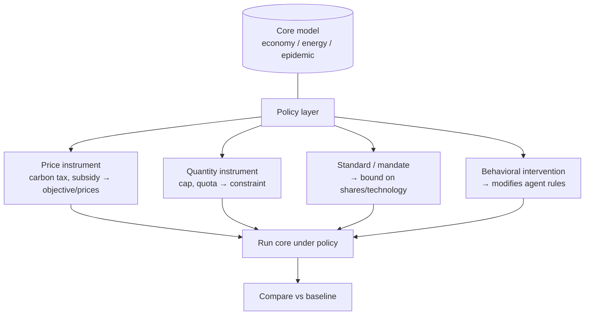

# Pattern — Policy Engine

!!! abstract "Pattern at a glance"
    **Intent:** represent **policy instruments** — taxes, caps, subsidies, standards,
    mandates, and behavioral interventions — as **composable, first-class objects** applied
    *to* a model, rather than hard-wired into its equations, so the same core can be run
    under many policy designs.
    **Also known as:** instrument layer, intervention framework, policy overlay.
    **Grounded in:** carbon-price/cap modules in [DICE](../model-families/climate-iam/dice.md),
    [TIMES](../model-families/energy/times.md),
    [OSeMOSYS](../model-families/energy/osemosys.md); intervention objects in
    [Covasim](../model-families/health/covasim.md); closures in
    [CGE](../model-families/economics/cge.md).

## Problem & forces

The *point* of a policy model is to compare **policy designs**. If each instrument is baked
into the core equations, every new policy means editing the model — slow, error-prone, and
hostile to comparison. The Policy Engine factors instruments *out* of the core. The forces:

- **Comparability** — many instruments must be run against an identical baseline core.
- **Composability** — real policy is a *package* (carbon tax + R&D subsidy + standard);
  instruments must stack without rewriting the model.
- **Separation of concerns** — *what the world does* (core) is distinct from *what the
  policymaker does to it* (instrument).
- **Instrument taxonomy** — price (tax/subsidy), quantity (cap/quota), and non-market
  (standard/mandate/information) instruments enter the model at different points.

## Structure



An instrument is an **object with an `apply(model)` method** that injects itself at the right
point: a **price** enters the objective or price system; a **cap** adds a constraint (whose
[dual is the instrument's shadow price](optimization-engine.md)); a **standard** bounds a
share; a **behavioral** intervention edits agent rules. The core never changes.

## Interface

```
Instrument := { type, apply(model), params, schedule }
policy     := [instrument, …]           # a composable package
run(core, policy) → results
compare(run(core, ∅), run(core, policy)) → policy effect
```

## Exemplars

| Model | Instrument as… | Enters at | Recovered signal |
|-------|----------------|-----------|------------------|
| [DICE](../model-families/climate-iam/dice.md) | Carbon price / abatement control | Objective (abatement cost) | Social cost of carbon |
| [TIMES](../model-families/energy/times.md)/[OSeMOSYS](../model-families/energy/osemosys.md) | Emission cap, target, phase-out | LP constraint | Marginal abatement cost (dual) |
| [CGE](../model-families/economics/cge.md) | Tax/subsidy, closure choice | Price wedges / closure | Welfare change (EV) |
| [Covasim](../model-families/health/covasim.md) | Test/trace/distance/vaccinate | Agent-rule modifier | Cases/deaths averted |

## Trade-offs & variants

- **Price vs quantity** — a carbon *tax* fixes the price and lets quantity float; a *cap*
  fixes quantity and lets the price (dual) float. Under uncertainty they differ
  (Weitzman "prices vs quantities") — the engine should express **both**.
- **Endogenous vs exogenous instrument** — a target can be an imposed constraint or the
  *output* of an optimization (DICE's optimal price).
- **Static vs scheduled** — instruments can be one-off or time-paths (a rising carbon price,
  a phased intervention).
- **Interaction effects** — stacked instruments interact (a subsidy can blunt a tax);
  composability must be *tested*, not assumed.

!!! quote "Lesson for the integrated simulator"
    The Policy Engine is the **layer the policymaker actually operates**, and it must be
    **decoupled from every core** so the *same* world can be run under a tax, a cap, a
    standard, or a package — and compared cleanly against a baseline. The transferable design
    is **instruments as composable objects with a typed injection point**: price instruments
    into objectives/prices, quantity instruments into constraints (harvesting the
    [dual](optimization-engine.md) as the implied price), standards as bounds, behavioral
    interventions as [agent-rule](behavior-engine.md) modifiers — mirroring
    [Covasim](../model-families/health/covasim.md)'s intervention objects and
    [CGE](../model-families/economics/cge.md)'s closure-as-configuration. Because a cap and a
    tax that look equivalent under certainty diverge under uncertainty, the simulator should
    let the user express an instrument **either way** and, via the
    [Sensitivity Engine](sensitivity-engine.md), reveal where the choice of instrument — not
    just its level — changes the outcome.

## See also
- [Scenario Engine](scenario-engine.md) · [Optimization Engine](optimization-engine.md) · [Behavior Engine](behavior-engine.md)
- [Validation Engine](validation-engine.md) · [Patterns catalog](index.md)
