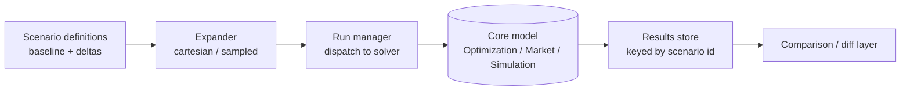

# Pattern — Scenario Engine

!!! abstract "Pattern at a glance"
    **Intent:** turn a model from a single run into a *managed family of policy
    experiments* — define, parameterize, batch, store, and compare scenarios reproducibly.
    **Also known as:** experiment manager, scenario framework, run manager.
    **Grounded in:** every model in this atlas; the IPCC **SSP/RCP** framework is the
    field's canonical shared-scenario system.

## Problem & forces

A policy model is useless as a one-shot calculation. The actual questions are *comparative*
— "carbon tax vs standards," "1.5 °C vs 2 °C," "high vs low growth" — so the model must run
many times under systematically varied assumptions, and results must remain **traceable to
the exact inputs that produced them**. The forces:

- **Combinatorial explosion** — policies × socioeconomic futures × parameter draws.
- **Reproducibility** — a headline number must be re-derivable months later.
- **Comparability** — scenarios must share a baseline and vary *one thing at a time* to be
  interpretable.
- **Separation of concerns** — the *what-if* definition should be decoupled from the solver.

## Structure



The Scenario Engine sits **above** the core solver and treats it as a black box: it owns
the *inputs* (a base case plus named deltas), the *sweep* (cartesian product or sampled
design), the *dispatch* (possibly parallel), and the *provenance* (every output row keyed
to its scenario id and input hash).

## Interface

```
Scenario  := { id, base, overrides: {param → value}, meta }
run(scenario) → results            # delegates to the core model
sweep(scenarios[]) → results_table # batch, parallelizable
compare(a, b) → diff               # baseline-relative reporting
```

## Exemplars

- **IPCC SSP/RCP** — community *shared* scenarios (five Shared Socioeconomic Pathways ×
  forcing levels) so [DICE](../model-families/climate-iam/dice.md), GCAM, REMIND, and
  MESSAGEix can be compared on common futures.
- **[DICE](../model-families/climate-iam/dice.md)** — "optimal" vs "base" vs
  temperature-limited runs are scenarios over the same core.
- **[TIMES](../model-families/energy/times.md)/[OSeMOSYS](../model-families/energy/osemosys.md)**
  — policy constraints (emission caps, phase-outs) as scenario overlays.
- **[Covasim](../model-families/health/covasim.md)** — intervention packages swept over
  seeds; the ensemble *is* a scenario sweep.

## Trade-offs & variants

- **Cartesian vs sampled** — full-factorial grids explode; Latin-hypercube / Sobol designs
  (see [Sensitivity Engine](sensitivity-engine.md)) cover high-dimensional spaces cheaply.
- **Scenario-as-data vs scenario-as-code** — declarative (YAML/DB rows) is reproducible and
  diffable; programmatic is flexible but harder to audit.
- **Shared vs bespoke** — shared frameworks (SSP/RCP) buy cross-model comparability at the
  cost of fit to any one question.

!!! quote "Lesson for the integrated simulator"
    The Scenario Engine is the **top-level API** of an integrated simulator — the layer a
    policy analyst actually touches. Design it first and make it **solver-agnostic**: a
    scenario is a baseline plus a set of overrides and a sampling design, and the *same*
    scenario definition must be dispatchable to an optimizing core, an equilibrium core, or
    an agent core (this atlas's recurring theme of *routing a question to the right
    paradigm*). Provenance is non-negotiable — every result must carry the hash of the
    inputs that made it — and the engine should natively support **running one policy under
    multiple model closures/paradigms** so disagreement between them becomes a first-class
    output rather than a hidden modeling choice.

## See also
- [Optimization Engine](optimization-engine.md) · [Market Engine](market-engine.md) · [Sensitivity Engine](sensitivity-engine.md)
- [Patterns catalog](index.md) · [Comparative hub](../comparative/index.md)
