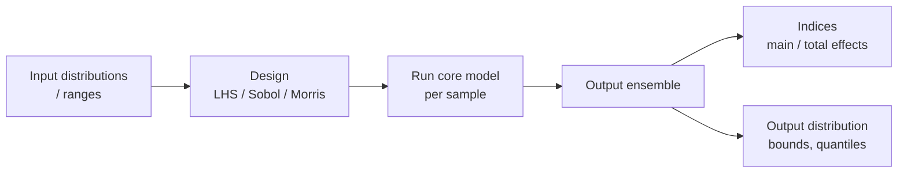

# Pattern — Sensitivity Engine

!!! abstract "Pattern at a glance"
    **Intent:** quantify how model outputs respond to perturbations in inputs — *which
    assumptions actually drive the result*, and how uncertain the result is.
    **Also known as:** uncertainty quantification (UQ) wrapper, sensitivity analysis,
    Monte-Carlo driver.
    **Grounded in:** [Vensim](../model-families/frameworks/vensim.md) Monte-Carlo tooling;
    the damage-function uncertainty at the heart of [DICE](../model-families/climate-iam/dice.md).

## Problem & forces

A single "best-estimate" run is dangerously mute about **robustness**. Policy conclusions
often hinge on a few deeply uncertain parameters (the DICE damage exponent, the discount
rate, an ABM's transmissibility). The Sensitivity Engine treats the core model as a black
box and samples it. The forces:

- **Uncertain inputs** — many parameters are estimates with wide bounds.
- **Dimensionality** — full-factorial sweeps explode; smart designs are essential.
- **Attribution** — decision-makers need to know *which* inputs matter, not just the spread.
- **Cost** — every sample is a full model run; the budget is finite.

## Structure



The engine wraps the [Scenario Engine](scenario-engine.md): a *sensitivity study is a
sampled scenario sweep*, post-processed into variance-decomposition indices and output
distributions.

## Interface

```
inputs   := {param → distribution / range}
design   := sample(inputs, method ∈ {LHS, Sobol, Morris, OAT})
run(design) → output_ensemble
analyze  → { main_effects, total_effects (Sobol), elementary_effects (Morris) }
```

## Methods & exemplars

| Method | Cost | Tells you |
|--------|------|-----------|
| One-at-a-time (OAT) | Low | Local slope; misses interactions |
| Morris elementary effects | Medium | Cheap global screening — *which* inputs matter |
| Sobol variance decomposition | High | Main + interaction effect shares (rigorous) |
| Latin-hypercube Monte-Carlo | Medium | Full output distribution |

- **[DICE](../model-families/climate-iam/dice.md)** — SCC is famously sensitive to the
  discount rate and damage function; sensitivity analysis *is* the debate.
- **[Vensim](../model-families/frameworks/vensim.md)** — built-in Monte-Carlo sensitivity
  over parameter ranges.
- **[Covasim](../model-families/health/covasim.md)** — ensembles over seeds *and*
  parameters give outcome distributions natively.

## Trade-offs & variants

- **Local vs global** — OAT is cheap but blind to interactions; Sobol is rigorous but
  expensive. Screen with Morris, then quantify with Sobol.
- **Emulators/surrogates** — fit a fast surrogate (Gaussian process, polynomial chaos) to
  the expensive model, then sample the surrogate.
- **Sensitivity vs calibration** — sensitivity *explores* the parameter space; the
  [Calibration Engine](calibration-engine.md) *searches* it for a fit.

!!! quote "Lesson for the integrated simulator"
    The Sensitivity Engine should be **mandatory, not optional** infrastructure — wrapped
    around every core so no result is ever reported as a bare point estimate. Its highest
    purpose in this atlas is **decomposing a headline number into "how much is science and
    how much is assumption"**: when the simulator says a policy "costs X% of GDP," a Sobol
    decomposition should show how much of X is driven by the discount rate, the closure, or
    the damage function versus genuine mechanism. Because a sensitivity study is just a
    sampled [scenario sweep](scenario-engine.md), it reuses the same solver-agnostic
    dispatch — and screening (Morris) before quantifying (Sobol) keeps the run budget sane.

## See also
- [Scenario Engine](scenario-engine.md) · [Calibration Engine](calibration-engine.md)
- [Patterns catalog](index.md) · [DICE dossier](../model-families/climate-iam/dice.md)
