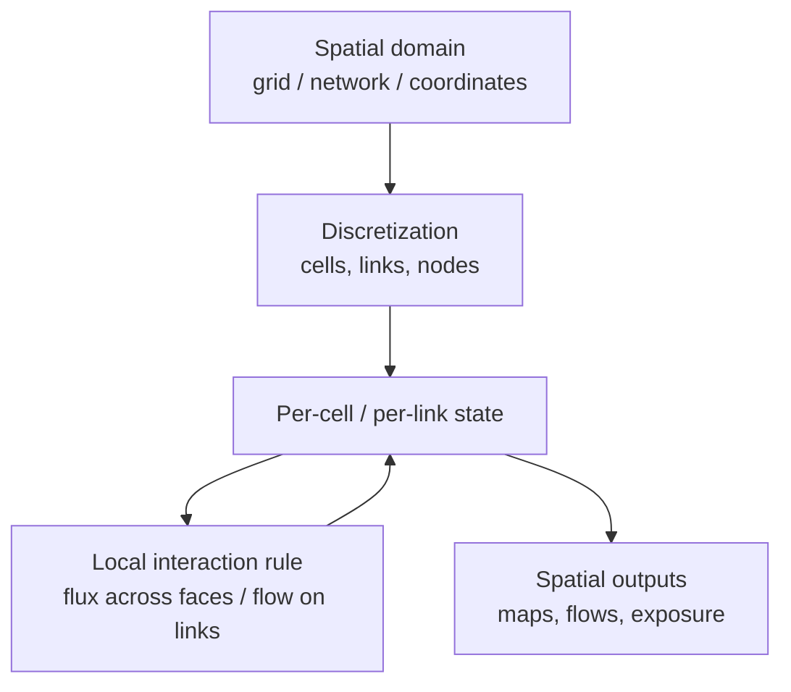

# Pattern — Spatial Engine

!!! abstract "Pattern at a glance"
    **Intent:** represent **space explicitly** — as a grid, a network, or continuous
    coordinates — so that *location, distance, connectivity, and flow* shape outcomes, and
    processes propagate through the geometry rather than over a spaceless aggregate.
    **Also known as:** network/GIS core, gridded-domain solver, spatial-interaction engine.
    **Grounded in:** [MATSim](../model-families/transport/matsim.md) (road/transit network);
    hydrology/geoscience grids (SWAT, MODFLOW); SUMO.

## Problem & forces

Many policy questions are **irreducibly spatial**: congestion depends on the road *network*,
groundwater on the aquifer *grid*, exposure on *where* people and pollutants are. Collapsing
space into an aggregate destroys the phenomenon. The Spatial Engine makes geometry
first-class. The forces:

- **Locality** — interactions are *local*: adjacent cells exchange water, connected links
  pass traffic, neighbors infect neighbors.
- **Topology matters** — a network's connectivity (not just distance) determines flow,
  bottlenecks, and reachability.
- **Resolution vs cost** — finer grids/networks capture more but cost more; the discretization
  itself shapes results.
- **Boundary & conservation** — flows must be conserved across cell/link faces (ties to the
  [Integration Engine](integration-engine.md)).

## Structure



Three common geometries:

- **Grid / raster** — space as cells; local flux rules (finite-difference/-volume) move
  quantities between neighbors. Used for **hydrology, groundwater, land, atmosphere**.
- **Network / graph** — nodes and links; entities *flow* along edges with capacities. Used for
  **transport, power, water distribution, epidemics on contact networks**.
- **Continuous / point** — agents at $(x,y)$ coordinates with distance-based interaction.

## Interface

```
domain     := grid | network | continuous
discretize := cells / (nodes, links) / coordinates
state[loc] := quantity or entities at each location
step       := for each location: exchange with neighbors (flux / flow)
             subject to capacity & conservation
outputs    := spatial fields, flows, reachability, exposure
```

## Exemplars

| Model | Geometry | Local rule | Spatial output |
|-------|----------|-----------|----------------|
| [MATSim](../model-families/transport/matsim.md) | Road/transit **network** | Queue flow on links (capacity, spillback) | Congestion, flows, accessibility |
| SUMO | Network + lanes | Car-following / microscopic dynamics | Second-by-second vehicle trajectories |
| SWAT | Watershed **grid**/HRUs | Water & nutrient routing | Streamflow, loads |
| MODFLOW | Aquifer **grid** | Darcy flux between cells (finite-difference) | Head fields, drawdown |

## Trade-offs & variants

- **Grid vs network** — rasters suit continuous fields (water, air); graphs suit
  flow-on-infrastructure (roads, power). Choosing wrong distorts the physics.
- **Resolution artifacts** — too coarse misses bottlenecks/gradients; too fine explodes cost.
  Resolution is a first-class dial (as in the
  [Energy Dispatch Engine](energy-dispatch-engine.md)'s time slices).
- **Static vs dynamic topology** — fixed network vs one that changes (new links, failures).
- **Coupling** — spatial state often feeds an [Integration Engine](integration-engine.md)
  (conservation over cells) or a [Behavior Engine](behavior-engine.md) (agents moving through
  space).

!!! quote "Lesson for the integrated simulator"
    The Spatial Engine is how the simulator answers **"where?"** — and *where* determines who
    is exposed, which link congests, and which region bears a policy's cost. The design lesson
    is to treat **space as an explicit, shared substrate** — a grid or network that multiple
    subsystems read and write — rather than re-encoding geometry separately in each module. A
    capable simulator should offer **both raster and graph** representations, make
    **resolution an explicit dial** with its own [sensitivity](sensitivity-engine.md) check
    (because the discretization can predetermine the answer), and — following
    [MATSim](../model-families/transport/matsim.md)'s **event-stream** design — let spatial
    processes emit a decoupled stream of located events that downstream modules (emissions,
    exposure, energy demand) can subscribe to. That clean spatial interface is what turns a
    pile of single-domain models into a genuinely *geographic* integrated simulator.

## See also
- [Behavior Engine](behavior-engine.md) · [Integration Engine](integration-engine.md) · [Energy Dispatch Engine](energy-dispatch-engine.md)
- [MATSim dossier](../model-families/transport/matsim.md) · [Patterns catalog](index.md)
