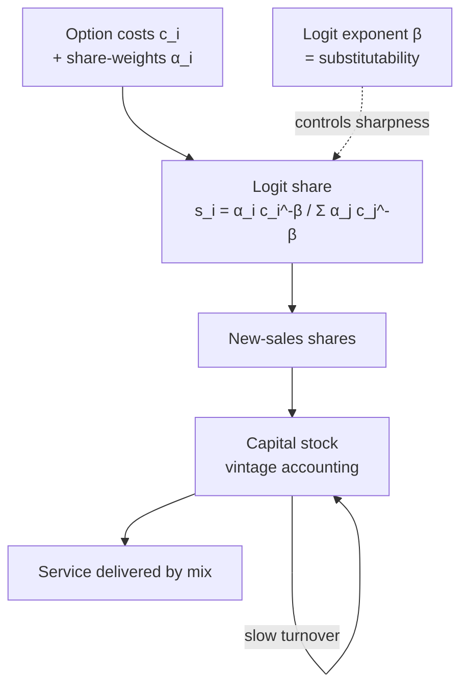

# Pattern — Technology-Adoption Engine

!!! abstract "Pattern at a glance"
    **Intent:** determine **which technologies gain market share over time** — how a cheaper
    or cleaner option *diffuses* through a stock of competitors — capturing **heterogeneity,
    inertia, and imperfect substitution** rather than an all-or-nothing switch.
    **Also known as:** market-share / diffusion module, logit choice, vintage-turnover model.
    **Grounded in:** [GCAM](../model-families/climate-iam/gcam.md)'s nested-logit shares;
    diffusion mechanisms in IMAGE, MESSAGEix, and energy models.

## Problem & forces

Real technology transitions are **gradual and partial**: even when heat pumps become cheaper
than gas boilers, they do not capture 100% of the market overnight. A model that picks the
single least-cost option (pure [LP](../paradigms/algorithms/lp.md)) produces unrealistic
**bang-bang** switches; the Technology-Adoption Engine smooths this. The forces:

- **Heterogeneity** — buyers differ in preferences, contexts, and hidden costs; "the" cost is
  really a *distribution*.
- **Imperfect substitution & information** — options are not identical; adoption lags
  awareness and trust.
- **Inertia & vintages** — capital is long-lived; the *stock* turns over slowly even if new
  *sales* shift fast.
- **Smoothness for solvers** — a differentiable share rule is numerically kinder than a
  discrete argmax (and avoids knife-edge flips).

## Structure



Two coupled ideas: a **share rule** (how new demand splits among options) and **vintage/stock
turnover** (how the installed base changes as old capital retires and new sales enter). The
**logit exponent $\beta$** tunes how sharply share responds to cost — $\beta \to \infty$
recovers winner-take-all least cost; small $\beta$ gives sluggish, heterogeneous adoption.

## Interface

```
options   := technologies supplying a service (cost c_i, share-weight α_i)
share(c)  := logit:  s_i = α_i c_i^-β / Σ_j α_j c_j^-β
sales     := share × new demand
stock_t   := retire(old vintages) + add(sales)      # slow turnover
service   := Σ stock_i · output_i
calibrate := set α_i so base-year shares match data
```

## Exemplars & variants

| Mechanism | Form | Seen in |
|-----------|------|---------|
| **Nested logit share** | Cost-based probabilistic share | [GCAM](../model-families/climate-iam/gcam.md), IMAGE |
| **Least-cost (knife-edge)** | argmin cost → 100% | pure [LP](../paradigms/algorithms/lp.md) energy ([TIMES](../model-families/energy/times.md)/[OSeMOSYS](../model-families/energy/osemosys.md)) |
| **Bass / S-curve diffusion** | Epidemic-style adoption over time | marketing & innovation models |
| **Vintage capital** | Age-structured stock turnover | most energy/IAM capital stocks |
| **Discrete-choice (agent)** | Individual logit over heterogeneous agents | [ABMs](behavior-engine.md), MATSim mode choice |

## Trade-offs & variants

- **Logit share vs least cost** — logit adds realism (gradual, partial adoption) but its
  **share-weights are calibrated, not derived** — behavior partly fitted (Lucas-critique
  concern). Least cost is cleaner but brittle. The
  [logit exponent](../model-families/climate-iam/gcam.md) $\beta$ is the key dial.
- **Sales vs stock** — modeling *new-sales* shares is easy; the policy-relevant *service*
  depends on the slowly-turning **stock**, so vintage accounting matters.
- **Empirical grounding** — floor costs, learning-by-doing (endogenous cost decline), and
  constraints keep adoption physically plausible.
- **Aggregate logit vs agent discrete-choice** — the same math at population vs individual
  scale (ties to [SD vs ABM](../comparative/system-dynamics-vs-abm.md)).

!!! quote "Lesson for the integrated simulator"
    The Technology-Adoption Engine is the simulator's answer to *"how fast does the new thing
    win?"* — and its central lesson is that **transitions are share-based, not switch-based**.
    A capable simulator should default to a **smooth, calibrated share rule** (logit or
    diffusion) with an explicit **substitutability dial** ($\beta$), so a cost advantage
    translates into *gradual, partial* uptake that respects heterogeneity, inertia, and slow
    **capital-vintage turnover** — while still being able to collapse to knife-edge least cost
    where that is genuinely appropriate. Two disciplines travel with it: expose the fact that
    share-weights are **calibrated behavior** (and stress-test them via the
    [Sensitivity Engine](sensitivity-engine.md)), and always track the **stock, not just
    sales**, because policy outcomes ride on the installed base that turns over slowly. This
    is the same aggregate-vs-individual choice seen elsewhere — a population logit and an
    [agent discrete-choice](behavior-engine.md) are two resolutions of one adoption process.

## See also
- [Optimization Engine](optimization-engine.md) · [Market Engine](market-engine.md) · [Behavior Engine](behavior-engine.md) · [Land Engine](land-engine.md)
- [GCAM dossier](../model-families/climate-iam/gcam.md) · [Patterns catalog](index.md)
