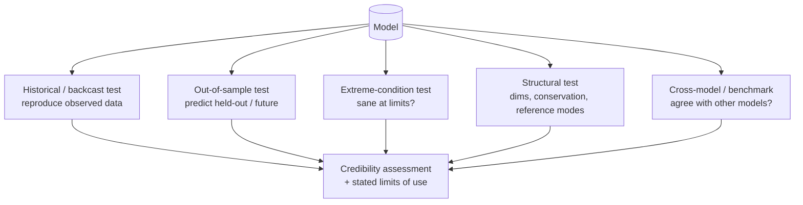

# Pattern — Validation Engine

!!! abstract "Pattern at a glance"
    **Intent:** systematically test whether a model is **fit for its purpose** — reproducing
    history, behaving sanely at extremes, staying internally consistent, and projecting
    out-of-sample — and to report the *limits* of its credibility alongside its results.
    **Also known as:** verification & validation (V&V), model evaluation, credibility
    assessment.
    **Grounded in:** the validation sections of every Gold dossier —
    [DICE](../model-families/climate-iam/dice.md),
    [Covasim](../model-families/health/covasim.md),
    [DSGE](../model-families/economics/dsge.md),
    [Vensim/SD](../model-families/frameworks/vensim.md),
    [MATSim](../model-families/transport/matsim.md).

## Problem & forces

A model that fits its calibration data can still be **wrong for the question asked** —
right numbers for wrong reasons (equifinality), or accurate in-sample but useless out-of-
sample. The Validation Engine is the discipline that separates a *credible* policy tool from
a curve-fit. The forces:

- **Fit ≠ validity** — matching history does not prove the mechanism (especially for richly
  parameterized [ABMs](behavior-engine.md)).
- **Purpose-relative** — validity is *for a use*; a model good for framing may be wrong for
  point prediction.
- **Structure vs behavior** — one can test the *outputs* or the *internal structure*; both
  matter (the [system-dynamics](integration-engine.md) tradition stresses structure).
- **Honesty about limits** — the engine's job includes reporting where the model should
  *not* be trusted.

## Structure



## The validation toolkit

| Test | Question | Seen in |
|------|----------|---------|
| **Historical / backcasting** | Reproduce the observed past? | DICE, DSGE, MATSim |
| **Out-of-sample projection** | Predict data withheld from fitting? | Covasim, MATSim |
| **Extreme-condition** | Behave sanely at limits (zero, huge inputs)? | System dynamics (Barlas) |
| **Dimensional / conservation** | Units consistent, stocks conserved? | SD, physical modules |
| **Reference-mode** | Reproduce the qualitative dynamic of concern? | System dynamics |
| **Structural / sensitivity** | Right output for the right reasons? | all (via [Sensitivity Engine](sensitivity-engine.md)) |
| **Cross-model / benchmark** | Agree with independent models (e.g. IPCC ensembles)? | IAMs, energy models |

## Interface

```
validate(model, data, purpose) → {
    historical_fit, out_of_sample_skill,
    extreme_condition_pass, structural_consistency,
    cross_model_agreement,
    stated_limits_of_use            # where NOT to trust it
}
```

## Trade-offs & variants

- **Point-prediction vs pattern** — some models (weather-like) are judged on forecast error;
  others (scenario IAMs) on *plausible patterns*, since the future is unconditionally
  unpredictable. Applying the wrong standard is a category error.
- **Structure-oriented vs black-box** — SD validation interrogates the feedback structure;
  ML/ABM validation leans on out-of-sample skill. Best practice uses both.
- **Equifinality** — for flexible models, report the *set* of parameterizations that fit,
  not one — tightly linked to the [Calibration Engine](calibration-engine.md).
- **Cost** — thorough V&V (ensembles, held-out experiments) is expensive but is what earns a
  model the right to inform policy.

!!! quote "Lesson for the integrated simulator"
    The Validation Engine must be **built in, not bolted on** — and its most important output
    is not a single "valid/invalid" stamp but a **map of where each subsystem can and cannot
    be trusted**, attached to every result the simulator emits. Because *fit is not validity*,
    the engine should run a **battery** — historical backcasting, out-of-sample skill,
    extreme-condition and conservation checks, reference-mode and cross-model comparison —
    matched to each subsystem's nature (structure-oriented for [feedback](integration-engine.md)
    models, out-of-sample for [agent](behavior-engine.md)/ML models). Above all, it should make
    the simulator **honest about its envelope**: flag when a scenario pushes an
    [emulator](climate-engine.md) outside its calibration range, surface equifinality instead
    of hiding it, and pair every headline number with the conditions under which it holds — so
    the tool's credibility is itself a first-class, inspectable output.

## See also
- [Calibration Engine](calibration-engine.md) · [Sensitivity Engine](sensitivity-engine.md) · [Policy Engine](policy-engine.md)
- [Patterns catalog](index.md) · [Three-Track Method](../foundations/three-track-method.md)
