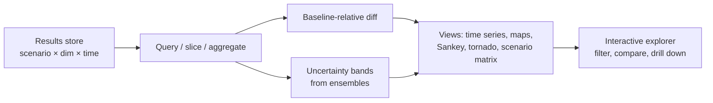

# Pattern — Visualization Engine

!!! abstract "Pattern at a glance"
    **Intent:** turn a model's high-dimensional output into **interpretable, comparable,
    and interactive** views — so analysts and decision-makers can *see* what a scenario
    implies, compare policies, and grasp uncertainty — without misleading them.
    **Also known as:** results explorer, scenario dashboard, output layer.
    **Grounded in:** IIASA/IPCC **scenario explorers** (IAMC database), Climate Interactive's
    **En-ROADS/C-ROADS** live dashboards, energy-model result viewers, ABM output analyzers.

## Problem & forces

A policy model emits vast, multi-dimensional output — trajectories across scenarios,
regions, sectors, and uncertainty draws. Left as raw tables it is unusable; the
Visualization Engine is what makes the analysis *land*. The forces:

- **Comparison is the task** — the value is almost always in the *difference* between a
  policy and a baseline, or between scenarios, not any single number.
- **Uncertainty must be shown, not hidden** — a fan chart tells the truth a single line
  hides (ties to [Sensitivity](sensitivity-engine.md)/[Deterministic vs Stochastic](../comparative/deterministic-vs-stochastic.md)).
- **Audiences differ** — a modeler wants diagnostics; a minister wants the headline and its
  risks. One output, several views.
- **Honesty** — visualization can clarify *or* deceive (truncated axes, cherry-picked
  scenarios); the engine carries an ethical load.

## Structure



The engine sits atop the [Scenario Engine](scenario-engine.md)'s results store: it
**slices** (by region/sector/scenario), computes **baseline-relative** differences, attaches
**uncertainty bands** from ensembles, and renders **audience-appropriate** views.

## Interface

```
results  := scenario × dimension × time (+ ensemble)
select   := filter(scenario, region, sector, …)
transform:= diff-vs-baseline | aggregate | index
render    := {timeseries, map, sankey, tornado, heatmap, scenario-matrix}
explorer := interactive(filter, compare, drilldown)
```

## Exemplars & idioms

| View | Shows | Typical use |
|------|-------|-------------|
| **Scenario explorer** (IAMC) | Many models × scenarios, filterable | Cross-model IAM comparison |
| **Live policy dashboard** (En-ROADS) | Instant response to instrument sliders | Stakeholder/negotiation role-play |
| **Fan chart** | Central path + uncertainty band | Stochastic/forecast output |
| **Tornado / spider** | Sensitivity ranking of inputs | Which assumption drives the result |
| **Sankey** | Flows (energy, material, money) | Energy-system balances |
| **Choropleth / network map** | Spatial results | Transport, hydrology, exposure |

## Trade-offs & variants

- **Static report vs interactive explorer** — reproducible figures vs exploratory dashboards;
  best practice ships both.
- **Aggregate vs drill-down** — headline clarity vs diagnostic depth; support *progressive
  disclosure*.
- **Honesty guardrails** — consistent axes, baseline-relative framing, always-on uncertainty
  bands to avoid the false precision a single line implies.
- **Coupling** — a live dashboard effectively exposes the [Scenario](scenario-engine.md) and
  [Policy](policy-engine.md) engines to the user in real time (En-ROADS runs the model behind
  the sliders).

!!! quote "Lesson for the integrated simulator"
    The Visualization Engine is where the simulator **meets its user**, and its prime
    directive is to make **comparison and uncertainty the defaults**: show policies against a
    baseline, and never a central path without its spread — because a single confident line is
    the most common way a model misleads. The design lesson from En-ROADS is the power of a
    **live loop** — instrument sliders that re-run the [Policy](policy-engine.md) and
    [Scenario](scenario-engine.md) engines and update the view in seconds, turning the model
    into a tool people *reason with* rather than a report they receive. And because the atlas's
    recurring finding is that results are **conditional on modeling assumptions**, the
    visualization layer should be able to display the *same* policy under multiple
    closures/paradigms side by side, so the disagreement between models becomes something the
    user can see, not a choice buried upstream.

## See also
- [Scenario Engine](scenario-engine.md) · [Policy Engine](policy-engine.md) · [Sensitivity Engine](sensitivity-engine.md)
- [Data Pipeline](data-pipeline.md) · [Patterns catalog](index.md)
