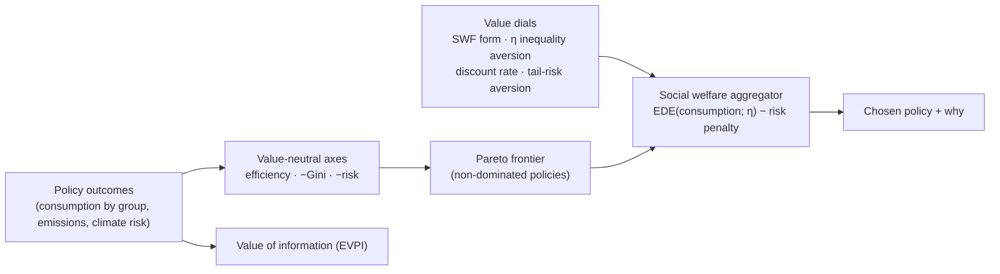

# Welfare/Equity Engine

!!! abstract "Pattern in one line"
    Make the **objective a dial, not a constant**: score policies on **value-neutral axes** (efficiency,
    equity, climate safety), expose a **Pareto frontier** of trade-offs, and pick a point only through an
    **inspectable social welfare function** whose parameters (SWF form, inequality aversion, discount
    rate, tail-risk aversion) are open to inspection and debate.

!!! note "A Polyphony-contributed engine (the 17th)"
    The atlas's original catalogue has 16 engines. This one was added by the **Polyphony** build
    (issue #4) because a decision-support instrument aimed at *altruistic* policy choice must treat the
    **welfare/equity objective as a first-class, contestable dial** — not bury it in a discount rate or a
    representative-agent utility. It generalizes the distributional accounting found inside
    [ENVISAGE](../model-families/economics/envisage.md) and [E3ME](../model-families/economics/e3me.md)
    into a reusable, cross-model engine. Implemented in `polyphony/polyphony/engines/welfare.py`.

## Intent

Turn "what is the best policy?" into "what are the **efficient trade-offs**, and where on them do our
**stated values** put us?" — so that contested value judgments are **exposed and adjustable**, never
smuggled in as a hidden constant.

## Forces

- A single welfare number **hides** its weights (discount rate, inequality aversion, whose utility counts).
- Real policy has **conflicting goals** — growth vs equity vs climate safety — with no value-free
  aggregation ([multi-objective](../paradigms/algorithms/multiobjective.md): compute the frontier, defer
  the weighting).
- Different ethical stances (utilitarian ↔ prioritarian ↔ **Rawlsian** maximin) rank the *same* outcomes
  differently — that disagreement is legitimate and must be representable.
- Uncertainty means the value of **resolving** it (VoI) is itself decision-relevant
  ([Bayesian decision](../paradigms/algorithms/bayesian-decision.md)).

## Structure

## Interface

- **Value-neutral axes** — `objective_vector(outcome)` → efficiency (mean consumption), equity (−Gini),
  climate safety (−risk); `pareto_frontier(outcomes)` returns the non-dominated set.
- **Value-laden aggregator** — `WelfareDials(swf, inequality_aversion η, discount_rate, tail_risk_aversion)`
  and `social_welfare_score` / `rank_policies`. The SWF is the **equally-distributed-equivalent** (Atkinson):
  η=0 → utilitarian (mean), η→∞ → Rawlsian (min), η>0 → prioritarian.
- **Value of information** — `value_of_information(outcomes_by_scenario, probs, dials)` returns **EVPI ≥ 0**,
  the welfare gain from resolving uncertainty before deciding.

## Exemplars

[ENVISAGE](../model-families/economics/envisage.md) and [E3ME](../model-families/economics/e3me.md)
carry distributional/incidence accounts; DICE's discounting debate (Nordhaus vs Stern) is precisely a
dispute over **this engine's dials**. Polyphony makes the dials explicit and shared across models.

## Trade-offs

- **Exposing** values invites disagreement — which is the point; a hidden weighting merely *conceals* it.
- The frontier grows costly with many objectives (>3–4); the SWF scalarization is a modeling choice that
  must itself be shown, not assumed.
- Illustrative numbers ≠ calibrated welfare; the engine's contribution is the **machinery of honesty**.

!!! quote "Lesson for the integrated simulator"
    The welfare objective is the most consequential contested assumption of all, so it deserves the
    strongest form of the atlas thesis: **compute the value-neutral trade-off frontier, and let values —
    an inspectable SWF with open dials — pick the point**, reporting how the choice moves with the
    weighting and what resolving uncertainty is worth. A simulator that outputs one welfare number has
    made an ethical decision on the user's behalf and hidden it; Polyphony's engine refuses to.

## See also
- Grounded in: [Multi-Objective Optimization](../paradigms/algorithms/multiobjective.md) ·
  [Bayesian Decision](../paradigms/algorithms/bayesian-decision.md)
- Distributional exemplars: [ENVISAGE](../model-families/economics/envisage.md) ·
  [E3ME](../model-families/economics/e3me.md)
- Polyphony: [blueprint §5](../polyphony/01-blueprint.md) · [ADR-0001](../decisions/0001-positioning-paradigm-plural-not-world-model.md)
