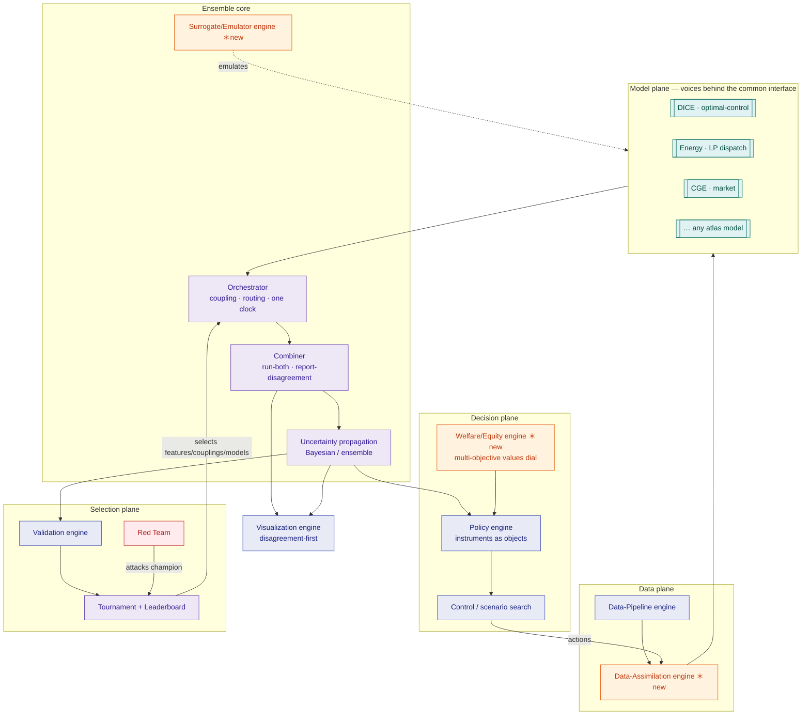
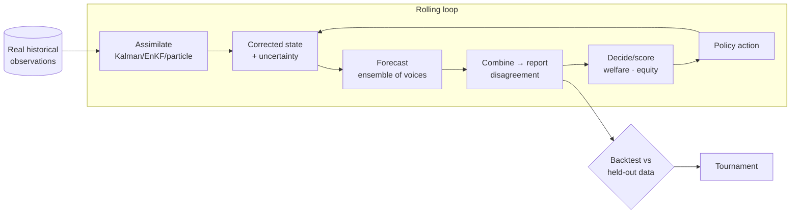
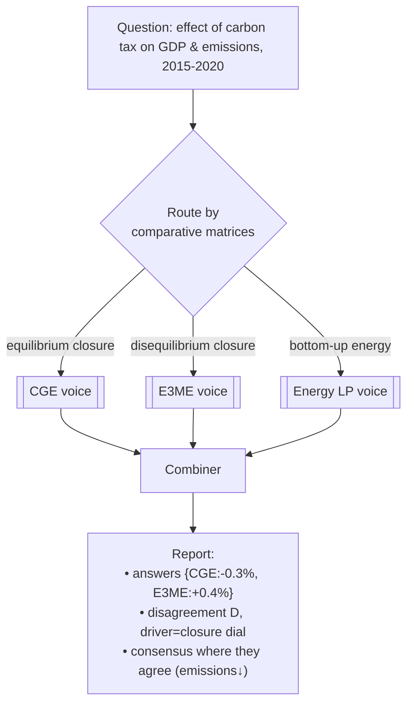
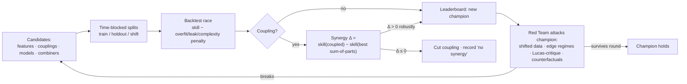

# Phase 1 — Blueprint & Wireframes

The engineering design for Polyphony, expressed **as the atlas's 16 engines** composed under
one clock on the digital-twin backbone. Everything here is a **design artifact** (interfaces,
protocols, diagrams); the code lands in Phase 2. Governing decisions:
[ADR-0003](../decisions/0003-tech-stack.md) (tech stack) and
[ADR-0004](../decisions/0004-disagreement-preservation-vs-bma.md) (disagreement-preservation as
the default combiner; BMA as a challenger).

!!! abstract "One-paragraph architecture"
    Polyphony wraps each atlas model behind a **common `Model` interface** (state · step · dials
    · provenance). An **Orchestrator** couples a chosen set of models into a directed graph of
    **state hand-offs**, steps them under one clock, and — where several models answer the same
    quantity — keeps **all** of their answers. A **Combiner** reports the ensemble as a
    **distribution with its disagreement**, never a silent average. A **Tournament** selects
    features, couplings, and models by backtesting against **real data**; a **Red Team** attacks
    the champion. A **Welfare/Equity** layer scores policies on an **inspectable multi-objective
    dial**. The whole thing runs on the **model ⇄ data-assimilation ⇄ control** loop.

---

## 1. Architecture as atlas engines



`＊new` = engines the atlas implies but doesn't yet formalize (issues
[#1](https://github.com/Sour-abh-Raj/computational-policy-atlas/issues/1)–[#4](https://github.com/Sour-abh-Raj/computational-policy-atlas/issues/4));
each gets an atlas page + graph node when built.

---

## 2. The common `Model` interface (state · step · dials · provenance)

Every voice — an optimizing IAM, an LP energy model, a CGE, an ABM — implements one small
protocol so it can compose. The interface is deliberately **paradigm-agnostic**: it says nothing
about *how* a model decides, only how it exposes state, advances, declares its dials, and records
provenance.

```python
# design sketch — lands in polyphony/polyphony/core/interface.py (Phase 2)
from typing import Protocol, runtime_checkable, Mapping, Any
import numpy as np

State = Mapping[str, np.ndarray | float]     # named, typed, serializable
Inputs = Mapping[str, np.ndarray | float]    # couplings from other models this step
Dials = Mapping[str, Any]                     # contested assumptions (see §5)

@runtime_checkable
class Model(Protocol):
    name: str
    paradigm: str            # "optimization" | "equilibrium" | "agent-based" | ...
    engines: tuple[str, ...] # which atlas engine patterns it instantiates
    provides: tuple[str, ...] # state keys it exposes for coupling (e.g. "co2", "gdp")
    requires: tuple[str, ...] # input keys it needs from other voices

    def init_state(self, dials: Dials, seed: int) -> State: ...
    def step(self, state: State, inputs: Inputs, dt: float, dials: Dials) -> "StepResult": ...
    def dials_spec(self) -> "DialsSpec": ...            # names, ranges, defaults, provenance
    def observe(self, state: State, keys: tuple[str, ...]) -> Mapping[str, float]: ...

class StepResult(Protocol):
    state: State
    outputs: Mapping[str, float]     # values other models may consume
    diagnostics: Mapping[str, float] # for validation/telemetry
    provenance: "Provenance"         # model version, dials used, solver, RNG seed, inputs hash
```

**Design rules.**

- **Foresight is a property, not an assumption in the loop.** A perfect-foresight model exposes a
  `solve_horizon()` and the orchestrator treats its whole trajectory as one "step"; a recursive
  model steps period-by-period. The [recursive-vs-perfect-foresight](../comparative/recursive-vs-perfect-foresight.md)
  dial routes which mode a coupling uses.
- **Provenance is mandatory** — every `StepResult` records model version, exact dials, solver,
  RNG seed, and a hash of inputs, so any number is reproducible and any disagreement traceable.
- **Adapters, not rewrites** — wrap open reference implementations where they exist; build faithful
  reduced-form / [surrogate](../decisions/0003-tech-stack.md) voices otherwise, with fidelity limits
  stated honestly (never claimed as the full model).

---

## 3. The digital-twin backbone: model ⇄ assimilation ⇄ control



Assimilation is what makes validation *honest*: the ensemble is **continuously corrected by data**
and scored on **held-out** windows, directly attacking the validation gap ADR-0001 calls out.

---

## 4. Coupling, routing, and run-both-report-disagreement

The Orchestrator holds a **coupling graph**: nodes are model instances, edges are state hand-offs
(`provides` → `requires`). Three behaviors distinguish Polyphony from a single integrated model:

1. **Routing** — each *question* (a target quantity + regime) is routed to the paradigm(s) valid
   for it, using the atlas comparative matrices as the routing table (e.g. long-run equilibrium →
   CGE; disequilibrium/involuntary-unemployment regime → E3ME; global spread → GLEAM; local
   intervention → Covasim).
2. **Run-both** — where multiple valid voices exist for the same quantity, run **all** of them.
3. **Report disagreement** — the Combiner emits, per quantity, the **set of answers**, their spread
   (e.g. range, IQR, a disagreement index $D$), and *which assumptions drive the split* — not a
   silent mean.



**Disagreement index (design).** For a target $y$ with voice answers $\{y_i\}$ weighted by
out-of-sample skill $w_i$, report the weighted spread and a normalized index
$D = \operatorname{sd}_w(\{y_i\}) / (|\bar y_w| + \varepsilon)$, **plus** an attribution of $D$ to the
dial(s) that, when equalized across voices, most collapse it. High $D$ with a clear driver is a
*finding*, not a failure.

---

## 5. Contested values as an inspectable multi-objective dial

Welfare/altruism is **never** a buried constant. The Welfare/Equity engine scores any policy on a
**vector** of objectives and returns a **Pareto frontier** (via the atlas's
[multi-objective](../paradigms/algorithms/multiobjective.md) method), with the value parameters
exposed as dials:

- **Objectives:** aggregate welfare, distributional/equity (e.g. welfare of the worst-off, Gini,
  regional incidence), emissions/climate risk, and robustness across the disagreement set.
- **Value dials:** social welfare function (utilitarian ↔ prioritarian ↔ Rawlsian), inequality
  aversion, **discount rate**, and tail-risk aversion — each an inspectable parameter, each moving
  the frontier.
- **Value of information:** report what resolving a given uncertainty (or disagreement) is *worth*
  to the decision, per [Bayesian decision](../paradigms/algorithms/bayesian-decision.md).

This is how Polyphony serves the *altruism* north star honestly: it shows the trade-offs and lets
**values, not the model, pick the point**.

---

## 6. Uncertainty propagation

Parametric and structural uncertainty flow end-to-end: (a) **parametric** — priors on dials/params
sampled (Monte-Carlo / where cheap, closed-form), propagated through the coupled step; (b)
**structural** — the *choice of voice* is itself an uncertainty, carried as the disagreement set
rather than marginalized away. Surrogates/emulators (issue #2) keep this affordable at ensemble
scale; assimilation narrows it against data.

---

## 7. Tournament, adversarial selection & synergy measurement

Nothing is accepted for clearing a fixed number. Everything **wins by beating rivals on real,
out-of-sample data** and **surviving the Red Team**.



- **Metrics** (per question): out-of-sample predictive skill (e.g. CRPS for distributions, MAE/MASE
  for point tracks), **calibration** (PIT / reliability), and, for policy, welfare/equity outcomes
  and disagreement fidelity. Penalize overfitting, leakage, redundancy, and complexity.
- **Synergy** is the headline coupling metric: **coupled minus best sum-of-parts** on held-out data,
  with confidence; a coupling advances only if positive and robust; otherwise it is **cut** and the
  null result recorded (publishable).
- **Convergence (DONE):** a champion no challenger or Red-Team attack can beat within a full round,
  **and** net positive synergy over isolated baselines across covered domains.

---

## 8. Feature-engineering plan

Candidate features are generated (lags, ratios, regime indicators, cross-domain terms, physically-
motivated transforms), then **raced** on out-of-sample/holdout/shift backtests with penalties;
survivors must be **causally defensible** (issue: causal-inference layer) to guard the synergy test
against spurious fit. Every surviving feature is logged on the leaderboard with why it won.

---

## 9. Package layout (Phase 2 target)

```
polyphony/polyphony/
  core/        interface.py · orchestrator.py · combiner.py · provenance.py · dials.py
  engines/     assimilation.py · surrogate.py · welfare.py · ensemble.py   (the ＊new engines)
  models/      dice.py · energy_lp.py · cge.py · … (adapters behind the interface)
  tournament/  race.py · synergy.py · leaderboard.py · redteam.py
  data/        loaders.py · splits.py   (real-data ingestion + time-blocked splits)
  eval/        metrics.py · calibration.py · reports.py
tests/         unit + a golden vertical-slice integration test
tools/         validate_graph.py (0-dangling gate)
```

## 10. Phase plan with automated acceptance tests

| Phase | Deliverable | Automated acceptance gate |
|-------|-------------|---------------------------|
| **2** | Interface + orchestrator + 3-model slice (DICE⇄energy⇄CGE) | `pytest` green; slice runs a coupled scenario end-to-end; provenance recorded; `mkdocs --strict` + graph 0-dangling |
| **3** | Feature/coupling tournament on the slice | leaderboard rows with out-of-sample winners over named rivals; ADRs cite survivors |
| **4** | Validation harness + real data + Red Team | reproducible eval script; **synergy Δ measured** coupled vs sum-of-parts on held-out data; calibration + welfare/equity + disagreement reported; a red-team attack logged |
| **5+** | Scale family-by-family | each new domain: adapter + tournament + synergy result + red-team round; graph & site kept in sync |

**DONE** = §7 convergence: tournament-converged champion + net positive synergy across covered
domains + survives sustained red-team attack.

---

## Self-review (Phase 1 gate)

- ✅ Architecture expressed as atlas engines; the 4 `＊new` engines are issue-tracked and will feed
  back as atlas pages.
- ✅ Common interface is paradigm-agnostic (state/step/dials/provenance); foresight handled as a
  property, not a baked-in assumption.
- ✅ Disagreement is a first-class output with an index + attribution — not an average.
- ✅ Values are an inspectable multi-objective dial (frontier + VoI), honoring the altruism north star.
- ✅ Selection is adversarial (tournament + synergy Δ + Red Team), no fixed thresholds.
- ✅ Positioning intact: an ensemble that reports disagreement — **not** a world model.
- ⏭ **Next (Iter 03 → Phase 2):** scaffold `polyphony/core` (interface, orchestrator, combiner,
  provenance, dials) with tests, then adapt the first two voices of the DICE⇄energy⇄CGE slice.
